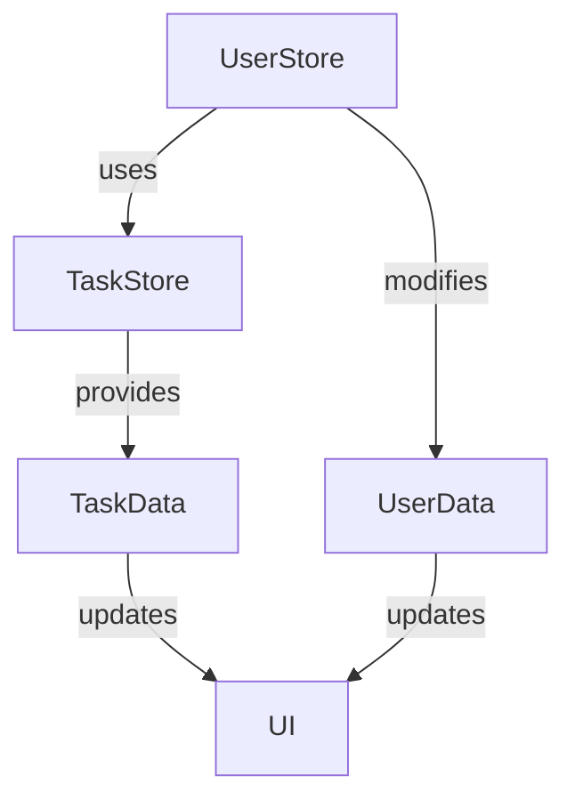

## 7.4.2 Working with Multiple Stores

In the world of state management, especially when using MobX in Flutter, the concept of multiple stores can significantly enhance the modularity and maintainability of your application. This section delves into the intricacies of working with multiple stores, providing you with the knowledge to effectively manage state across various domains of your app.

### Concept of Multiple Stores

#### When and Why to Use Multiple Stores

In a complex application, it's crucial to separate concerns to maintain a clean and manageable codebase. By using multiple stores, you can:

- **Enhance Modularity:** Each store can focus on a specific domain or feature of your application, such as user management, task management, or settings.
- **Improve Maintainability:** Smaller, focused stores are easier to maintain, test, and debug.
- **Facilitate Team Collaboration:** Different team members can work on separate stores without interfering with each other's code.
- **Optimize Performance:** By isolating state changes to specific stores, you can reduce unnecessary updates and improve performance.

#### Benefits of Focused Stores

Focused stores allow you to encapsulate logic and state related to a particular feature or domain. This separation helps in:

- **Reducing Complexity:** Each store handles a specific part of the application's state, making the logic simpler and more understandable.
- **Reusability:** Stores can be reused across different parts of the application or even in different projects.
- **Scalability:** As your application grows, you can add more stores without affecting existing ones.

### Communicating Between Stores

While keeping stores independent is ideal, there are scenarios where stores need to interact. For example, a `UserStore` might need to clear tasks in a `TaskStore` upon user logout.

#### Injecting Dependencies

One way to facilitate communication between stores is through dependency injection. This allows one store to access and manipulate the state of another store safely.

Here's an example of how you can achieve this:

```dart
class UserStore = _UserStore with _$UserStore;

abstract class _UserStore with Store {
  final TaskStore taskStore;

  _UserStore(this.taskStore);

  @action
  void logout() {
    // Perform logout operations
    taskStore.clearTasks();
  }
}
```

In this example, `UserStore` has a dependency on `TaskStore`, allowing it to clear tasks when a user logs out.

#### Avoiding Circular Dependencies

Circular dependencies occur when two or more stores depend on each other, creating a loop that can lead to runtime errors and difficult-to-debug issues. To avoid this:

- **Use Interfaces:** Define interfaces for stores to interact with each other, reducing direct dependencies.
- **Service Locator Pattern:** Use a service locator to manage dependencies and resolve them at runtime.
- **Constructor Injection:** Prefer constructor injection to set dependencies explicitly, making the dependencies clear and manageable.

### Injection Strategies

#### Constructor Injection

Constructor injection is a straightforward method where dependencies are passed to the store through its constructor. This method is explicit and makes it easy to see what dependencies a store requires.

#### Service Locator Pattern

A service locator is a design pattern that provides a centralized registry for managing dependencies. It allows you to resolve dependencies at runtime, offering flexibility and decoupling.

#### Using the `Provider` Package

The `Provider` package in Flutter is a popular choice for dependency injection. It allows you to provide stores to the widget tree, making them accessible to any widget that needs them.

```dart
void main() {
  final taskStore = TaskStore();
  final userStore = UserStore(taskStore);

  runApp(
    MultiProvider(
      providers: [
        Provider<TaskStore>.value(value: taskStore),
        Provider<UserStore>.value(value: userStore),
      ],
      child: MyApp(),
    ),
  );
}
```

### Best Practices

- **Keep Stores Independent:** Minimize dependencies between stores to reduce coupling and increase flexibility.
- **Document Interactions:** Clearly document how stores interact with each other to improve maintainability and facilitate onboarding for new developers.
- **Test Store Interactions:** Write tests to ensure that interactions between stores work as expected and do not introduce bugs.

### Code Examples

Let's consider an application that manages users and tasks. We'll split the logic into two stores: `UserStore` and `TaskStore`.

#### UserStore

```dart
class UserStore = _UserStore with _$UserStore;

abstract class _UserStore with Store {
  final TaskStore taskStore;

  _UserStore(this.taskStore);

  @observable
  String username;

  @action
  void login(String name) {
    username = name;
    // Additional login logic
  }

  @action
  void logout() {
    username = null;
    taskStore.clearTasks();
  }
}
```

#### TaskStore

```dart
class TaskStore = _TaskStore with _$TaskStore;

abstract class _TaskStore with Store {
  @observable
  ObservableList<String> tasks = ObservableList<String>();

  @action
  void addTask(String task) {
    tasks.add(task);
  }

  @action
  void clearTasks() {
    tasks.clear();
  }
}
```

### Mermaid.js Diagrams

To better understand the relationships and data flow between multiple stores, let's visualize it using a Mermaid.js diagram.



This diagram illustrates how `UserStore` and `TaskStore` interact and update the UI.

### Key Takeaways

- **Scalability:** Multiple stores allow you to scale your application's state management effectively.
- **Modularity:** By separating concerns, you can keep your codebase clean and maintainable.
- **Flexibility:** With dependency injection, stores can interact without tight coupling, providing flexibility in how you structure your application.

By mastering the use of multiple stores in MobX, you can build robust, scalable, and maintainable Flutter applications. Remember to keep stores focused, document interactions, and use dependency injection wisely to avoid pitfalls.

## Quiz Time!



### When should you consider using multiple stores in a Flutter application?

- [x] To separate concerns and improve modularity.
- [ ] To increase the number of dependencies.
- [ ] To make the application more complex.
- [ ] To reduce the number of files in the project.

> **Explanation:** Multiple stores help in separating concerns and improving modularity, making the application easier to manage and maintain.

### What is a potential pitfall when stores interact with each other?

- [x] Circular dependencies.
- [ ] Increased performance.
- [ ] Reduced code readability.
- [ ] Simplified debugging.

> **Explanation:** Circular dependencies can occur when stores depend on each other, leading to complex and hard-to-debug issues.

### Which pattern can be used to manage dependencies between stores?

- [x] Service Locator Pattern.
- [ ] Singleton Pattern.
- [ ] Factory Pattern.
- [ ] Observer Pattern.

> **Explanation:** The Service Locator Pattern provides a centralized registry for managing dependencies, allowing for flexible and decoupled interactions.

### How can you inject dependencies into a store?

- [x] Constructor Injection.
- [ ] Global Variables.
- [ ] Hardcoding Dependencies.
- [ ] Using Static Methods.

> **Explanation:** Constructor injection is a method where dependencies are passed to the store through its constructor, making the dependencies explicit and manageable.

### What package is recommended for dependency injection in Flutter?

- [x] Provider.
- [ ] Bloc.
- [ ] Redux.
- [ ] GetX.

> **Explanation:** The `Provider` package is widely used for dependency injection in Flutter, allowing stores to be provided to the widget tree.

### How can you avoid circular dependencies between stores?

- [x] Use interfaces to reduce direct dependencies.
- [ ] Increase the number of dependencies.
- [ ] Use global variables.
- [ ] Hardcode dependencies.

> **Explanation:** Using interfaces can help reduce direct dependencies between stores, minimizing the risk of circular dependencies.

### What is a benefit of keeping stores independent?

- [x] Reduced coupling and increased flexibility.
- [ ] Increased complexity.
- [ ] More dependencies.
- [ ] Harder to maintain.

> **Explanation:** Keeping stores independent reduces coupling and increases flexibility, making the application easier to maintain and extend.

### What should be documented to improve maintainability?

- [x] Store interactions.
- [ ] Variable names.
- [ ] Line numbers.
- [ ] File paths.

> **Explanation:** Documenting store interactions helps improve maintainability by making it clear how stores interact with each other.

### What is the purpose of the `clearTasks` method in the `TaskStore`?

- [x] To clear all tasks from the task list.
- [ ] To add a new task.
- [ ] To update a task.
- [ ] To display tasks.

> **Explanation:** The `clearTasks` method is used to clear all tasks from the task list, typically called during user logout.

### True or False: Multiple stores can help in optimizing performance by isolating state changes.

- [x] True
- [ ] False

> **Explanation:** True. By isolating state changes to specific stores, you can reduce unnecessary updates and improve performance.


