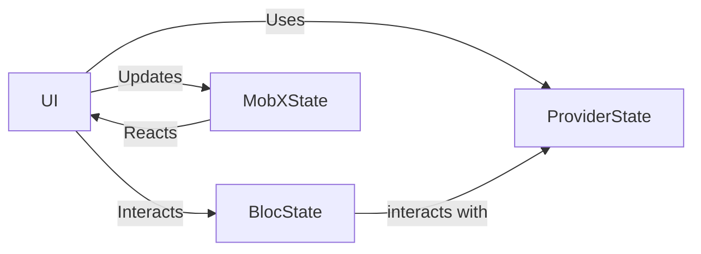

## 8.1.1 When and Why to Combine

In the ever-evolving landscape of Flutter development, state management remains a pivotal aspect that can make or break the user experience. As applications grow in complexity, relying on a single state management solution may not always suffice. This section delves into the strategic combination of multiple state management solutions, exploring when and why such an approach might be necessary.

### Understanding the Need for Combination

In the realm of Flutter development, state management solutions like Provider, Bloc, Redux, and MobX each offer distinct advantages and cater to different aspects of application design. However, as applications scale and requirements diversify, a single solution might not address all needs effectively. Here are some scenarios where combining solutions becomes beneficial:

- **Complexity and Scalability:** As applications grow, they often require different state management strategies for various components. For instance, a complex app with both simple UI state and intricate business logic might benefit from using Provider for lightweight state management and Bloc for handling complex, event-driven logic.
  
- **Diverse Requirements:** Different parts of an application may have varying requirements. For example, a global state might be efficiently managed with Redux, while localized, reactive state changes in specific widgets could be better handled by MobX.

- **Performance Optimization:** Some solutions are more performant for specific tasks. Combining them allows developers to leverage the strengths of each, optimizing performance across the application.

### Use Cases for Combining Solutions

Let's explore some practical examples where combining state management solutions can be advantageous:

- **Provider and Bloc:** Use Provider for managing simple state, such as theme or localization settings, while employing Bloc for more complex, event-driven features like user authentication or data fetching processes.

- **Redux and MobX:** Implement Redux for managing global application state, ensuring predictability and consistency, while using MobX for reactive UI components that require frequent updates based on user interactions.

- **Riverpod and Bloc:** Leverage Riverpod for dependency injection and simple state management, while utilizing Bloc for handling complex business logic and state transitions.

#### Example Scenario

Consider a social media application where:

- **Provider** is used for managing user preferences and theme settings.
- **Bloc** handles the news feed, managing events like fetching new posts, liking, and commenting.
- **MobX** is employed for the chat feature, providing reactive updates as messages are sent and received.

### Benefits of Combining State Management Solutions

Combining multiple state management solutions offers several benefits:

- **Flexibility:** Tailor state management strategies to specific application needs, ensuring each part of the app is optimized for its function.

- **Scalability:** As the application grows, different solutions can be integrated to handle increasing complexity without overhauling existing architecture.

- **Cleaner Code Separation:** By using different solutions for different parts of the app, developers can maintain cleaner and more modular codebases.

- **Enhanced Collaboration:** Teams can work on different parts of the application using the most suitable state management approach, improving productivity and collaboration.

### Potential Challenges

While combining state management solutions can be beneficial, it also introduces challenges:

- **Increased Complexity:** Managing multiple libraries can complicate the codebase, making it harder to maintain and debug.

- **Learning Curve:** Developers need to be familiar with multiple state management paradigms, which can increase the learning curve.

- **Documentation and Alignment:** Clear documentation and team alignment are crucial to ensure everyone understands how different solutions interact within the application.

### Best Practices

To effectively combine state management solutions, consider the following best practices:

- **Careful Planning:** Before integrating multiple solutions, thoroughly plan the architecture and identify which parts of the application will benefit from each solution.

- **Start Simple:** Begin with a primary state management tool and integrate additional solutions as needed, ensuring each addition is justified by specific requirements.

- **Consistent Documentation:** Maintain comprehensive documentation to help team members understand the architecture and interactions between different state management solutions.

- **Regular Reviews:** Periodically review the state management strategy to ensure it continues to meet the application's needs as it evolves.

### Examples and Case Studies

#### Hypothetical Example

Imagine a financial application where:

- **Provider** manages user settings and preferences.
- **Bloc** handles transaction processing and history, ensuring robust event-driven logic.
- **MobX** is used for real-time updates in stock prices and portfolio values.

#### Real-World Application

A well-known example is the integration of Redux and MobX in large-scale e-commerce platforms, where Redux manages the global state for user sessions and cart data, while MobX handles reactive UI updates for product listings and search results.

### Mermaid.js Diagrams

To visualize the architecture of an application combining multiple state management solutions, consider the following diagram:

In this diagram, the UI interacts with both Provider and Bloc states, while MobX handles reactive updates directly linked to the UI.

### Key Takeaways

- **Understand Strengths and Weaknesses:** Before combining solutions, thoroughly understand the strengths and weaknesses of each state management approach.

- **Weigh Pros and Cons:** Carefully weigh the benefits and challenges of combining solutions to ensure it aligns with the application's goals.

- **Encourage Experimentation:** Encourage teams to experiment with different combinations to find the most effective strategy for their specific needs.

By strategically combining state management solutions, developers can create robust, scalable, and maintainable Flutter applications that meet diverse requirements and deliver exceptional user experiences.

## Quiz Time!



### What is one reason to combine multiple state management solutions in a Flutter application?

- [x] To leverage the strengths of each solution for different parts of the application.
- [ ] To reduce the overall complexity of the application.
- [ ] To eliminate the need for documentation.
- [ ] To avoid using any single solution extensively.

> **Explanation:** Combining solutions allows developers to leverage the strengths of each for different parts of the application, optimizing performance and scalability.

### Which of the following is a potential challenge when combining state management solutions?

- [x] Increased complexity in the codebase.
- [ ] Simplified debugging process.
- [ ] Reduced learning curve for developers.
- [ ] Elimination of the need for team alignment.

> **Explanation:** Combining multiple solutions can increase complexity, making the codebase harder to maintain and debug.

### What is a benefit of using Provider and Bloc together in a Flutter application?

- [x] Provider can manage simple state, while Bloc handles complex, event-driven logic.
- [ ] Both can be used interchangeably without any specific purpose.
- [ ] Bloc is used for UI updates, while Provider handles backend logic.
- [ ] Provider is only used for testing purposes.

> **Explanation:** Provider is suitable for managing simple state, while Bloc is ideal for handling complex, event-driven logic.

### Why is clear documentation important when combining state management solutions?

- [x] It ensures team members understand the architecture and interactions between solutions.
- [ ] It is only necessary for large teams.
- [ ] It reduces the need for testing.
- [ ] It eliminates the need for code comments.

> **Explanation:** Clear documentation helps team members understand how different solutions interact within the application, ensuring alignment and effective collaboration.

### In a financial application, which state management solution might be used for real-time updates in stock prices?

- [x] MobX
- [ ] Redux
- [ ] Provider
- [ ] Bloc

> **Explanation:** MobX is well-suited for handling reactive updates, making it ideal for real-time updates in stock prices.

### What is a best practice when starting to combine state management solutions?

- [x] Start with a primary tool and integrate others as needed.
- [ ] Implement all solutions simultaneously.
- [ ] Avoid using any documentation.
- [ ] Use only the most complex solutions available.

> **Explanation:** Starting with a primary tool and integrating others as needed ensures that each addition is justified by specific requirements.

### Which of the following is a use case for combining Redux and MobX?

- [x] Redux for global state and MobX for reactive UI components.
- [ ] MobX for global state and Redux for UI components.
- [ ] Both for managing the same state.
- [ ] Neither should be used together.

> **Explanation:** Redux is effective for managing global state, while MobX excels at handling reactive UI components.

### What is a potential benefit of combining state management solutions?

- [x] Enhanced flexibility and scalability.
- [ ] Reduced need for team collaboration.
- [ ] Simplified architecture.
- [ ] Elimination of all state management challenges.

> **Explanation:** Combining solutions enhances flexibility and scalability, allowing developers to tailor strategies to specific application needs.

### Which diagram type is useful for visualizing the architecture of combined state management solutions?

- [x] Mermaid.js graph
- [ ] UML class diagram
- [ ] Pie chart
- [ ] Bar graph

> **Explanation:** Mermaid.js graphs are effective for visualizing the architecture and interactions between different state management solutions.

### True or False: Combining state management solutions always simplifies the development process.

- [ ] True
- [x] False

> **Explanation:** While combining solutions can offer benefits, it often increases complexity and requires careful planning and documentation.


