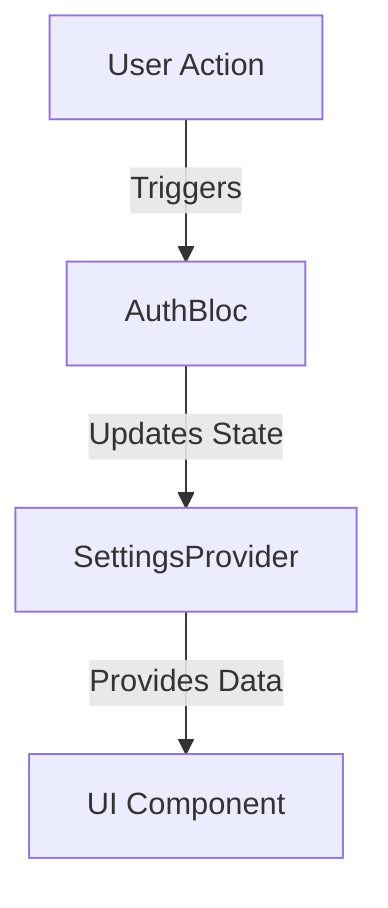

## 8.1.2 Handling Complexity

In the realm of Flutter development, managing state effectively is crucial for building scalable and maintainable applications. As applications grow in complexity, developers often find themselves needing to combine multiple state management solutions to address different aspects of their app's architecture. This section delves into the intricacies of handling complexity when integrating various state management techniques, offering insights into modularization, communication, conflict avoidance, and best practices.

### Managing Increased Complexity

Combining state management solutions can introduce significant complexity into your application's architecture. Each solution, whether it's `Bloc`, `Provider`, `Riverpod`, or others, comes with its own paradigms and mechanisms for handling state. As you integrate multiple solutions, it's essential to maintain a clear separation of concerns to prevent your codebase from becoming unmanageable.

#### Separation of Concerns

A clear separation of concerns ensures that each part of your application is responsible for a specific piece of functionality. This principle is vital when combining state management solutions, as it prevents overlapping responsibilities and helps maintain clarity in your codebase. For example, you might use `Bloc` for handling business logic and complex state transitions, while `Provider` could manage simpler, localized state.

### Modularization

Modularization is a powerful strategy for managing complexity in large applications. By breaking your application into distinct modules or layers, you can ensure that each state management solution operates independently within its domain. This approach not only simplifies development but also enhances testability and maintainability.

#### Structuring Code with Modularization

Consider structuring your application into modules such as `Authentication`, `Settings`, and `UserProfile`. Each module can utilize a different state management solution tailored to its specific needs. For instance:

- **Authentication Module:** Use `Bloc` to handle complex authentication flows and state transitions.
- **Settings Module:** Implement `Provider` for managing user preferences and settings.
- **UserProfile Module:** Leverage `Riverpod` for reactive data fetching and caching.

By isolating state management implementations within modules, you can reduce interdependencies and make your codebase easier to navigate.

### Communication Between Solutions

When combining state management solutions, facilitating communication between them is crucial. Different systems may need to share data or trigger actions in response to state changes. Here are some strategies for handling such interactions:

#### Example: Bloc and Provider Interaction

Consider a scenario where a `Bloc` needs to access data from a `Provider`, and vice versa. Here's how you can achieve this:

```dart
// Bloc accesses Provider
final settings = context.read<SettingsProvider>().settings;

// Provider accesses Bloc
final authBloc = BlocProvider.of<AuthBloc>(context);
```

In this example, the `Bloc` retrieves settings from a `Provider`, while the `Provider` can access the `Bloc` to trigger authentication-related actions. This interaction is facilitated through Flutter's `BuildContext`, ensuring seamless communication between different state management systems.

### Avoiding Conflicts

When multiple state management solutions coexist, potential conflicts such as overlapping responsibilities or duplicate state can arise. To prevent and resolve these issues, consider the following strategies:

#### Centralized State Management

Centralizing state management involves consolidating shared state into a single source of truth. This approach can help avoid duplication and ensure consistency across your application. For instance, you might use a global `Provider` or `Riverpod` to manage app-wide settings or user data.

#### Shared Interfaces

Implementing shared interfaces allows different state management systems to interact without direct dependencies. By defining a common interface for shared functionality, you can decouple systems and reduce the risk of conflicts.

### Documentation and Team Communication

Thorough documentation is essential when combining multiple state management solutions. It helps keep track of how different states interact and ensures that team members understand the architecture. Encourage regular team meetings to discuss state management strategies, share insights, and address challenges collaboratively.

### Mermaid.js Diagrams

Visualizing complex interactions can significantly enhance understanding. Use Mermaid.js diagrams to illustrate how different state management solutions interact within your application. Here's an example of a diagram depicting the flow of data between a `Bloc` and a `Provider`:



This diagram shows how a user action triggers the `AuthBloc`, which updates the state in the `SettingsProvider`, ultimately affecting the UI component.

### Best Practices

To ensure consistency and maintainability, adhere to the following best practices:

- **Consistent Coding Standards:** Establish and follow coding standards across your application to maintain readability and reduce errors.
- **Dependency Injection:** Use dependency injection frameworks to manage dependencies cleanly, facilitating testing and modularization.
- **Regular Refactoring:** Continuously refactor your code to improve structure and reduce complexity.
- **Comprehensive Testing:** Implement unit and integration tests to verify the behavior of different state management solutions and their interactions.

By following these best practices, you can effectively manage complexity and build robust, scalable Flutter applications.

### Conclusion

Handling complexity in state management requires careful planning and execution. By combining multiple solutions thoughtfully, maintaining a clear separation of concerns, and adhering to best practices, you can create a flexible and maintainable architecture. Remember to document your strategies and foster open communication within your team to ensure success.

## Quiz Time!



### What is a key benefit of modularizing your application when combining state management solutions?

- [x] It allows each state management solution to operate independently within its domain.
- [ ] It increases the complexity of the codebase.
- [ ] It requires more resources to manage.
- [ ] It makes testing more difficult.

> **Explanation:** Modularization allows each state management solution to operate independently, simplifying development and enhancing testability.

### How can you facilitate communication between a Bloc and a Provider in Flutter?

- [x] Use Flutter's BuildContext to access data and actions.
- [ ] Directly import each other's classes.
- [ ] Use global variables.
- [ ] Avoid communication between them.

> **Explanation:** Using Flutter's BuildContext allows you to access data and actions between different state management solutions like Bloc and Provider.

### What is a potential conflict when combining multiple state management solutions?

- [x] Overlapping responsibilities or duplicate state.
- [ ] Improved performance.
- [ ] Simplified architecture.
- [ ] Enhanced security.

> **Explanation:** Combining multiple state management solutions can lead to overlapping responsibilities or duplicate state, which need to be managed carefully.

### What is the purpose of using shared interfaces in state management?

- [x] To decouple systems and reduce the risk of conflicts.
- [ ] To increase dependencies between systems.
- [ ] To make the code more complex.
- [ ] To centralize all state management logic.

> **Explanation:** Shared interfaces allow different state management systems to interact without direct dependencies, reducing the risk of conflicts.

### Why is documentation important when combining state management solutions?

- [x] It helps keep track of how different states interact and ensures team members understand the architecture.
- [ ] It is only necessary for large teams.
- [ ] It can be skipped if the code is self-explanatory.
- [ ] It is only useful for debugging.

> **Explanation:** Documentation helps track interactions between states and ensures that all team members understand the architecture, which is crucial when combining solutions.

### What is a benefit of using dependency injection in state management?

- [x] It facilitates testing and modularization.
- [ ] It increases code complexity.
- [ ] It reduces code readability.
- [ ] It eliminates the need for documentation.

> **Explanation:** Dependency injection helps manage dependencies cleanly, facilitating testing and modularization.

### How can centralized state management help avoid conflicts?

- [x] By consolidating shared state into a single source of truth.
- [ ] By duplicating state across modules.
- [ ] By increasing the number of state management solutions.
- [ ] By using global variables.

> **Explanation:** Centralized state management consolidates shared state into a single source of truth, avoiding duplication and ensuring consistency.

### What is a best practice for maintaining consistency in a Flutter application using multiple state management solutions?

- [x] Establish and follow consistent coding standards.
- [ ] Use as many state management solutions as possible.
- [ ] Avoid refactoring the code.
- [ ] Minimize testing efforts.

> **Explanation:** Establishing and following consistent coding standards helps maintain readability and reduce errors in a complex codebase.

### How can Mermaid.js diagrams be useful in managing complexity?

- [x] By visualizing complex interactions and data flows.
- [ ] By replacing the need for written documentation.
- [ ] By simplifying the codebase.
- [ ] By reducing the number of state management solutions needed.

> **Explanation:** Mermaid.js diagrams help visualize complex interactions and data flows, enhancing understanding of the architecture.

### True or False: Combining multiple state management solutions always leads to a simpler architecture.

- [ ] True
- [x] False

> **Explanation:** Combining multiple state management solutions can introduce complexity, and careful planning is needed to manage it effectively.


