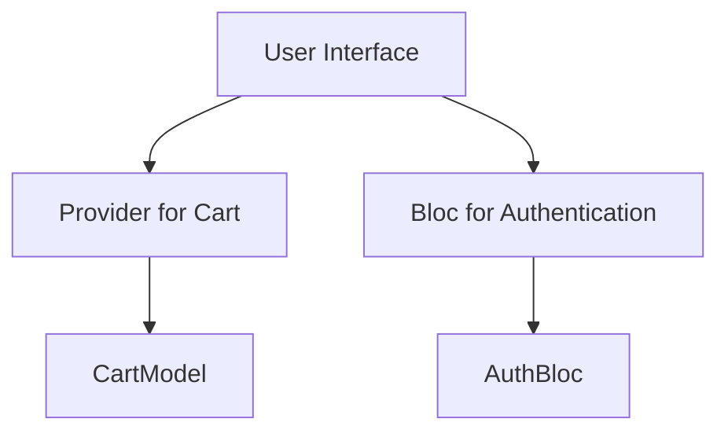
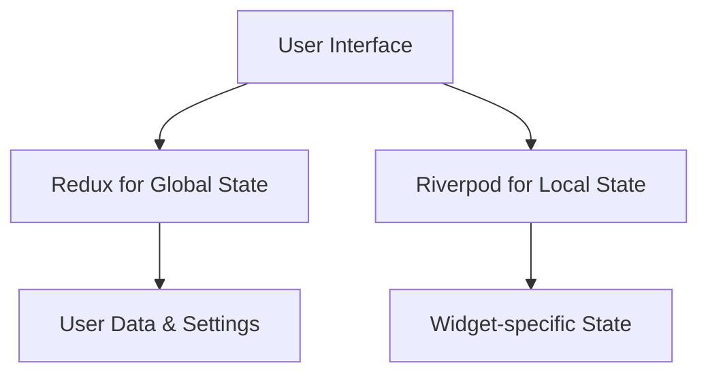

## 8.1.3 Real-World Examples

In the evolving landscape of Flutter development, leveraging multiple state management solutions within a single application can provide a robust and scalable architecture. This approach allows developers to harness the strengths of different solutions, tailoring them to specific needs within the app. In this section, we delve into two comprehensive case studies: an e-commerce application and a social media app, each illustrating how combining state management solutions can optimize performance and maintainability.

### Case Study 1: E-commerce Application

In this e-commerce application, we explore how `Provider` and `Bloc` can be effectively combined to manage different aspects of the app's state. The shopping cart, which requires simple and frequent updates, is managed using `Provider`, while the more complex user authentication flow is handled by `Bloc`.

#### Shopping Cart with Provider

The shopping cart in an e-commerce app is a prime example of ephemeral state that changes frequently as users add or remove items. `Provider` is an ideal choice here due to its simplicity and efficiency in managing local state.

```dart
import 'package:flutter/material.dart';
import 'package:provider/provider.dart';

class CartModel extends ChangeNotifier {
  final List<String> _items = [];

  List<String> get items => _items;

  void addItem(String item) {
    _items.add(item);
    notifyListeners();
  }

  void removeItem(String item) {
    _items.remove(item);
    notifyListeners();
  }
}

void main() {
  runApp(
    ChangeNotifierProvider(
      create: (context) => CartModel(),
      child: MyApp(),
    ),
  );
}

class MyApp extends StatelessWidget {
  @override
  Widget build(BuildContext context) {
    return MaterialApp(
      home: Scaffold(
        appBar: AppBar(title: Text('E-commerce App')),
        body: Consumer<CartModel>(
          builder: (context, cart, child) {
            return ListView.builder(
              itemCount: cart.items.length,
              itemBuilder: (context, index) {
                return ListTile(
                  title: Text(cart.items[index]),
                  trailing: IconButton(
                    icon: Icon(Icons.remove),
                    onPressed: () => cart.removeItem(cart.items[index]),
                  ),
                );
              },
            );
          },
        ),
        floatingActionButton: FloatingActionButton(
          onPressed: () => Provider.of<CartModel>(context, listen: false).addItem('New Item'),
          child: Icon(Icons.add),
        ),
      ),
    );
  }
}
```

**Explanation:**
- `CartModel` is a `ChangeNotifier` that holds the cart's state.
- `Provider` is used to manage and update the cart state efficiently.
- `Consumer` widget listens for changes and rebuilds the UI accordingly.

#### User Authentication with Bloc

User authentication involves more complex logic, such as handling asynchronous operations and managing multiple states (e.g., loading, authenticated, error). `Bloc` is well-suited for this task due to its separation of concerns and use of streams.

```dart
import 'package:flutter_bloc/flutter_bloc.dart';

// Events
abstract class AuthEvent {}

class LoginEvent extends AuthEvent {
  final String username;
  final String password;

  LoginEvent(this.username, this.password);
}

// States
abstract class AuthState {}

class AuthInitial extends AuthState {}

class AuthLoading extends AuthState {}

class Authenticated extends AuthState {}

class AuthError extends AuthState {
  final String message;

  AuthError(this.message);
}

// Bloc
class AuthBloc extends Bloc<AuthEvent, AuthState> {
  AuthBloc() : super(AuthInitial());

  @override
  Stream<AuthState> mapEventToState(AuthEvent event) async* {
    if (event is LoginEvent) {
      yield AuthLoading();
      try {
        // Simulate network call
        await Future.delayed(Duration(seconds: 2));
        yield Authenticated();
      } catch (e) {
        yield AuthError('Login failed');
      }
    }
  }
}
```

**Explanation:**
- `AuthBloc` manages the authentication state using events and states.
- `LoginEvent` triggers the authentication process.
- `AuthState` represents different states of the authentication flow.

#### Integration and Architecture

Combining `Provider` and `Bloc` allows each part of the application to use the most appropriate state management solution. The architecture can be visualized as follows:



**Diagram Explanation:**
- The UI interacts with both `Provider` and `Bloc`.
- `Provider` manages the cart state through `CartModel`.
- `Bloc` handles authentication logic through `AuthBloc`.

### Case Study 2: Social Media App

In this social media application, we explore how `Redux` and `Riverpod` can be combined to manage global and local states, respectively. `Redux` is used for managing global app state, such as user data and settings, while `Riverpod` is used for local state management within specific widgets.

#### Global State Management with Redux

`Redux` is ideal for managing global state due to its predictable state container and unidirectional data flow. In this app, it manages user data and settings.

```dart
import 'package:flutter/material.dart';
import 'package:flutter_redux/flutter_redux.dart';
import 'package:redux/redux.dart';

// Actions
class UpdateUserAction {
  final String username;

  UpdateUserAction(this.username);
}

// Reducer
String userReducer(String state, dynamic action) {
  if (action is UpdateUserAction) {
    return action.username;
  }
  return state;
}

// Store
final store = Store<String>(userReducer, initialState: 'Guest');

void main() {
  runApp(MyApp());
}

class MyApp extends StatelessWidget {
  @override
  Widget build(BuildContext context) {
    return StoreProvider(
      store: store,
      child: MaterialApp(
        home: Scaffold(
          appBar: AppBar(title: Text('Social Media App')),
          body: StoreConnector<String, String>(
            converter: (store) => store.state,
            builder: (context, username) {
              return Center(child: Text('Hello, $username'));
            },
          ),
        ),
      ),
    );
  }
}
```

**Explanation:**
- `UpdateUserAction` is an action to update the username.
- `userReducer` updates the state based on actions.
- `StoreProvider` and `StoreConnector` integrate Redux with the UI.

#### Local State Management with Riverpod

`Riverpod` is used for managing local state within specific widgets, providing a more flexible and modern approach compared to `Provider`.

```dart
import 'package:flutter/material.dart';
import 'package:flutter_riverpod/flutter_riverpod.dart';

final counterProvider = StateProvider<int>((ref) => 0);

void main() {
  runApp(ProviderScope(child: MyApp()));
}

class MyApp extends StatelessWidget {
  @override
  Widget build(BuildContext context) {
    return MaterialApp(
      home: Scaffold(
        appBar: AppBar(title: Text('Counter')),
        body: Center(
          child: Consumer(builder: (context, watch, child) {
            final count = watch(counterProvider).state;
            return Text('$count');
          }),
        ),
        floatingActionButton: FloatingActionButton(
          onPressed: () {
            context.read(counterProvider).state++;
          },
          child: Icon(Icons.add),
        ),
      ),
    );
  }
}
```

**Explanation:**
- `counterProvider` is a `StateProvider` managing the counter state.
- `Consumer` widget listens to state changes and rebuilds the UI.

#### Integration and Architecture

The integration of `Redux` and `Riverpod` in the social media app can be visualized as follows:



**Diagram Explanation:**
- The UI interacts with both `Redux` and `Riverpod`.
- `Redux` manages global state such as user data.
- `Riverpod` handles local state within specific widgets.

### Challenges Faced and Solutions Implemented

**Challenges:**
- **State Synchronization:** Ensuring consistent state updates across different parts of the app can be challenging when using multiple state management solutions.
- **Complexity:** Managing multiple state solutions can increase the complexity of the codebase.

**Solutions:**
- **Clear Separation of Concerns:** Clearly define the responsibilities of each state management solution to avoid overlap.
- **Consistent State Interfaces:** Use consistent interfaces for accessing and updating state to simplify integration.

### Lessons Learned

- **Flexibility:** Combining multiple state management solutions provides flexibility and allows each part of the app to use the most suitable tool.
- **Performance:** Properly managing state with the right tools can lead to performance improvements and a better user experience.
- **Maintainability:** While adding complexity, a well-structured approach can enhance maintainability by isolating state logic.

### Conclusion

Combining multiple state management solutions in Flutter applications allows developers to leverage the strengths of each tool, resulting in a more efficient and maintainable codebase. By carefully selecting and integrating these solutions, developers can address specific challenges and optimize their applications for performance and scalability.

## Quiz Time!



### Which state management solution is used for managing the shopping cart in the e-commerce application case study?

- [x] Provider
- [ ] Bloc
- [ ] Redux
- [ ] Riverpod

> **Explanation:** Provider is used for managing the shopping cart due to its simplicity and efficiency in handling local state.

### What is the primary reason for using Bloc in the e-commerce application?

- [ ] To manage the shopping cart
- [x] To handle user authentication
- [ ] To manage global app state
- [ ] To handle local widget state

> **Explanation:** Bloc is used to handle user authentication because it efficiently manages complex state logic and asynchronous operations.

### In the social media app case study, which solution is used for managing global app state?

- [ ] Provider
- [ ] Bloc
- [x] Redux
- [ ] Riverpod

> **Explanation:** Redux is used for managing global app state such as user data and settings due to its predictable state container.

### Which state management solution is used for local state management in specific widgets of the social media app?

- [ ] Provider
- [ ] Bloc
- [ ] Redux
- [x] Riverpod

> **Explanation:** Riverpod is used for local state management within specific widgets, providing a flexible and modern approach.

### What is a key benefit of combining multiple state management solutions in a Flutter app?

- [x] Flexibility in using the most suitable tool for each part of the app
- [ ] Simplifies the codebase
- [ ] Reduces the need for state management
- [ ] Eliminates the need for testing

> **Explanation:** Combining multiple solutions provides flexibility, allowing developers to use the most suitable tool for each specific need.

### What is a common challenge when using multiple state management solutions?

- [ ] Increased performance
- [x] State synchronization
- [ ] Reduced complexity
- [ ] Improved maintainability

> **Explanation:** Ensuring consistent state updates across different parts of the app can be challenging when using multiple state management solutions.

### How can the complexity of using multiple state management solutions be mitigated?

- [x] By clearly defining the responsibilities of each solution
- [ ] By using only one solution for all state management
- [ ] By avoiding state management altogether
- [ ] By using more complex solutions

> **Explanation:** Clearly defining the responsibilities of each state management solution helps avoid overlap and reduces complexity.

### What is a lesson learned from combining multiple state management solutions?

- [ ] It always decreases performance
- [x] It provides flexibility and can improve maintainability
- [ ] It eliminates the need for state management
- [ ] It simplifies the codebase

> **Explanation:** Combining solutions provides flexibility and can improve maintainability by isolating state logic.

### Which diagramming tool is used to visualize the architecture and data flow in the case studies?

- [ ] UML
- [x] Mermaid.js
- [ ] Lucidchart
- [ ] Visio

> **Explanation:** Mermaid.js is used to create diagrams that visualize the architecture and data flow in the applications.

### True or False: Using multiple state management solutions always simplifies the codebase.

- [ ] True
- [x] False

> **Explanation:** While using multiple solutions can provide flexibility and performance benefits, it can also increase the complexity of the codebase.


