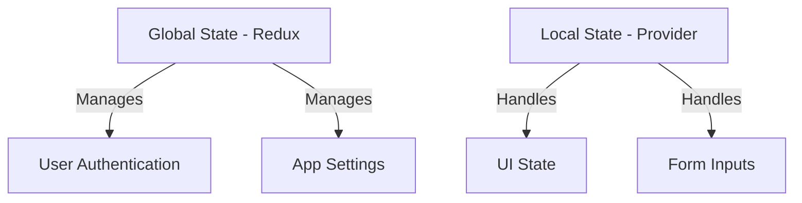
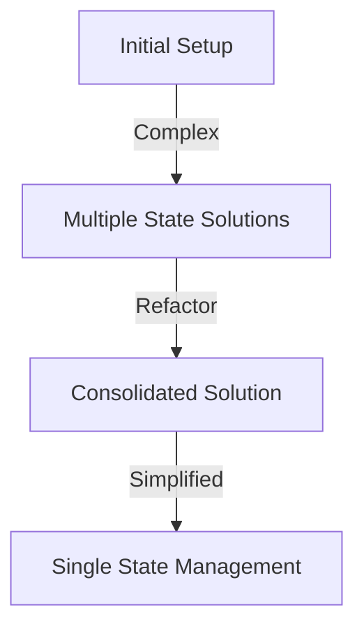

## 8.1.4 Potential Pitfalls and How to Avoid Them

In the realm of Flutter development, state management is a critical aspect that can significantly influence the maintainability and performance of an application. As applications grow in complexity, developers often find themselves combining multiple state management solutions to address different needs within the app. While this approach can offer flexibility and power, it also introduces potential pitfalls that can lead to increased complexity and maintenance challenges. This section delves into these common pitfalls and provides strategies to avoid them, ensuring your application remains robust and manageable.

### Identifying Common Pitfalls

When combining multiple state management solutions, developers can encounter several common issues:

- **State Duplication:** This occurs when the same piece of state is managed by more than one solution, leading to inconsistencies and synchronization problems.
- **Conflicting Updates:** Different state management solutions might attempt to update the same state simultaneously, causing unpredictable behavior.
- **Increased Cognitive Load:** Managing multiple solutions can overwhelm developers, making it difficult to track state changes and understand the application's flow.
- **Debugging Difficulty:** With multiple layers of state management, identifying the source of a bug can become challenging, complicating the debugging process.

### Strategies to Avoid Pitfalls

To mitigate these pitfalls, consider the following strategies:

#### Centralized State Management

Centralizing shared state can prevent duplication and ensure consistency across your application. Here are some tips:

- **Primary State Management Solution:** Use a primary solution, such as Redux or Bloc, for managing global state that needs to be accessed across different parts of the application. Reserve other solutions, like Provider or Riverpod, for local state management where appropriate.

```dart
// Example of using Redux for global state
final store = Store<AppState>(
  appReducer,
  initialState: AppState.initial(),
  middleware: [loggingMiddleware],
);

// Using Provider for local state
class LocalStateNotifier extends ChangeNotifier {
  int _counter = 0;

  int get counter => _counter;

  void increment() {
    _counter++;
    notifyListeners();
  }
}
```

#### Clear Boundaries

Defining clear boundaries and responsibilities for each state management solution can help maintain clarity:

- **Separation of Concerns:** Assign specific responsibilities to each state management solution. For example, use Bloc for handling business logic and Provider for simple UI state.



#### Consistent Naming Conventions

Using consistent naming conventions can reduce confusion and improve code readability:

- **Naming Patterns:** Adopt a naming pattern that reflects the purpose and scope of each state variable or function. For instance, prefix global state variables with `global` and local ones with `local`.

```dart
// Consistent naming for state variables
int globalUserCount;
int localCounter;
```

#### Code Reviews and Testing

Implementing rigorous code reviews and comprehensive testing can catch potential issues early:

- **Peer Reviews:** Encourage team members to review each other's code to identify potential pitfalls.
- **Unit and Integration Tests:** Write tests to ensure that state updates occur as expected and that different solutions interact correctly.

```dart
// Example of a unit test for a state update
void main() {
  test('Counter increments', () {
    final counter = LocalStateNotifier();
    counter.increment();
    expect(counter.counter, 1);
  });
}
```

### Debugging Techniques

Effective debugging is crucial when dealing with multiple state management solutions:

- **Logging and Debugging Tools:** Use logging to track state changes and identify issues. Tools like Flutter DevTools and Redux DevTools can provide insights into state transitions.

```dart
// Example of logging middleware in Redux
void loggingMiddleware(Store<AppState> store, action, NextDispatcher next) {
  print('Dispatching action: $action');
  next(action);
  print('New state: ${store.state}');
}
```

- **State Inspectors:** Utilize state inspectors to visualize state changes and understand the flow of data within your application.

### Refactoring

When your state management setup becomes unwieldy, consider refactoring:

- **Simplification:** Consolidate state management solutions if necessary to simplify your architecture. This might involve migrating from multiple solutions to a single, more comprehensive one.



### Key Takeaways

- **Foresight and Planning:** Anticipate potential pitfalls by planning your state management strategy carefully. Consider the scope and complexity of your application before choosing solutions.
- **Continuous Evaluation:** Regularly evaluate your state management setup to ensure it remains efficient and manageable as your application evolves.
- **Adaptation:** Be open to adapting your strategy as new tools and techniques emerge, ensuring your application stays current with best practices.

By understanding these potential pitfalls and implementing the strategies outlined above, you can effectively manage state in your Flutter applications, even when combining multiple solutions. This approach will help maintain a clean, efficient, and scalable codebase, ultimately leading to a better developer experience and a more robust application.

## Quiz Time!



### What is a common issue when combining multiple state management solutions?

- [x] State duplication
- [ ] Faster performance
- [ ] Reduced complexity
- [ ] Increased security

> **Explanation:** State duplication occurs when the same piece of state is managed by more than one solution, leading to inconsistencies.

### Which strategy helps prevent state duplication?

- [x] Centralized state management
- [ ] Using more state management solutions
- [ ] Ignoring state conflicts
- [ ] Increasing cognitive load

> **Explanation:** Centralized state management helps prevent duplication by managing shared state in a single solution.

### What is a benefit of defining clear boundaries for state management solutions?

- [x] Improved clarity and separation of concerns
- [ ] Increased debugging difficulty
- [ ] More complex codebase
- [ ] Reduced performance

> **Explanation:** Clear boundaries improve clarity and separation of concerns, making the codebase easier to manage.

### How can consistent naming conventions help in state management?

- [x] Reduce confusion and improve readability
- [ ] Increase code complexity
- [ ] Make debugging harder
- [ ] Slow down development

> **Explanation:** Consistent naming conventions reduce confusion and improve code readability.

### What is the role of code reviews in state management?

- [x] Catch potential issues early
- [ ] Increase the number of bugs
- [x] Improve code quality
- [ ] Reduce collaboration

> **Explanation:** Code reviews help catch potential issues early and improve overall code quality.

### Which tool can be used for logging state changes in a Redux setup?

- [x] Logging middleware
- [ ] Flutter DevTools
- [ ] Riverpod
- [ ] Provider

> **Explanation:** Logging middleware is used in Redux to log state changes and actions.

### What is a sign that refactoring might be needed in a state management setup?

- [x] The setup becomes unwieldy
- [ ] The app runs smoothly
- [x] Increased complexity
- [ ] Reduced code readability

> **Explanation:** When the state management setup becomes unwieldy or complex, refactoring might be necessary.

### How can state inspectors help in debugging?

- [x] Visualize state changes
- [ ] Increase code complexity
- [ ] Slow down the application
- [ ] Reduce performance

> **Explanation:** State inspectors help visualize state changes, aiding in understanding the flow of data.

### Why is continuous evaluation important in state management?

- [x] Ensures the setup remains efficient
- [ ] Increases debugging difficulty
- [ ] Reduces code quality
- [ ] Slows down development

> **Explanation:** Continuous evaluation ensures the state management setup remains efficient and manageable.

### True or False: Combining multiple state management solutions always increases performance.

- [ ] True
- [x] False

> **Explanation:** Combining multiple state management solutions can increase complexity and may not always lead to better performance.


