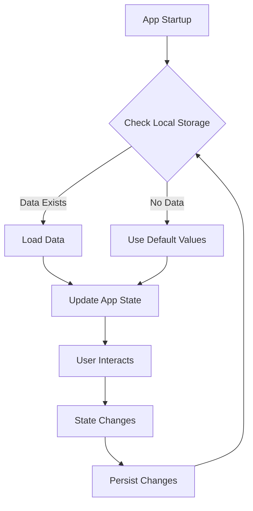

## 8.2.1 Persisting State Locally

In modern mobile applications, maintaining a seamless user experience often requires persisting state locally. This capability ensures that user preferences, cached data, and offline functionality are preserved across app sessions. In this section, we will delve into the reasons for local state persistence, explore various storage solutions available in Flutter, and provide practical guidance on implementing these solutions effectively.

### Reasons for Local Persistence

Local persistence is crucial for several reasons:

- **User Preferences:** Saving user settings, such as theme preferences or language choices, enhances personalization and user satisfaction.
- **Data Caching:** Caching data locally can significantly improve app performance by reducing network requests and loading times.
- **Offline Functionality:** Allowing users to access certain features without an internet connection is vital for a robust user experience.

By persisting state locally, developers can create applications that are more responsive, reliable, and user-friendly.

### Persistence Solutions

Flutter offers several local storage options, each with its own strengths and weaknesses. Let's explore some of the most popular solutions:

#### SharedPreferences

**SharedPreferences** is a simple key-value storage solution ideal for storing small amounts of data, such as user preferences.

- **Pros:**
  - Easy to use and integrate.
  - Suitable for storing primitive data types.
- **Cons:**
  - Not suitable for complex data structures.
  - Limited to small data sizes.

#### SQLite

**SQLite** is a powerful relational database engine that provides structured data storage.

- **Pros:**
  - Supports complex queries and relationships.
  - Well-suited for structured data.
- **Cons:**
  - Requires more setup and management.
  - May be overkill for simple data needs.

#### Hive

**Hive** is a lightweight and fast key-value database designed for Flutter applications.

- **Pros:**
  - Fast and efficient for both read and write operations.
  - Supports complex data types with minimal overhead.
- **Cons:**
  - Requires additional setup for advanced features like encryption.

#### Moor/Drift

**Moor** (now known as **Drift**) is an ORM-like layer on top of SQLite, providing a more developer-friendly interface.

- **Pros:**
  - Combines the power of SQLite with an easy-to-use API.
  - Supports reactive data streams.
- **Cons:**
  - Adds an abstraction layer that may introduce complexity.

### Implementing Persistence

To illustrate the implementation of local persistence, we'll focus on using Hive, a popular choice for its simplicity and performance.

#### Example with Hive

##### Setup

1. **Add Dependencies:**

   Add the following dependencies to your `pubspec.yaml` file:

   ```yaml
   dependencies:
     hive: ^2.0.0
     hive_flutter: ^1.0.0

   dev_dependencies:
     hive_generator: ^1.0.0
     build_runner: ^2.0.0
   ```

2. **Initialize Hive:**

   Initialize Hive in the `main` function of your application:

   ```dart
   import 'package:flutter/material.dart';
   import 'package:hive_flutter/hive_flutter.dart';

   void main() async {
     await Hive.initFlutter();
     runApp(MyApp());
   }
   ```

##### Storing Data

To store data in Hive, open a box and use the `put` method:

```dart
var box = await Hive.openBox('settings');
box.put('isDarkMode', true);
```

##### Retrieving Data

Retrieve data using the `get` method, providing a default value if the key does not exist:

```dart
bool isDarkMode = box.get('isDarkMode', defaultValue: false);
```

#### Integration with State Management

To integrate Hive with your state management solution, follow these steps:

- **Update State on Startup:**

  Load persisted data when the app starts and update the state accordingly. This ensures that the app reflects the user's last known preferences or data.

  ```dart
  void loadSettings() async {
    var box = await Hive.openBox('settings');
    bool isDarkMode = box.get('isDarkMode', defaultValue: false);
    // Update your state management solution with this value
  }
  ```

- **Persist State Changes:**

  Whenever the state changes, update the persisted data to reflect these changes.

  ```dart
  void toggleDarkMode(bool value) {
    var box = Hive.box('settings');
    box.put('isDarkMode', value);
    // Update your state management solution
  }
  ```

### Best Practices

- **Asynchronous Operations:** Always perform I/O tasks asynchronously to prevent blocking the UI thread.
- **Data Encryption:** Use encryption for sensitive data to enhance security.
- **Error Handling:** Implement robust error handling to manage read/write failures gracefully. Consider using fallback mechanisms or default values.

### Error Handling

When dealing with local persistence, errors can occur during read or write operations. Here are some strategies to handle these errors:

- **Try-Catch Blocks:** Use try-catch blocks to catch exceptions and handle them appropriately.
- **Default Values:** Provide default values when retrieving data to ensure the app can continue functioning even if the data is missing or corrupted.
- **Logging:** Log errors for further analysis and debugging.

### Mermaid.js Diagrams

Below is a diagram illustrating the flow of data between the state management solution and local storage using Hive:



### Key Takeaways

- Local persistence is essential for enhancing user experience by maintaining state across sessions.
- Choose the right storage solution based on your app's requirements, considering factors like data complexity and performance needs.
- Implement best practices such as asynchronous operations and error handling to ensure a smooth and secure user experience.

By understanding and applying these techniques, you can create Flutter applications that are not only efficient but also provide a seamless and personalized experience for users.

## Quiz Time!



### What is a primary reason for persisting state locally in a Flutter application?

- [x] To maintain user preferences across sessions
- [ ] To increase the app's file size
- [ ] To reduce the app's performance
- [ ] To complicate the app's architecture

> **Explanation:** Persisting state locally helps maintain user preferences, ensuring a consistent user experience across app sessions.

### Which local storage solution is best suited for storing simple key-value pairs in Flutter?

- [x] SharedPreferences
- [ ] SQLite
- [ ] Hive
- [ ] Moor/Drift

> **Explanation:** SharedPreferences is ideal for storing simple key-value pairs due to its simplicity and ease of use.

### What is a disadvantage of using SQLite for local persistence in Flutter?

- [ ] It is easy to set up
- [x] It may be overkill for simple data needs
- [ ] It supports complex queries
- [ ] It is lightweight

> **Explanation:** SQLite is a powerful database engine, but it may be unnecessarily complex for simple data storage needs.

### How does Hive differ from SharedPreferences?

- [x] Hive supports complex data types
- [ ] Hive is slower than SharedPreferences
- [ ] Hive is only for Android
- [ ] Hive requires no setup

> **Explanation:** Hive supports complex data types and is designed for fast read and write operations, unlike SharedPreferences, which is limited to primitive data types.

### What is a best practice when performing I/O tasks for local persistence?

- [x] Perform tasks asynchronously
- [ ] Perform tasks synchronously
- [ ] Ignore error handling
- [ ] Block the UI thread

> **Explanation:** Performing I/O tasks asynchronously prevents blocking the UI thread, ensuring a smooth user experience.

### Which strategy is recommended for handling read/write errors in local persistence?

- [x] Use try-catch blocks
- [ ] Ignore errors
- [ ] Use synchronous operations
- [ ] Disable error logging

> **Explanation:** Using try-catch blocks allows developers to handle exceptions gracefully and maintain app stability.

### What is the role of the `put` method in Hive?

- [x] To store data in a Hive box
- [ ] To retrieve data from a Hive box
- [ ] To delete data from a Hive box
- [ ] To initialize Hive

> **Explanation:** The `put` method is used to store data in a Hive box, associating a value with a specific key.

### What should be done if sensitive data is stored locally?

- [x] Use encryption
- [ ] Store it in plain text
- [ ] Ignore security concerns
- [ ] Use SharedPreferences

> **Explanation:** Encrypting sensitive data enhances security and protects user information from unauthorized access.

### What is a benefit of using Moor/Drift over raw SQLite?

- [x] It provides an ORM-like interface
- [ ] It is more complex to use
- [ ] It lacks reactive data streams
- [ ] It is slower than SQLite

> **Explanation:** Moor/Drift offers an ORM-like interface, simplifying database interactions and supporting reactive data streams.

### True or False: Local persistence can improve app performance by reducing network requests.

- [x] True
- [ ] False

> **Explanation:** By caching data locally, apps can reduce the need for frequent network requests, improving performance and responsiveness.


