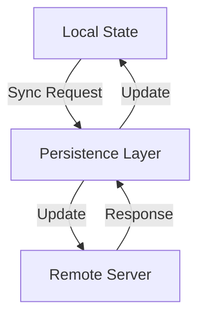

## 8.2.2 Syncing with Remote Data

In the ever-evolving landscape of mobile applications, maintaining a seamless and consistent user experience across devices and sessions is paramount. A critical aspect of achieving this is ensuring that the local state of an application is synchronized with remote data sources, such as cloud databases or servers. This section delves into the intricacies of data synchronization in Flutter applications, providing insights into various synchronization strategies, conflict resolution techniques, and best practices to ensure robust and efficient state management.

### Understanding Data Synchronization

Data synchronization refers to the process of ensuring that data across different systems or components remains consistent. In the context of state management, it involves keeping the local state of an application in sync with remote servers. This is crucial in scenarios where data is shared across multiple devices or users, such as collaborative applications, social media platforms, or e-commerce systems.

#### Scenarios for Data Synchronization

- **Collaborative Applications:** Multiple users interacting with shared data, such as documents or project management tools.
- **E-commerce Platforms:** Synchronizing inventory and order status between the app and backend systems.
- **Social Media Apps:** Keeping user feeds and notifications up-to-date with server-side changes.

### Implementing Sync Mechanisms

There are several patterns for implementing data synchronization, each suited to different use cases and requirements.

#### Manual Syncing

Manual syncing is triggered by explicit user actions, such as pulling to refresh a list or pressing a sync button. This approach gives users control over when data is updated but may lead to outdated information if not used frequently.

```dart
// Example of manual syncing in Flutter
void manualSync() {
  // Trigger data fetch from the server
  fetchDataFromServer().then((data) {
    // Update local state with fetched data
    setState(() {
      localData = data;
    });
  }).catchError((error) {
    // Handle errors
    print('Error syncing data: $error');
  });
}
```

#### Automatic Syncing

Automatic syncing occurs periodically or in response to specific events, such as app launch or network reconnection. This ensures that data is regularly updated without user intervention.

```dart
// Example of automatic syncing using a timer
Timer.periodic(Duration(minutes: 5), (timer) {
  fetchDataFromServer().then((data) {
    // Update local state
    updateLocalState(data);
  });
});
```

#### Real-time Syncing

Real-time syncing involves continuous updates between the client and server, often using technologies like WebSockets or Firebase. This approach is ideal for applications requiring instant updates, such as chat apps or live dashboards.

```dart
// Example of real-time syncing with Firebase
StreamSubscription<DocumentSnapshot> subscription;
void startRealTimeSync() {
  subscription = FirebaseFirestore.instance
      .collection('data')
      .doc('documentId')
      .snapshots()
      .listen((snapshot) {
    // Update local state with real-time data
    updateLocalState(snapshot.data());
  });
}
```

### Conflict Resolution Strategies

When local and remote data diverge, conflicts can arise. Effective conflict resolution strategies are essential to maintain data integrity.

#### Last Write Wins

In this strategy, the most recent change overwrites others. While simple, it may lead to data loss if not carefully managed.

#### Merge Strategies

Merge strategies involve combining changes from multiple sources. This can be complex but helps preserve all modifications.

#### User Prompts

Prompting users to resolve conflicts manually can be effective in applications where user input is critical, such as collaborative editing tools.

```dart
// Example of prompting user for conflict resolution
void resolveConflict(localData, remoteData) {
  if (localData != remoteData) {
    showDialog(
      context: context,
      builder: (context) => AlertDialog(
        title: Text('Conflict Detected'),
        content: Text('Choose which data to keep'),
        actions: [
          TextButton(
            onPressed: () {
              // Keep local data
              updateRemoteData(localData);
              Navigator.pop(context);
            },
            child: Text('Keep Local'),
          ),
          TextButton(
            onPressed: () {
              // Keep remote data
              updateLocalState(remoteData);
              Navigator.pop(context);
            },
            child: Text('Keep Remote'),
          ),
        ],
      ),
    );
  }
}
```

### Implementing with State Management

Integrating synchronization into state management logic requires careful planning and execution. Let's explore an example using `Bloc` and `Firebase`.

#### Example with `Bloc` and `Firebase`

In this example, we'll demonstrate how to listen to Firebase streams and update the `Bloc` state, as well as dispatch events when local changes need to be synced upstream.

```dart
// Bloc event for syncing data
abstract class DataEvent {}

class FetchData extends DataEvent {}

class UpdateData extends DataEvent {
  final Map<String, dynamic> newData;

  UpdateData(this.newData);
}

// Bloc state
abstract class DataState {}

class DataInitial extends DataState {}

class DataLoaded extends DataState {
  final Map<String, dynamic> data;

  DataLoaded(this.data);
}

// Bloc implementation
class DataBloc extends Bloc<DataEvent, DataState> {
  final FirebaseFirestore firestore;

  DataBloc(this.firestore) : super(DataInitial()) {
    on<FetchData>((event, emit) async {
      // Listen to Firebase stream
      firestore.collection('data').snapshots().listen((snapshot) {
        emit(DataLoaded(snapshot.data()));
      });
    });

    on<UpdateData>((event, emit) async {
      // Update Firebase with new data
      await firestore.collection('data').doc('documentId').set(event.newData);
    });
  }
}
```

### Handling Offline Scenarios

Designing applications to handle offline scenarios gracefully is crucial for maintaining a positive user experience. Patterns such as queueing actions to be performed when connectivity is restored can be effective.

```dart
// Example of queueing actions for offline handling
List<Function> actionQueue = [];

void performAction(Function action) {
  if (isConnected()) {
    action();
  } else {
    actionQueue.add(action);
  }
}

void onConnectivityRestored() {
  for (var action in actionQueue) {
    action();
  }
  actionQueue.clear();
}
```

### Optimistic Updates

Optimistic updates provide immediate UI feedback before the server confirms the change. This approach enhances user experience but requires handling potential failures, such as reverting changes if the server update fails.

```dart
// Example of optimistic updates
void updateDataOptimistically(Map<String, dynamic> newData) {
  // Update UI immediately
  setState(() {
    localData = newData;
  });

  // Attempt to update server
  updateRemoteData(newData).catchError((error) {
    // Revert changes if update fails
    setState(() {
      localData = previousData;
    });
  });
}
```

### Best Practices

- **Efficient Data Fetching:** Use techniques like pagination or delta updates to minimize data transfer.
- **Robust Error Handling:** Implement retry logic and error handling to manage network failures gracefully.
- **Security Considerations:** Ensure data synchronization processes are secure, especially when handling sensitive information.

### Mermaid.js Diagrams

To better understand the synchronization process, let's visualize the data flow between local state, persistence layer, and remote server.



### Key Takeaways

- **Complexity of Syncing:** Data synchronization is a complex process that requires careful planning and implementation.
- **Reliable Mechanisms:** A reliable and user-friendly synchronization mechanism is essential for maintaining data consistency and enhancing user experience.

By understanding and implementing these advanced state management techniques, you can ensure that your Flutter applications provide a seamless and consistent experience for users, regardless of their connectivity status or device.

## Quiz Time!



### What is data synchronization in the context of state management?

- [x] Ensuring data consistency between local and remote systems
- [ ] Storing data locally on the device
- [ ] Encrypting data for security
- [ ] Compressing data to save space

> **Explanation:** Data synchronization involves keeping data consistent between local and remote systems, ensuring that changes are reflected across all platforms.

### Which of the following is a manual syncing method?

- [x] User-triggered refresh
- [ ] Periodic updates
- [ ] Real-time updates
- [ ] Automatic background sync

> **Explanation:** Manual syncing is typically triggered by user actions, such as a refresh button, allowing users to control when data is updated.

### What is a potential drawback of the "Last Write Wins" conflict resolution strategy?

- [x] It may lead to data loss
- [ ] It requires user intervention
- [ ] It is too complex to implement
- [ ] It is not suitable for real-time applications

> **Explanation:** The "Last Write Wins" strategy can lead to data loss as it overwrites previous changes without considering their importance.

### How can optimistic updates enhance user experience?

- [x] By providing immediate feedback
- [ ] By delaying server updates
- [ ] By requiring user confirmation
- [ ] By reducing network traffic

> **Explanation:** Optimistic updates provide immediate feedback to users, making the application feel more responsive even before server confirmation.

### Which technology is commonly used for real-time data synchronization?

- [x] WebSockets
- [ ] HTTP requests
- [ ] FTP
- [ ] Email

> **Explanation:** WebSockets are commonly used for real-time data synchronization as they allow continuous, bidirectional communication between client and server.

### What is a common pattern for handling offline scenarios?

- [x] Queueing actions for later execution
- [ ] Disabling the app until connectivity is restored
- [ ] Automatically deleting unsynced data
- [ ] Prompting the user to reconnect

> **Explanation:** Queueing actions for later execution ensures that user actions are preserved and executed once connectivity is restored.

### What is a benefit of using merge strategies for conflict resolution?

- [x] Preserving changes from multiple sources
- [ ] Simplifying the synchronization process
- [ ] Eliminating the need for user input
- [ ] Reducing server load

> **Explanation:** Merge strategies help preserve changes from multiple sources, ensuring that all modifications are considered in the final data state.

### How can you ensure efficient data fetching during synchronization?

- [x] Using pagination or delta updates
- [ ] Fetching all data at once
- [ ] Ignoring server responses
- [ ] Only updating data once a day

> **Explanation:** Efficient data fetching techniques like pagination or delta updates minimize data transfer and improve synchronization performance.

### What is the role of the persistence layer in data synchronization?

- [x] It acts as an intermediary between local state and remote server
- [ ] It stores data permanently on the device
- [ ] It encrypts data for security
- [ ] It compresses data to save space

> **Explanation:** The persistence layer acts as an intermediary, managing the flow of data between the local state and the remote server during synchronization.

### True or False: Real-time syncing is ideal for applications that require instant updates.

- [x] True
- [ ] False

> **Explanation:** Real-time syncing is indeed ideal for applications that require instant updates, such as chat apps or live dashboards, as it ensures data is continuously updated.


