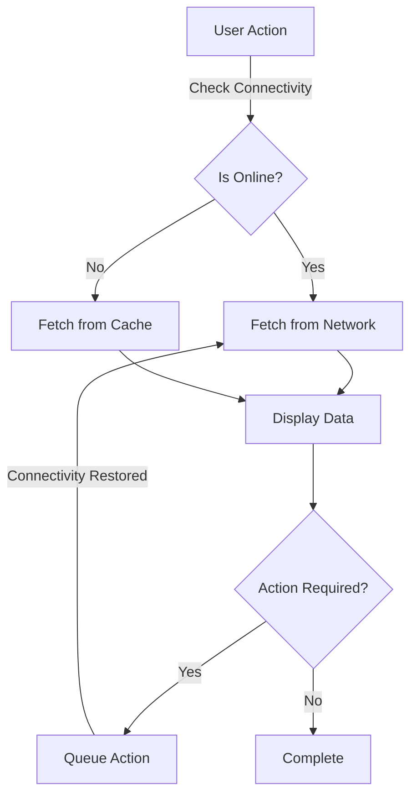

## 8.2.3 Offline Support

In today's fast-paced digital world, users expect seamless experiences from their mobile applications, regardless of network connectivity. Offline support is a crucial feature that enhances user experience by allowing app usage without a constant internet connection. This section delves into the importance of offline support, strategies for designing offline-first applications, caching techniques, and best practices for implementing offline functionality in Flutter.

### Importance of Offline Support

Offline support significantly enhances user experience by ensuring that applications remain functional even when network connectivity is unavailable. This capability is particularly important for users in areas with unreliable internet access or those who frequently travel. By enabling offline functionality, applications can:

- **Improve User Engagement:** Users are more likely to engage with an app that works reliably, regardless of connectivity.
- **Increase App Reliability:** Offline support reduces the dependency on network availability, making the app more robust.
- **Enhance User Satisfaction:** Providing a seamless experience without interruptions leads to higher user satisfaction and retention.

### Designing for Offline First

Designing for offline-first means building applications that function offline by default and synchronize data when connectivity is restored. This approach requires careful planning and implementation of strategies to manage data locally and ensure consistency. Key strategies include:

- **Local Data Storage:** Store essential data locally to ensure the app remains functional offline.
- **Data Synchronization:** Implement mechanisms to sync data with the server when connectivity is available.
- **Graceful Degradation:** Ensure that the app degrades gracefully, providing limited functionality when offline.

### Caching Strategies

Caching is a fundamental technique for managing data in offline-first applications. It involves storing data locally to improve access speed and reduce network dependency. Common caching strategies include:

- **Cache Aside:** The application checks the cache before fetching data from the network. If the data is not present, it retrieves it from the network and stores it in the cache for future use.
  
  ```dart
  Future<Data> fetchData() async {
    var data = await cache.getData();
    if (data == null) {
      data = await network.fetchData();
      cache.storeData(data);
    }
    return data;
  }
  ```

- **Read-Through Cache:** The application fetches data from the cache, which automatically loads data from the network if it is not present in the cache.

- **Write-Through Cache:** Writes are performed to the cache and then propagated to the network, ensuring consistency between local and remote data.

### Implementing Offline Functionality

Implementing offline functionality in Flutter involves using local storage solutions and detecting network connectivity changes. Here are some practical steps:

#### Caching Data Locally

Flutter provides several options for local data storage, such as `shared_preferences`, `sqflite`, and `hive`. These packages allow you to store data locally in a structured format.

```dart
import 'package:hive/hive.dart';

void cacheData(String key, dynamic value) async {
  var box = await Hive.openBox('myBox');
  box.put(key, value);
}

dynamic retrieveData(String key) async {
  var box = await Hive.openBox('myBox');
  return box.get(key);
}
```

#### Detecting Network Connectivity

The `connectivity_plus` package is a powerful tool for detecting network connectivity changes. It allows you to check the current connectivity status and listen for changes.

```dart
import 'package:connectivity_plus/connectivity_plus.dart';

void checkConnectivity() async {
  final connectivityResult = await Connectivity().checkConnectivity();
  if (connectivityResult == ConnectivityResult.none) {
    print('No internet connection');
  } else {
    print('Connected to the internet');
  }
}
```

#### Handling State Changes Based on Connectivity

You can use the connectivity status to adjust the app's behavior, such as disabling certain features when offline or queuing actions to be performed when connectivity is restored.

### Data Consistency and Conflict Management

Ensuring data integrity when transitioning between offline and online states is crucial. Here are some strategies:

- **Conflict Resolution:** Implement conflict resolution strategies to handle discrepancies between local and remote data. This may involve merging changes or prompting the user to resolve conflicts.
  
- **Versioning:** Use versioning to track changes and ensure that the latest data is used when syncing.

- **Atomic Operations:** Ensure that data operations are atomic, meaning they are completed fully or not at all, to prevent partial updates.

### User Experience Considerations

Providing a seamless user experience involves communicating the app's offline status and managing user expectations. Consider the following:

- **Visual Indicators:** Use visual indicators, such as icons or banners, to inform users of the app's offline status.

- **Deferred Actions:** Clearly communicate when actions are deferred due to lack of connectivity and provide feedback once they are completed.

### Best Practices

Implementing offline support requires careful consideration of several best practices:

- **Track Pending Actions:** Keep a queue of actions that need to be synced when connectivity is restored.

- **Limit Local Data:** Avoid storing excessive amounts of data locally to prevent storage issues.

- **Test Offline Scenarios:** Thoroughly test the app's behavior in offline scenarios to ensure reliability.

### Mermaid.js Diagrams

Below is a diagram illustrating the flow of data and actions in offline and online modes:



### Key Takeaways

- **Plan and Test:** Thoroughly plan and test offline scenarios to ensure a seamless user experience.
- **User Engagement:** Offline support enhances user engagement and satisfaction by providing a reliable app experience.
- **Data Management:** Implement robust data management strategies to ensure consistency and integrity.

By incorporating offline support into your Flutter applications, you can significantly enhance the user experience, making your app more reliable and engaging. This not only improves user satisfaction but also increases the likelihood of retaining users in the long term. As you implement these strategies, consider the specific needs of your application and users, and continuously test and refine your approach to achieve the best results.

## Quiz Time!



### What is the primary benefit of offline support in mobile applications?

- [x] Enhances user experience by allowing app usage without network connectivity
- [ ] Reduces app development time
- [ ] Increases app monetization opportunities
- [ ] Simplifies app architecture

> **Explanation:** Offline support enhances user experience by allowing users to continue using the app even when there is no network connectivity, ensuring reliability and engagement.

### Which caching strategy involves checking the cache before fetching from the network?

- [x] Cache Aside
- [ ] Read-Through Cache
- [ ] Write-Through Cache
- [ ] Cache Invalidation

> **Explanation:** Cache Aside strategy involves the application checking the cache before fetching data from the network, storing it in the cache if not present.

### What package is commonly used in Flutter to detect network connectivity changes?

- [x] connectivity_plus
- [ ] sqflite
- [ ] shared_preferences
- [ ] hive

> **Explanation:** The `connectivity_plus` package is used in Flutter to detect network connectivity changes and manage app behavior accordingly.

### How can you ensure data integrity when transitioning between offline and online states?

- [x] Implement conflict resolution strategies
- [ ] Store all data locally
- [ ] Disable offline functionality
- [ ] Use only local databases

> **Explanation:** Implementing conflict resolution strategies helps ensure data integrity by managing discrepancies between local and remote data.

### What should you do to provide a seamless user experience regarding offline status?

- [x] Use visual indicators to inform users of offline status
- [ ] Hide all features when offline
- [ ] Automatically delete local data
- [ ] Ignore connectivity changes

> **Explanation:** Using visual indicators helps inform users of the app's offline status, enhancing transparency and user experience.

### Which of the following is a best practice for managing offline data?

- [x] Track pending actions to be synced
- [ ] Store unlimited data locally
- [ ] Avoid testing offline scenarios
- [ ] Use only synchronous operations

> **Explanation:** Tracking pending actions to be synced ensures that all necessary operations are completed once connectivity is restored.

### What is a key consideration when designing for offline-first applications?

- [x] Local data storage and synchronization
- [ ] Reducing app features
- [ ] Increasing network dependency
- [ ] Simplifying user interface

> **Explanation:** Designing for offline-first involves local data storage and synchronization to ensure app functionality without network connectivity.

### What is the role of versioning in offline support?

- [x] Track changes and ensure the latest data is used
- [ ] Increase app complexity
- [ ] Simplify data structures
- [ ] Reduce app size

> **Explanation:** Versioning helps track changes and ensures that the latest data is used when syncing, maintaining data integrity.

### How can you handle deferred actions due to lack of connectivity?

- [x] Communicate to users when actions are deferred
- [ ] Ignore deferred actions
- [ ] Automatically cancel all actions
- [ ] Disable app features

> **Explanation:** Communicating to users when actions are deferred helps manage expectations and provides feedback once actions are completed.

### True or False: Offline support is only beneficial for users in areas with unreliable internet access.

- [x] False
- [ ] True

> **Explanation:** Offline support benefits all users by ensuring app functionality regardless of connectivity, enhancing reliability and user experience.


