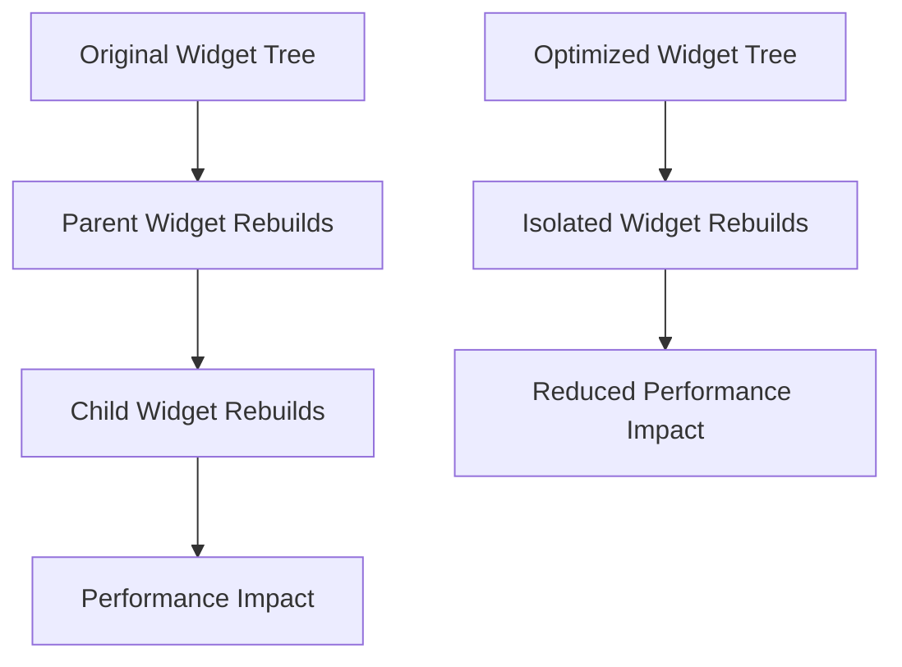

## 8.3.1 Reducing Widget Rebuilds

In the world of Flutter development, achieving smooth and responsive user interfaces is paramount. One of the key factors influencing performance is how efficiently the widget tree is managed, particularly in terms of widget rebuilds. In this section, we delve into the intricacies of widget rebuilds, identify common causes of excessive rebuilds, and explore advanced techniques to optimize performance by reducing unnecessary rebuilds.

### Understanding Widget Rebuilds

Flutter's architecture is built around the concept of a widget tree. Each widget in Flutter represents a part of the user interface, and these widgets are organized in a hierarchical structure. When a widget's state changes, Flutter rebuilds the widget tree to reflect these changes. While this reactive approach is powerful, it can lead to performance issues if not managed carefully.

#### How Flutter's Widget Tree Works

At the core of Flutter's rendering engine is the widget tree, which is a representation of the UI structure. The widget tree is rebuilt whenever there is a change in the state that affects the UI. This rebuilding process involves:

- **Creating New Widgets:** New instances of widgets are created to reflect changes.
- **Updating the Render Tree:** The render tree, which is responsible for painting the UI, is updated based on the new widget tree.
- **Layout and Paint Phases:** The layout and paint phases are executed to render the updated UI on the screen.

While this process is efficient for small changes, excessive or unnecessary rebuilds can lead to performance bottlenecks, causing the UI to lag or stutter.

### Identifying Causes of Excessive Rebuilds

To optimize performance, it's crucial to identify and address the common causes of excessive widget rebuilds:

- **Indiscriminate Use of `setState`:** Overusing `setState` can trigger unnecessary rebuilds. It's important to call `setState` only when the specific part of the UI affected by the state change needs to be updated.
  
- **Rebuilding Parent Widgets:** When a parent widget is rebuilt, all its child widgets are also rebuilt. This can lead to entire subtrees being unnecessarily rebuilt, impacting performance.

- **Inappropriate Use of Keys:** Keys are used to preserve the state of widgets when they are moved in the widget tree. Not using keys appropriately can lead to widgets being rebuilt unnecessarily.

### Optimization Techniques

To mitigate the impact of excessive widget rebuilds, consider the following optimization techniques:

#### Use of `const` Constructors

Using `const` constructors for widgets that do not change can prevent them from being rebuilt unnecessarily. `const` widgets are instantiated once and reused, reducing the overhead of widget creation.

```dart
const Text('Hello, World!');
```

#### Extracting Widgets

Breaking down large widgets into smaller, reusable components can help isolate rebuilds to only the parts of the UI that need to change. This approach promotes a more modular and maintainable codebase.

```dart
class MyWidget extends StatelessWidget {
  @override
  Widget build(BuildContext context) {
    return Column(
      children: [
        HeaderWidget(),
        ContentWidget(),
        FooterWidget(),
      ],
    );
  }
}
```

#### Using `Consumer` and `Selector` Widgets Wisely

In state management solutions like Provider, using `Consumer` and `Selector` widgets can help limit rebuilds to only the parts of the UI that depend on specific pieces of state.

```dart
Selector<MyModel, SomeValue>(
  selector: (_, model) => model.someValue,
  builder: (_, value, __) {
    return Text('$value');
  },
);
```

#### Immutable Data Structures

Using immutable objects ensures that changes to state do not have unintended side effects, which can trigger unnecessary rebuilds. Immutable data structures promote predictable state changes.

#### Memoization

Memoization involves caching the results of expensive operations to prevent them from being recomputed unnecessarily. This technique can significantly reduce the workload during widget rebuilds.

### Performance Profiling

Profiling tools are essential for identifying performance bottlenecks related to widget rebuilds. Flutter provides several tools for performance profiling:

- **Flutter's Performance Overlay:** This tool provides a visual representation of the frame rendering performance, helping identify jank and slow frames.

- **DevTools:** Flutter DevTools offers a suite of performance profiling tools, including a timeline view to analyze frame rendering and identify rebuild hotspots.

- **`flutter_driver`:** This tool allows for automated performance testing, enabling developers to simulate user interactions and measure performance metrics.

### Best Practices

To further optimize widget rebuilds, consider the following best practices:

- **Avoid Logic in the `build` Method:** Keep the `build` method focused on UI construction. Move any logic or state manipulation outside the `build` method to prevent unnecessary rebuilds.

- **Use `AnimatedBuilder` and `ValueListenableBuilder`:** These widgets provide efficient ways to rebuild only parts of the UI that need to change, reducing the impact on performance.

- **Be Cautious with Global Keys:** While global keys can be useful for preserving state, they can also impact performance if overused. Use them judiciously.

### Mermaid.js Diagrams

To visualize the impact of optimization techniques, consider the following diagrams illustrating the widget tree before and after optimization:



### Key Takeaways

Efficient widget rebuilding is crucial for maintaining smooth and responsive UIs in Flutter applications. By understanding the causes of excessive rebuilds and implementing optimization techniques, developers can significantly enhance app performance. Continuous profiling and adherence to best practices are essential for identifying and addressing performance bottlenecks throughout the development process.

## Quiz Time!



### What is a common cause of excessive widget rebuilds in Flutter?

- [x] Indiscriminate use of `setState`
- [ ] Using `const` constructors
- [ ] Extracting widgets into smaller components
- [ ] Using immutable data structures

> **Explanation:** Indiscriminate use of `setState` can trigger unnecessary widget rebuilds, impacting performance.

### How can `const` constructors help reduce widget rebuilds?

- [x] They prevent widgets from being rebuilt unnecessarily.
- [ ] They increase the complexity of the widget tree.
- [ ] They are only useful for stateful widgets.
- [ ] They require additional memory usage.

> **Explanation:** `const` constructors allow widgets to be instantiated once and reused, reducing the need for rebuilding.

### What is the purpose of using `Selector` widgets in state management?

- [x] To limit rebuilds to only parts of the UI that depend on specific state.
- [ ] To increase the number of widget rebuilds.
- [ ] To replace `Consumer` widgets entirely.
- [ ] To manage global state across the app.

> **Explanation:** `Selector` widgets help limit rebuilds to only those parts of the UI that depend on specific pieces of state, optimizing performance.

### Which tool provides a visual representation of frame rendering performance in Flutter?

- [x] Flutter's Performance Overlay
- [ ] DevTools
- [ ] `flutter_driver`
- [ ] `flutter_test`

> **Explanation:** Flutter's Performance Overlay provides a visual representation of frame rendering performance, helping identify jank and slow frames.

### Why should logic be avoided in the `build` method?

- [x] To prevent unnecessary widget rebuilds.
- [ ] To increase the complexity of the widget tree.
- [ ] To ensure all widgets are stateful.
- [ ] To reduce the number of `setState` calls.

> **Explanation:** Keeping logic out of the `build` method helps prevent unnecessary widget rebuilds, optimizing performance.

### What is the benefit of using immutable data structures in Flutter?

- [x] They prevent unintended side effects that can trigger rebuilds.
- [ ] They increase the complexity of state management.
- [ ] They require more memory usage.
- [ ] They are only useful for local state.

> **Explanation:** Immutable data structures ensure that changes to state do not have unintended side effects, preventing unnecessary rebuilds.

### How does memoization help in reducing widget rebuilds?

- [x] By caching results of expensive operations to prevent recomputation.
- [ ] By increasing the number of widget rebuilds.
- [ ] By replacing `setState` calls.
- [ ] By managing global state across the app.

> **Explanation:** Memoization caches the results of expensive operations, reducing the need for recomputation and unnecessary widget rebuilds.

### What is a potential downside of overusing global keys in Flutter?

- [x] They can impact performance if overused.
- [ ] They prevent widgets from being rebuilt.
- [ ] They are only useful for local state.
- [ ] They increase the complexity of the widget tree.

> **Explanation:** While global keys can be useful for preserving state, they can impact performance if overused.

### Which widget can be used to efficiently rebuild only parts of the UI that need to change?

- [x] AnimatedBuilder
- [ ] StatefulWidget
- [ ] StatelessWidget
- [ ] GlobalKey

> **Explanation:** `AnimatedBuilder` provides an efficient way to rebuild only parts of the UI that need to change, reducing the impact on performance.

### True or False: Continuous profiling is essential for identifying performance bottlenecks related to widget rebuilds.

- [x] True
- [ ] False

> **Explanation:** Continuous profiling is essential for identifying and addressing performance bottlenecks related to widget rebuilds, ensuring smooth UI performance.


