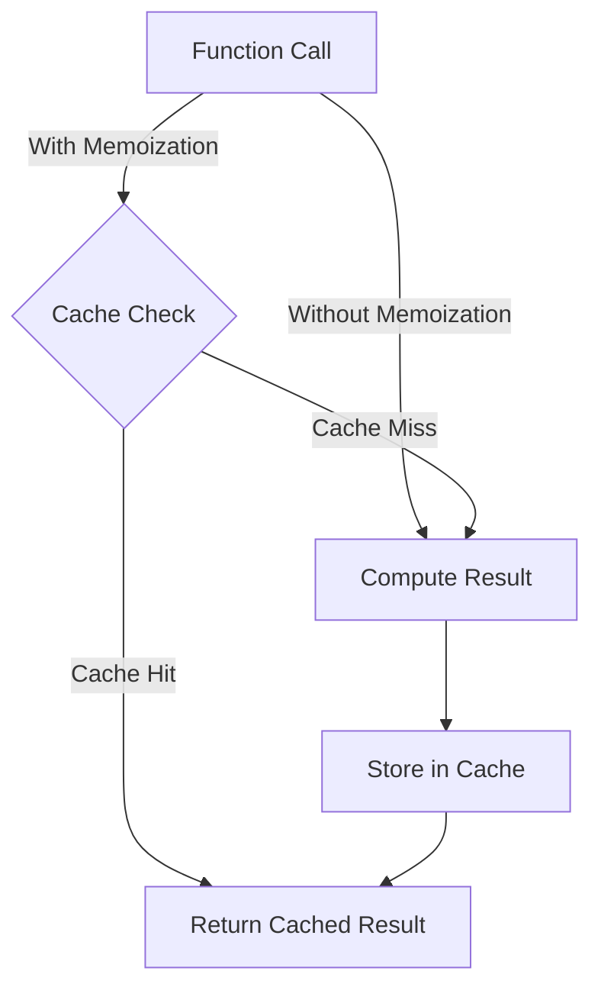

## 8.3.2 Memoization Techniques

In the realm of software development, particularly in Flutter applications, performance optimization is a crucial aspect that can significantly enhance user experience. One of the powerful techniques to achieve this is memoization. This section delves into the concept of memoization, its implementation in Dart, and its application in state management, providing practical examples and insights into best practices.

### Understanding Memoization

Memoization is a technique used to cache the results of expensive function calls and return the cached result when the same inputs occur again. This approach prevents redundant computations, thereby optimizing performance, especially in scenarios where functions are called repeatedly with the same parameters.

#### Key Concepts of Memoization

- **Caching Results:** Memoization stores the results of function calls in a cache, allowing subsequent calls with the same inputs to retrieve results directly from the cache.
- **Avoiding Redundant Computations:** By caching results, memoization avoids the need to recompute results for the same inputs, saving time and computational resources.
- **Efficiency in Repeated Calls:** Memoization is particularly beneficial in applications where certain computations are repeated frequently, such as in recursive algorithms or state management scenarios.

### Implementing Memoization in Dart

In Dart, memoization can be implemented using various approaches, including utilizing existing packages or creating custom memoization logic. Below, we explore both methods.

#### Using Packages for Memoization

The Dart ecosystem offers packages like `memoize` that simplify the implementation of memoization. These packages provide utilities to cache function results efficiently.

#### Custom Memoization Example

Implementing custom memoization in Dart involves creating a cache to store computed results. Here's an example using a recursive Fibonacci function:

```dart
Map<int, int> cache = {};

int fibonacci(int n) {
  if (cache.containsKey(n)) return cache[n]!;
  if (n <= 1) return n;
  cache[n] = fibonacci(n - 1) + fibonacci(n - 2);
  return cache[n]!;
}
```

In this example, the Fibonacci function checks if the result for a given `n` is already in the cache. If so, it returns the cached result; otherwise, it computes the result, stores it in the cache, and then returns it.

### Using `compute` Function for Heavy Computations

For heavy computations that might block the main thread, Dart provides the `compute` function to offload processing to background isolates. This is particularly useful for tasks that are computationally intensive and can benefit from parallel execution.

```dart
import 'package:flutter/foundation.dart';

Future<int> expensiveFunction(int inputData) async {
  // Simulate a heavy computation
  return inputData * 2;
}

void main() async {
  final result = await compute(expensiveFunction, 10);
  print(result); // Output: 20
}
```

The `compute` function takes a top-level function and its input data, executing the function in a separate isolate and returning the result asynchronously.

### Memoization in State Management

Memoization plays a significant role in state management, particularly in optimizing computed properties and selectors. Frameworks like MobX, Redux, and Provider leverage memoization to enhance performance by caching derived state.

#### Computed Properties in MobX

In MobX, computed properties are inherently memoized. They cache their results and only recompute when their dependencies change, making them efficient for derived state.

#### Selectors in Redux and Provider

Selectors in Redux and Provider act as memoized functions that derive state from the store. They ensure that components only re-render when the specific slice of state they depend on changes.

```dart
import 'package:provider/provider.dart';

class AppState {
  final int counter;
  AppState(this.counter);
}

int selectCounter(AppState state) => state.counter;

void main() {
  final store = Provider.of<AppState>(context);
  final counter = selectCounter(store);
  // The component will only re-render if the counter value changes
}
```

### Best Practices

While memoization is a powerful tool, it should be used judiciously. Here are some best practices to consider:

- **Avoid Overuse:** Overusing memoization can lead to unnecessary complexity and memory usage. Use it only when there are clear performance benefits.
- **Cache Invalidation:** Implement proper cache invalidation logic to ensure that stale data is not used. This is crucial in dynamic applications where state frequently changes.
- **Measure Performance:** Always measure performance before and after implementing memoization to ensure that it provides the desired benefits.

### Performance Measurement

To validate the effectiveness of memoization, it's essential to measure performance metrics such as execution time and memory usage before and after applying memoization techniques. Tools like the Dart DevTools can assist in profiling and analyzing performance.

### Visualizing Memoization with Mermaid.js

To better understand the impact of memoization, let's visualize function calls with and without memoization using Mermaid.js diagrams.



In this diagram, we see that with memoization, a cache check is performed before computation. If the result is cached, it's returned immediately, saving computation time.

### Key Takeaways

Memoization is a valuable technique for optimizing performance in Flutter applications. By caching expensive function results, it prevents redundant computations and enhances efficiency. However, it should be used appropriately, with careful consideration of cache invalidation and performance measurement.

### Additional Resources

- [Dart DevTools](https://flutter.dev/docs/development/tools/devtools/overview) for performance profiling
- [MobX Documentation](https://mobx.netlify.app/getting-started) for understanding computed properties
- [Redux Selectors](https://redux.js.org/recipes/computing-derived-data) for leveraging memoization in state management

## Quiz Time!



### What is memoization?

- [x] A technique to cache the results of expensive function calls
- [ ] A method to increase the size of the cache
- [ ] A way to reduce the number of function calls
- [ ] A technique to optimize memory usage

> **Explanation:** Memoization involves caching the results of expensive function calls to avoid redundant computations.

### How does memoization improve performance?

- [x] By preventing redundant computations
- [ ] By increasing the number of computations
- [ ] By reducing the size of the application
- [ ] By optimizing memory usage

> **Explanation:** Memoization improves performance by caching results and preventing redundant computations when inputs haven't changed.

### Which function in Dart can offload heavy computations to background isolates?

- [x] `compute`
- [ ] `isolate`
- [ ] `async`
- [ ] `await`

> **Explanation:** The `compute` function in Dart is used to offload heavy computations to background isolates.

### What is a key benefit of using computed properties in MobX?

- [x] They are inherently memoized
- [ ] They require manual caching
- [ ] They increase memory usage
- [ ] They decrease application performance

> **Explanation:** Computed properties in MobX are inherently memoized, meaning they cache their results and only recompute when dependencies change.

### In Redux and Provider, what acts as memoized functions?

- [x] Selectors
- [ ] Reducers
- [ ] Actions
- [ ] Dispatchers

> **Explanation:** Selectors in Redux and Provider act as memoized functions that derive state from the store.

### What should be considered when using memoization?

- [x] Cache invalidation logic
- [ ] Increasing cache size
- [ ] Reducing function calls
- [ ] Optimizing memory usage

> **Explanation:** Proper cache invalidation logic is crucial to ensure that stale data is not used in dynamic applications.

### How can you measure the performance impact of memoization?

- [x] By comparing execution time and memory usage before and after implementation
- [ ] By increasing the cache size
- [ ] By reducing the number of function calls
- [ ] By optimizing memory usage

> **Explanation:** Performance impact can be measured by comparing execution time and memory usage before and after implementing memoization.

### What is a potential downside of overusing memoization?

- [x] Unnecessary complexity
- [ ] Increased application speed
- [ ] Reduced memory usage
- [ ] Simplified codebase

> **Explanation:** Overusing memoization can lead to unnecessary complexity and increased memory usage.

### Which tool can assist in profiling and analyzing performance in Dart?

- [x] Dart DevTools
- [ ] Redux DevTools
- [ ] MobX Inspector
- [ ] Flutter Analyzer

> **Explanation:** Dart DevTools is a tool that can assist in profiling and analyzing performance in Dart applications.

### True or False: Memoization always improves performance.

- [ ] True
- [x] False

> **Explanation:** Memoization does not always improve performance; it depends on the context and proper implementation.


