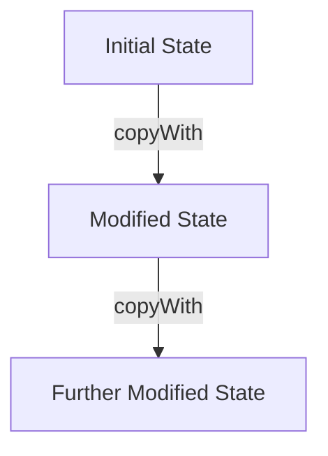

## 8.3.3 Using Immutable Data Structures

In the realm of state management, immutability plays a pivotal role in enhancing the robustness and maintainability of applications. This section delves into the advantages of using immutable data structures, how to implement them in Dart, and their impact on performance and state management.

### Advantages of Immutability

Immutability refers to the concept where data structures, once created, cannot be altered. This approach offers several benefits:

- **Predictability:** Immutable data structures ensure that once a state is set, it remains unchanged. This predictability simplifies reasoning about code behavior, as developers can be confident that no part of the application will inadvertently modify the state.

- **Easier Debugging:** With immutable data, debugging becomes more straightforward. Since the state cannot change unexpectedly, tracking down bugs related to state mutations is easier. Developers can focus on the logic that creates new states rather than worrying about hidden mutations.

- **Avoiding Unintended Side Effects:** Immutability prevents side effects that occur when one part of the application inadvertently changes the state that another part relies on. This leads to more stable and reliable applications.

- **Performance Improvement:** Immutable data structures can improve performance by enabling shallow comparisons. When comparing two immutable objects, you only need to check their references rather than their entire contents, which can be a significant optimization.

### Implementing Immutability in Dart

Dart, the language used for Flutter development, provides several ways to implement immutability:

#### Using `const` Constructors and `final` Fields

The simplest way to create immutable classes in Dart is by using `const` constructors and `final` fields. Here's an example:

```dart
class Point {
  final double x;
  final double y;

  const Point(this.x, this.y);
}

void main() {
  const point = Point(1.0, 2.0);
  // point.x = 3.0; // This will cause a compile-time error
}
```

In this example, the `Point` class is immutable because its fields are `final`, and it uses a `const` constructor.

#### Using Packages: `built_value` and `freezed`

For more complex data structures, Dart offers packages like `built_value` and `freezed` that automate the creation of immutable classes.

##### `freezed` Package Example

The `freezed` package is a popular choice for generating immutable data classes in Dart. Here's how you can use it:

1. **Add the package to your `pubspec.yaml`:**

   ```yaml
   dependencies:
     freezed_annotation: ^0.14.0
   dev_dependencies:
     build_runner: ^2.1.0
     freezed: ^0.14.0
   ```

2. **Define a data class using `freezed`:**

   ```dart
   import 'package:freezed_annotation/freezed_annotation.dart';
   part 'user.freezed.dart';

   @freezed
   class User with _$User {
     const factory User({required String name, required int age}) = _User;
   }
   ```

   This code defines an immutable `User` class with `name` and `age` fields. The `freezed` package generates the necessary boilerplate code for immutability and other features like `copyWith`.

### Copying with Modifications

Immutable objects cannot be modified after creation. Instead, you create new instances with updated values using methods like `copyWith`. Here's an example using the `User` class from above:

```dart
void main() {
  final user = User(name: 'Alice', age: 30);
  final updatedUser = user.copyWith(name: 'Bob');

  print(user); // Output: User(name: Alice, age: 30)
  print(updatedUser); // Output: User(name: Bob, age: 30)
}
```

The `copyWith` method creates a new `User` instance with the specified modifications, leaving the original instance unchanged.

### Immutability in State Management

Immutability is crucial in state management solutions like Redux. It enables features such as:

- **Time-Travel Debugging:** By maintaining a history of immutable states, developers can "travel" back and forth in time to inspect how the application reached its current state.

- **State Snapshots:** Immutable states allow for easy creation of snapshots, which can be used for debugging or restoring previous states.

### Performance Considerations

While immutability can lead to increased memory usage due to the creation of new objects, the benefits often outweigh the costs. The ability to perform shallow comparisons and the reduction in bugs related to state mutations can lead to overall performance improvements.

### Best Practices

- **Consistent Use:** Apply immutable data structures consistently throughout your application to maintain predictability and reliability.

- **Efficient Data Structures:** Combine immutability with efficient data structures, such as collections from the `kt_dart` package, to optimize performance.

### Mermaid.js Diagrams

To visualize the concept of state transitions using immutable objects, consider the following Mermaid.js diagram:



This diagram illustrates how state transitions occur by creating new instances rather than modifying existing ones.

### Key Takeaways

- Immutability enhances predictability, debugging, and performance.
- Dart provides tools like `const` constructors and packages like `freezed` for implementing immutability.
- Immutability is essential in state management solutions for features like time-travel debugging.
- While there is a memory cost, the benefits of immutability often outweigh the drawbacks.
- Consistent use of immutable data structures leads to robust and maintainable code.

By embracing immutability, you can build more reliable and maintainable Flutter applications. Experiment with the examples provided and consider how immutability can benefit your projects.

## Quiz Time!



### What is one of the main advantages of using immutable data structures?

- [x] Predictability in code behavior
- [ ] Reduced memory usage
- [ ] Increased complexity
- [ ] Faster write operations

> **Explanation:** Immutable data structures ensure that once a state is set, it remains unchanged, leading to predictable code behavior.

### How can you create an immutable class in Dart?

- [x] Use `const` constructors and `final` fields
- [ ] Use `var` for fields
- [ ] Use `mutable` keyword
- [ ] Use `dynamic` for fields

> **Explanation:** In Dart, you can create immutable classes by using `const` constructors and `final` fields, ensuring that the state cannot be altered after creation.

### Which package is commonly used for generating immutable data classes in Dart?

- [x] `freezed`
- [ ] `mutable`
- [ ] `dart_immutable`
- [ ] `stateful`

> **Explanation:** The `freezed` package is widely used in Dart for generating immutable data classes, providing features like `copyWith`.

### What does the `copyWith` method do?

- [x] Creates a new instance with updated values
- [ ] Modifies the original instance
- [ ] Deletes the original instance
- [ ] Copies the instance to a new variable

> **Explanation:** The `copyWith` method creates a new instance with specified modifications, leaving the original instance unchanged.

### Why is immutability important in Redux?

- [x] It enables time-travel debugging and state snapshots
- [ ] It reduces the need for state management
- [ ] It allows direct state mutations
- [ ] It simplifies UI rendering

> **Explanation:** Immutability in Redux allows for time-travel debugging and easy creation of state snapshots, enhancing the debugging process.

### What is a potential downside of using immutable data structures?

- [x] Increased memory usage
- [ ] Unpredictable code behavior
- [ ] Difficulty in debugging
- [ ] Increased risk of side effects

> **Explanation:** While immutability offers many benefits, it can lead to increased memory usage due to the creation of new objects for each state change.

### Which of the following is a best practice when using immutable data structures?

- [x] Consistent use throughout the application
- [ ] Use only in specific parts of the application
- [ ] Avoid using with efficient data structures
- [ ] Use only for temporary data

> **Explanation:** Consistent use of immutable data structures throughout the application ensures predictability and reliability.

### What does the `freezed` package provide?

- [x] Automatic generation of immutable data classes
- [ ] Mutable data class generation
- [ ] State management solutions
- [ ] UI components

> **Explanation:** The `freezed` package provides tools for automatically generating immutable data classes in Dart.

### How can immutability improve performance?

- [x] By enabling shallow comparisons
- [ ] By reducing memory allocation
- [ ] By increasing write speeds
- [ ] By simplifying algorithms

> **Explanation:** Immutability allows for shallow comparisons, which can improve performance by reducing the need to compare entire object contents.

### True or False: Immutability can lead to more reliable applications.

- [x] True
- [ ] False

> **Explanation:** True. Immutability prevents unintended side effects and hidden state mutations, leading to more reliable applications.


