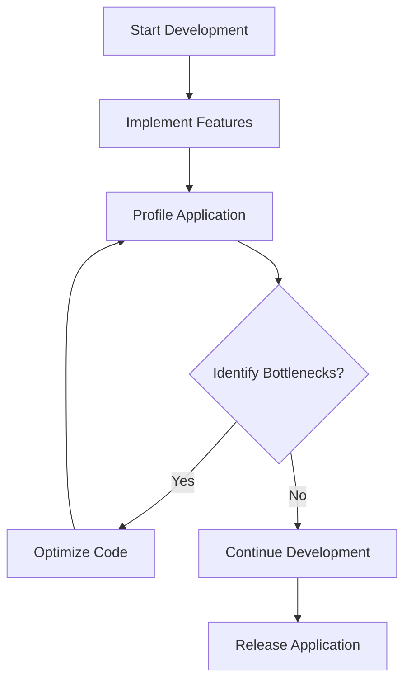

## 8.3.4 Profiling and Benchmarking

In the realm of Flutter development, ensuring your application performs optimally is crucial for delivering a seamless user experience. Profiling and benchmarking are essential techniques that help developers identify performance bottlenecks, optimize resource usage, and maintain high standards of app performance. This section delves into the importance of profiling, how to effectively use Flutter DevTools, benchmarking code, and implementing automated performance testing.

### Importance of Profiling

Profiling is the process of measuring various aspects of your application's performance to identify inefficiencies and areas for improvement. It provides insights into how your app uses CPU, memory, and other resources, allowing you to pinpoint bottlenecks that could degrade user experience.

- **Identifying Bottlenecks:** Profiling helps uncover slow rendering frames, excessive memory usage, and CPU-intensive operations.
- **Optimizing Resource Usage:** By understanding how your app consumes resources, you can make informed decisions to optimize performance.
- **Enhancing User Experience:** A well-profiled app ensures smooth animations, quick load times, and efficient resource management, leading to a better user experience.

### Using Flutter DevTools

Flutter DevTools is a powerful suite of tools designed to help developers profile and debug their Flutter applications. It provides a comprehensive view of your app's performance, including frame rendering, CPU usage, and memory allocation.

#### Timeline View

The Timeline View in Flutter DevTools is instrumental in analyzing how your app renders frames. It provides a detailed breakdown of each frame, highlighting the time spent in various phases such as layout, painting, and compositing.

- **Analyzing Frame Rendering:** Use the Timeline View to identify frames that take longer to render and investigate the causes.
- **Optimizing Animation Performance:** By understanding the rendering process, you can optimize animations and transitions for smoother performance.

#### CPU Profiler

The CPU Profiler helps identify functions that consume significant processing power. By analyzing CPU usage, you can detect expensive operations and optimize them for better performance.

- **Identifying Expensive Functions:** Use the CPU Profiler to pinpoint functions that are CPU-intensive and refactor them for efficiency.
- **Improving Computational Efficiency:** Optimize algorithms and data processing tasks to reduce CPU load.

#### Memory Tab

Memory management is critical in Flutter applications, especially for long-running apps. The Memory Tab in Flutter DevTools allows you to monitor memory allocation and detect potential leaks.

- **Monitoring Memory Allocation:** Track how your app allocates and deallocates memory over time.
- **Detecting Memory Leaks:** Identify objects that are not being properly disposed of, preventing memory leaks.

#### Screenshots and Explanations

While screenshots cannot be included here, when using Flutter DevTools, you will find intuitive interfaces for each of these tools. The Timeline View provides a graphical representation of frame rendering, the CPU Profiler displays a call tree of function calls, and the Memory Tab shows a real-time graph of memory usage.

### Benchmarking Code

Benchmarking involves measuring the performance of specific code segments to understand their efficiency. The `benchmark_harness` package in Dart provides a simple way to write benchmarks for your code.

```dart
import 'package:benchmark_harness/benchmark_harness.dart';

class MyBenchmark extends BenchmarkBase {
  const MyBenchmark() : super('MyBenchmark');

  @override
  void run() {
    // Code to benchmark
  }
}

void main() {
  MyBenchmark().report();
}
```

- **Writing Benchmarks:** Use the `benchmark_harness` package to create benchmarks for critical code paths.
- **Measuring Execution Time:** Benchmarking helps measure the execution time of functions and identify areas for optimization.

### Automated Performance Testing

Automated performance testing ensures that your app maintains its performance standards throughout development. The `flutter_driver` and `integration_test` packages facilitate automated performance tests.

- **Setting Up Performance Tests:** Use `flutter_driver` to simulate user interactions and measure app performance.
- **Continuous Monitoring:** Integrate performance tests into your CI/CD pipeline to catch regressions early.

### Analyzing Results

Interpreting the data collected from profiling and benchmarking is crucial for making informed optimization decisions.

- **Setting Performance Budgets:** Define acceptable performance thresholds and monitor adherence over time.
- **Data-Driven Optimization:** Use profiling data to focus optimization efforts on areas with the most significant impact.

### Best Practices

- **Regular Profiling:** Make profiling a regular part of your development workflow to catch performance issues early.
- **Focus on Impactful Areas:** Prioritize optimization efforts on code paths that significantly affect performance.
- **Integrate Performance Checks:** Incorporate performance checks into your CI/CD pipeline for continuous monitoring.

### Mermaid.js Diagrams

Below is a diagram illustrating the steps in profiling and how they relate to the development process.



### Key Takeaways

- **Data-Driven Optimization:** Performance optimization should be guided by data collected through profiling and benchmarking.
- **Proactive Approach:** Regular profiling and performance testing help maintain optimal app performance.

### References and Further Reading

- [Flutter DevTools Documentation](https://flutter.dev/docs/development/tools/devtools/overview)
- [Dart Benchmark Harness](https://pub.dev/packages/benchmark_harness)
- [Flutter Driver](https://flutter.dev/docs/cookbook/testing/integration/introduction)
- [Integration Test Package](https://pub.dev/packages/integration_test)

## Quiz Time!



### What is the primary purpose of profiling in Flutter applications?

- [x] To identify performance bottlenecks and optimize resource usage.
- [ ] To add new features to the application.
- [ ] To improve the application's user interface design.
- [ ] To manage application state.

> **Explanation:** Profiling helps identify performance bottlenecks and optimize resource usage, ensuring the application runs efficiently.

### Which tool in Flutter DevTools helps analyze frame rendering?

- [x] Timeline View
- [ ] CPU Profiler
- [ ] Memory Tab
- [ ] Widget Inspector

> **Explanation:** The Timeline View in Flutter DevTools is used to analyze how frames are rendered, helping identify rendering bottlenecks.

### What is the purpose of the CPU Profiler in Flutter DevTools?

- [x] To identify functions that consume significant processing power.
- [ ] To monitor network requests.
- [ ] To manage application state.
- [ ] To design user interfaces.

> **Explanation:** The CPU Profiler helps identify functions that are CPU-intensive, allowing developers to optimize them for better performance.

### How does the `benchmark_harness` package help in performance optimization?

- [x] It allows developers to write benchmarks for specific code segments.
- [ ] It automatically optimizes code for better performance.
- [ ] It provides a graphical interface for designing applications.
- [ ] It manages application state.

> **Explanation:** The `benchmark_harness` package helps developers write benchmarks to measure the performance of specific code segments.

### What is a key benefit of automated performance testing?

- [x] Continuous monitoring of app performance throughout development.
- [ ] Automatic feature implementation.
- [ ] Improved user interface design.
- [ ] Simplified state management.

> **Explanation:** Automated performance testing ensures that app performance is continuously monitored, catching regressions early in the development process.

### Which package is used for automated performance tests in Flutter?

- [x] flutter_driver
- [ ] provider
- [ ] bloc
- [ ] riverpod

> **Explanation:** The `flutter_driver` package is used for automated performance tests, simulating user interactions and measuring app performance.

### What should be defined to ensure performance standards are maintained?

- [x] Performance budgets
- [ ] New features
- [ ] User interface guidelines
- [ ] State management strategies

> **Explanation:** Performance budgets define acceptable performance thresholds, helping ensure standards are maintained over time.

### Why is regular profiling important in the development workflow?

- [x] To catch performance issues early.
- [ ] To add new features quickly.
- [ ] To improve user interface design.
- [ ] To manage application state.

> **Explanation:** Regular profiling helps catch performance issues early, allowing developers to address them before they affect users.

### What is the role of the Memory Tab in Flutter DevTools?

- [x] To monitor memory allocation and detect leaks.
- [ ] To manage application state.
- [ ] To design user interfaces.
- [ ] To optimize CPU usage.

> **Explanation:** The Memory Tab in Flutter DevTools monitors memory allocation and helps detect potential memory leaks.

### True or False: Performance optimization should be guided by data collected through profiling and benchmarking.

- [x] True
- [ ] False

> **Explanation:** Performance optimization should be data-driven, using insights from profiling and benchmarking to guide improvements.


