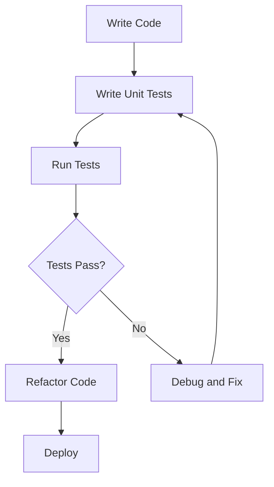

## 8.4.1 Unit Testing State Logic

Unit testing is a fundamental practice in software development that ensures individual components of an application function as intended. In the context of Flutter and its state management solutions, unit testing plays a crucial role in verifying the correctness of state transitions and logic. This article delves into the intricacies of unit testing state logic, providing detailed insights, practical examples, and best practices for testing state management in Flutter applications.

### Purpose of Unit Testing

Unit tests are designed to validate the smallest parts of an application, typically functions or methods, in isolation from the rest of the codebase. The primary goals of unit testing include:

- **Verification of Functionality:** Ensuring that each component behaves as expected.
- **Facilitating Refactoring:** Allowing developers to make changes confidently, knowing that existing functionality is preserved.
- **Preventing Regressions:** Catching bugs early by providing a safety net of tests that fail when unintended changes occur.
- **Documentation of Code Behavior:** Serving as a form of documentation that describes how the code should behave under various conditions.

In state management, unit tests are particularly important for verifying that state transitions occur correctly and that the application responds appropriately to user interactions and data changes.

### Writing Tests for State Management

Different state management solutions in Flutter require tailored approaches to unit testing. This section explores how to write tests for popular state management libraries, including Provider, Riverpod, Bloc, and Redux.

#### Testing with Provider and Riverpod

Provider and Riverpod are popular state management solutions in Flutter that facilitate dependency injection and state management. Testing these solutions involves verifying the behavior of providers and state notifiers.

**Testing with Riverpod:**

Riverpod offers a robust way to manage state, and testing it involves creating a `ProviderContainer` to simulate the provider environment.

```dart
import 'package:flutter_test/flutter_test.dart';
import 'package:riverpod/riverpod.dart';
import 'package:my_app/counter_provider.dart';

void main() {
  test('Counter increments smoke test', () {
    final container = ProviderContainer();
    final counter = container.read(counterProvider.notifier);

    counter.increment();

    expect(container.read(counterProvider).state, 1);
  });
}
```

In this example, a `ProviderContainer` is used to create an isolated environment for testing. The `counterProvider` is read to access the state notifier, and the `increment` method is called. Finally, the test asserts that the state has incremented as expected.

**Testing with Provider:**

Provider tests often involve using `ChangeNotifier` and verifying state changes.

```dart
import 'package:flutter_test/flutter_test.dart';
import 'package:my_app/counter_model.dart';

void main() {
  test('Counter increments', () {
    final counter = CounterModel();

    counter.increment();

    expect(counter.value, 1);
  });
}
```

Here, the `CounterModel` is instantiated, and the `increment` method is called. The test checks that the `value` property has increased, confirming the correct behavior.

#### Testing with Bloc

Bloc is a powerful state management library that uses the Business Logic Component pattern. The `bloc_test` package simplifies testing by providing utilities to test Bloc states and events.

```dart
import 'package:flutter_test/flutter_test.dart';
import 'package:bloc_test/bloc_test.dart';
import 'package:my_app/counter_bloc.dart';

void main() {
  blocTest<CounterBloc, int>(
    'emits [1] when Increment event is added',
    build: () => CounterBloc(),
    act: (bloc) => bloc.add(Increment()),
    expect: () => [1],
  );
}
```

In this example, `blocTest` is used to define a test for `CounterBloc`. The `build` function creates an instance of the bloc, and the `act` function adds an `Increment` event. The `expect` function asserts that the bloc emits the expected state.

#### Testing with Redux

Redux is a predictable state container that uses actions and reducers. Testing Redux involves verifying that reducers produce the correct state changes.

```dart
import 'package:flutter_test/flutter_test.dart';
import 'package:my_app/redux/reducers.dart';
import 'package:my_app/redux/actions.dart';

void main() {
  test('Reducer increments state', () {
    final state = counterReducer(0, IncrementAction());
    expect(state, 1);
  });
}
```

This test checks that the `counterReducer` correctly increments the state when an `IncrementAction` is dispatched.

### Testing Async Operations

Asynchronous operations, such as API calls, are common in state management. Testing these operations requires simulating asynchronous behavior and dependencies.

**Using Mockito for Mocking:**

Mockito is a popular library for creating mock objects in Dart. It allows you to simulate dependencies and verify interactions.

```dart
import 'package:flutter_test/flutter_test.dart';
import 'package:mockito/mockito.dart';
import 'package:my_app/services/api_service.dart';
import 'package:my_app/counter_provider.dart';

class MockApiService extends Mock implements ApiService {}

void main() {
  test('Fetches data successfully', () async {
    final apiService = MockApiService();
    when(apiService.fetchData()).thenAnswer((_) async => 'data');

    final counterProvider = CounterProvider(apiService);

    expect(await counterProvider.fetchData(), 'data');
  });
}
```

In this example, `MockApiService` is used to mock the `ApiService`. The `fetchData` method is stubbed to return a predefined value, allowing the test to verify that `CounterProvider` handles the data correctly.

**Using FakeAsync for Timing Control:**

FakeAsync allows you to control the passage of time in tests, making it useful for testing time-dependent logic.

```dart
import 'package:flutter_test/flutter_test.dart';
import 'package:fake_async/fake_async.dart';
import 'package:my_app/timer_provider.dart';

void main() {
  test('Timer increments after delay', () {
    fakeAsync((async) {
      final timerProvider = TimerProvider();

      timerProvider.startTimer();
      async.elapse(Duration(seconds: 1));

      expect(timerProvider.value, 1);
    });
  });
}
```

Here, `fakeAsync` is used to simulate the passage of time, allowing the test to verify that the timer increments as expected after a delay.

### Test Coverage and Maintenance

Achieving high test coverage is essential for ensuring the reliability of state management code. It involves writing tests for all critical paths and edge cases.

- **Aim for Comprehensive Coverage:** Focus on testing all critical state transitions and logic.
- **Keep Tests Up-to-Date:** Regularly update tests to reflect changes in the codebase, ensuring they remain relevant and accurate.

### Best Practices for Unit Testing

Adhering to best practices in unit testing enhances the quality and maintainability of tests.

- **Write Descriptive Test Cases:** Clearly describe the expected behavior and conditions in each test case.
- **Use Setup and Teardown Functions:** Maintain clean test environments by using setup and teardown functions to initialize and dispose of resources.
- **Isolate Tests:** Ensure that each test is independent and does not rely on the state or outcome of other tests.

### Visualizing the Unit Testing Process

To better understand the unit testing process and its integration with development, consider the following Mermaid.js diagram illustrating the typical workflow:



This diagram represents the iterative process of writing code, writing tests, running tests, and responding to test results. It highlights the importance of unit testing in the development lifecycle.

### Key Takeaways

- **Importance of Unit Testing:** Unit testing is crucial for ensuring the reliability and correctness of state management logic.
- **Incorporate Testing as a Standard Practice:** Make testing an integral part of the development process to catch bugs early and facilitate refactoring.
- **Leverage Tools and Libraries:** Utilize tools like Mockito, FakeAsync, and bloc_test to simplify testing and improve test coverage.

By following these guidelines and examples, you can effectively test state management logic in your Flutter applications, ensuring robust and reliable software.

## Quiz Time!



### What is the primary purpose of unit testing in state management?

- [x] To validate individual components and ensure they work as intended
- [ ] To test the entire application at once
- [ ] To replace integration testing
- [ ] To eliminate the need for manual testing

> **Explanation:** Unit testing focuses on validating individual components of an application to ensure they function correctly in isolation.

### Which package is commonly used for testing Bloc state management in Flutter?

- [ ] mockito
- [ ] provider_test
- [x] bloc_test
- [ ] redux_test

> **Explanation:** The `bloc_test` package is specifically designed for testing Bloc state management in Flutter.

### How does the `fakeAsync` utility help in testing?

- [x] It allows control over the passage of time in tests
- [ ] It mocks network requests
- [ ] It automatically generates test cases
- [ ] It provides a visual interface for testing

> **Explanation:** `fakeAsync` is used to simulate and control the passage of time in tests, which is useful for testing time-dependent logic.

### What is a key benefit of using Mockito in unit tests?

- [ ] It provides a GUI for testing
- [x] It allows mocking of dependencies
- [ ] It generates code coverage reports
- [ ] It simplifies test data creation

> **Explanation:** Mockito is a library that allows developers to create mock objects and simulate dependencies in unit tests.

### In the context of Redux, what is tested to ensure correct state transitions?

- [ ] Widgets
- [x] Reducers
- [ ] Providers
- [ ] Streams

> **Explanation:** In Redux, reducers are tested to ensure they produce the correct state transitions in response to actions.

### What is the role of the `ProviderContainer` in Riverpod testing?

- [ ] It generates mock data
- [x] It simulates the provider environment for testing
- [ ] It manages widget trees
- [ ] It provides UI components

> **Explanation:** `ProviderContainer` is used in Riverpod to create an isolated environment for testing providers and their state.

### Why is it important to keep unit tests up-to-date?

- [ ] To increase the size of the test suite
- [x] To ensure tests remain relevant and accurate with code changes
- [ ] To reduce the need for integration tests
- [ ] To automate deployment processes

> **Explanation:** Keeping unit tests up-to-date ensures they accurately reflect the current codebase and continue to validate expected behavior.

### What does the `blocTest` function do in Bloc testing?

- [ ] It generates UI components
- [x] It defines and runs tests for Bloc states and events
- [ ] It creates mock services
- [ ] It manages app navigation

> **Explanation:** `blocTest` is a function used to define and run tests for Bloc states and events, simplifying the testing process.

### Which tool is used to mock dependencies in Dart tests?

- [x] Mockito
- [ ] bloc_test
- [ ] FakeAsync
- [ ] Provider

> **Explanation:** Mockito is a popular library for creating mock objects and simulating dependencies in Dart tests.

### True or False: Unit tests should be dependent on each other to ensure comprehensive coverage.

- [ ] True
- [x] False

> **Explanation:** Unit tests should be independent of each other to ensure that each test is isolated and does not rely on the state or outcome of other tests.


