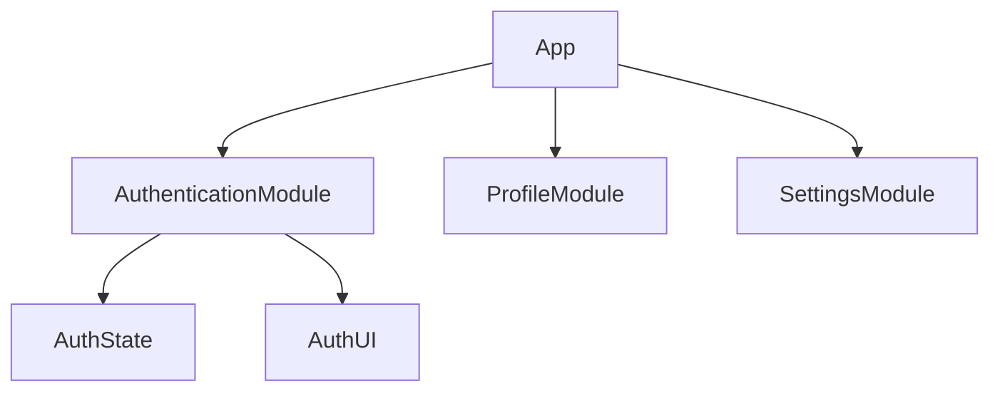

## 9.1.1 Modularizing Code

In the realm of software development, particularly in Flutter applications, modularizing code is a cornerstone practice that significantly enhances maintainability, readability, and scalability. This section delves into the importance of modularization, explores various approaches, and provides practical guidance on implementing modular structures in your Flutter projects.

### Importance of Modularization

Modularizing code is akin to organizing a library. Instead of having a single, overwhelming collection of books, you categorize them into sections—fiction, non-fiction, science, history—making it easier to find, manage, and update. Similarly, modularizing code involves breaking down an application into smaller, independent modules, each responsible for a specific functionality or feature. This approach offers several key benefits:

- **Maintainability:** Smaller modules are easier to manage and update. Changes in one module typically do not affect others, reducing the risk of introducing bugs.
- **Readability:** A well-organized codebase is easier to navigate, making it simpler for developers to understand the structure and flow of the application.
- **Scalability:** As applications grow, modular structures allow for seamless addition of new features without disrupting existing functionality.
- **Testing and Collaboration:** Independent modules can be tested in isolation, and teams can work on different modules concurrently, enhancing collaboration and efficiency.

### Approaches to Modularization

There are several approaches to modularizing code in Flutter, with feature-based and layer-based modularization being the most prevalent. Each approach has its own merits and can be chosen based on the specific needs of the project.

#### Feature-Based Modularization

Feature-based modularization involves organizing code by features or functionalities. This approach is intuitive and aligns with how users interact with the application. For instance, you might have separate modules for authentication, user profiles, and settings.

**Example Directory Structure:**

```
lib/
├── authentication/
│   ├── models/
│   ├── screens/
│   ├── widgets/
│   └── state/
├── profile/
├── settings/
└── main.dart
```

In this structure:
- **Models** contain data structures and business logic.
- **Screens** include UI components specific to the feature.
- **Widgets** are reusable UI components.
- **State** manages the state of the feature, possibly using state management solutions like Provider or Bloc.

This structure allows developers to focus on one feature at a time, making it easier to add or modify features without affecting the rest of the application.

#### Layer-Based Modularization

Layer-based modularization organizes code by layers such as presentation, business logic, and data access. This approach emphasizes separation of concerns, ensuring that each layer has a distinct responsibility.

**Example Directory Structure:**

```
lib/
├── data/
├── domain/
├── presentation/
└── main.dart
```

In this structure:
- **Data Layer** handles data retrieval and storage, interacting with APIs or databases.
- **Domain Layer** contains business logic and entities, acting as an intermediary between data and presentation layers.
- **Presentation Layer** includes UI components and user interaction logic.

Layer-based modularization is particularly beneficial for applications with complex business logic, as it clearly delineates where each piece of logic resides.

### Using Packages

Dart's package system allows developers to create reusable packages within the app, encapsulating modules for better organization and reuse. This is particularly useful for large applications or when sharing code across multiple projects.

**Creating a Reusable Package:**

1. **Create a Package Directory:**
   - Organize your code into a package structure within the `lib` directory.
   - Example: `lib/packages/authentication`.

2. **Define a `pubspec.yaml` File:**
   - Each package should have its own `pubspec.yaml` file to manage dependencies and metadata.

3. **Export Package Components:**
   - Use Dart's `export` directive to expose package components to other parts of the application.

4. **Import and Use the Package:**
   - Import the package in your main application using Dart's import syntax.

This approach promotes code reuse and consistency across different parts of the application or even across different applications.

### Dependency Management

Managing dependencies between modules is crucial to avoid tight coupling, which can hinder maintainability and scalability. Here are some strategies:

- **Use Interfaces and Abstractions:** Define interfaces for modules to interact with each other, allowing for flexibility in implementation.
- **Dependency Injection:** Use dependency injection frameworks to manage dependencies, making it easier to swap out implementations.
- **Loose Coupling:** Ensure that modules are loosely coupled, interacting with each other through well-defined interfaces or services.

### Code Examples

Let's explore how to refactor code into modules and manage dependencies effectively.

**Refactoring Code into Modules:**

Suppose you have a simple Flutter application with authentication and profile features. Here's how you might organize it:

```dart
// lib/authentication/models/user.dart
class User {
  final String id;
  final String name;

  User(this.id, this.name);
}

// lib/authentication/state/auth_state.dart
import 'package:flutter/material.dart';

class AuthState extends ChangeNotifier {
  User _user;

  User get user => _user;

  void login(User user) {
    _user = user;
    notifyListeners();
  }
}

// lib/authentication/screens/login_screen.dart
import 'package:flutter/material.dart';
import 'package:provider/provider.dart';
import '../state/auth_state.dart';

class LoginScreen extends StatelessWidget {
  @override
  Widget build(BuildContext context) {
    return Scaffold(
      body: Center(
        child: ElevatedButton(
          onPressed: () {
            Provider.of<AuthState>(context, listen: false).login(User('1', 'John Doe'));
          },
          child: Text('Login'),
        ),
      ),
    );
  }
}
```

**Importing and Using Modules:**

In your main application file, you can import and use these modules:

```dart
// lib/main.dart
import 'package:flutter/material.dart';
import 'package:provider/provider.dart';
import 'authentication/state/auth_state.dart';
import 'authentication/screens/login_screen.dart';

void main() {
  runApp(
    ChangeNotifierProvider(
      create: (_) => AuthState(),
      child: MyApp(),
    ),
  );
}

class MyApp extends StatelessWidget {
  @override
  Widget build(BuildContext context) {
    return MaterialApp(
      home: LoginScreen(),
    );
  }
}
```

### Benefits

Modularizing code offers numerous benefits, including:

- **Improved Code Reusability:** Modules can be reused across different projects or parts of the application.
- **Better Team Collaboration:** Teams can work on different modules concurrently without stepping on each other's toes.
- **Easier Debugging:** Isolated modules make it easier to identify and fix bugs.

### Best Practices

- **Start with a Modular Structure:** Begin your project with a modular structure to avoid refactoring later.
- **Maintain Consistency:** Ensure consistent organization and naming conventions across modules.
- **Document Modules:** Provide clear documentation for each module, explaining its purpose and usage.

### Mermaid.js Diagrams

Visualizing the modular architecture can help in understanding the relationships between different modules.



This diagram illustrates how the main application interacts with different modules, each responsible for a specific feature.

### Key Takeaways

- Modularizing code is essential for building scalable and maintainable Flutter applications.
- Choose an appropriate modularization approach based on your project's needs.
- Use Dart's package system to create reusable modules.
- Manage dependencies carefully to avoid tight coupling.
- Start with a modular structure and maintain consistency throughout the project.

By adopting these practices, you can create Flutter applications that are robust, scalable, and easy to maintain, setting a solid foundation for future growth and enhancement.

## Quiz Time!



### What is the primary benefit of modularizing code in Flutter applications?

- [x] Improved maintainability
- [ ] Increased complexity
- [ ] Reduced performance
- [ ] Limited functionality

> **Explanation:** Modularizing code improves maintainability by organizing the codebase into smaller, manageable parts.

### Which modularization approach organizes code by features or functionalities?

- [x] Feature-Based Modularization
- [ ] Layer-Based Modularization
- [ ] Object-Oriented Modularization
- [ ] Functional Modularization

> **Explanation:** Feature-Based Modularization organizes code by features or functionalities, such as authentication or settings.

### What is a key advantage of using Dart's package system for modularization?

- [x] Code reuse across different projects
- [ ] Increased code duplication
- [ ] Reduced code readability
- [ ] Limited scalability

> **Explanation:** Dart's package system allows for code reuse across different projects, promoting consistency and efficiency.

### How does layer-based modularization organize code?

- [x] By layers such as presentation, business logic, and data access
- [ ] By features or functionalities
- [ ] By programming language
- [ ] By developer preferences

> **Explanation:** Layer-based modularization organizes code by layers, ensuring separation of concerns.

### What is a common strategy for managing dependencies between modules?

- [x] Use interfaces and abstractions
- [ ] Hardcode dependencies
- [ ] Avoid using dependencies
- [ ] Use global variables

> **Explanation:** Using interfaces and abstractions helps manage dependencies, promoting loose coupling between modules.

### What is the purpose of the `pubspec.yaml` file in a Dart package?

- [x] To manage dependencies and metadata
- [ ] To store application data
- [ ] To define UI components
- [ ] To execute Dart scripts

> **Explanation:** The `pubspec.yaml` file manages dependencies and metadata for Dart packages.

### Which of the following is a benefit of modularizing code?

- [x] Easier debugging
- [ ] Increased code size
- [ ] Reduced functionality
- [ ] Slower development

> **Explanation:** Modularizing code makes debugging easier by isolating issues within specific modules.

### What is a best practice when starting a new Flutter project?

- [x] Start with a modular structure
- [ ] Write all code in a single file
- [ ] Avoid using state management
- [ ] Use global variables for state

> **Explanation:** Starting with a modular structure helps avoid refactoring and promotes maintainability.

### Which diagramming tool is used to visualize modular architecture in this section?

- [x] Mermaid.js
- [ ] UML
- [ ] Flowchart.js
- [ ] Graphviz

> **Explanation:** Mermaid.js is used to create diagrams that visualize modular architecture.

### True or False: Modularizing code limits the scalability of a Flutter application.

- [ ] True
- [x] False

> **Explanation:** Modularizing code enhances the scalability of a Flutter application by organizing it into manageable parts.


