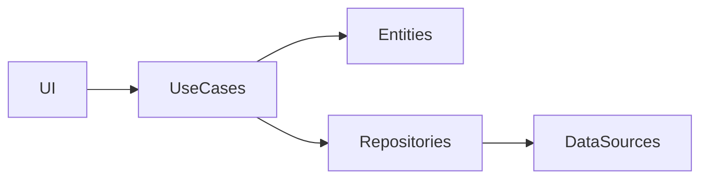

## 9.1.2 Clean Architecture Principles

In the realm of software development, achieving a balance between maintainability, scalability, and testability is crucial. Clean Architecture, a concept popularized by Robert C. Martin (also known as Uncle Bob), provides a structured approach to designing software systems that meet these goals. This article delves into the principles of Clean Architecture, its application in Flutter projects, and how it aligns with SOLID principles to create robust, flexible applications.

### Introduction to Clean Architecture

Clean Architecture is a software design philosophy that emphasizes the separation of concerns, making systems easier to understand, develop, and maintain. The core idea is to organize code into layers, each with distinct responsibilities, and to ensure that dependencies flow inward, towards the core business logic. This architecture promotes:

- **Separation of Concerns:** Each layer has a specific role, reducing the complexity of individual components.
- **Maintainability:** Changes in one part of the system have minimal impact on others.
- **Testability:** Isolated components make unit testing straightforward.

### Layers of Clean Architecture

Clean Architecture is typically divided into three main layers:

#### Presentation Layer

This layer is responsible for handling user interfaces and interactions. In Flutter, this includes widgets, screens, and state management components like BLoCs or Providers. The presentation layer should be as thin as possible, delegating business logic to the domain layer.

#### Domain Layer

The domain layer contains the core business logic and entities. It is the heart of the application, independent of any frameworks or external systems. This layer includes:

- **Entities:** Fundamental objects that represent business data.
- **Use Cases:** Specific operations that the application can perform, encapsulating business rules.

#### Data Layer

The data layer manages data sources, such as APIs, databases, or local storage. It provides data to the domain layer through repositories, which abstract the data source details.

### Dependency Rule

A key principle of Clean Architecture is the Dependency Rule: each layer can depend only on layers inward. The inner layers know nothing about the outer layers. This ensures that the core business logic remains unaffected by changes in the user interface or data sources.

### Implementing Clean Architecture in Flutter

Applying Clean Architecture in Flutter involves organizing your project into distinct directories for each layer. Here's a suggested directory structure:

```
lib/
├── data/
│   ├── models/
│   ├── repositories/
├── domain/
│   ├── entities/
│   ├── repositories/
│   └── usecases/
├── presentation/
│   ├── blocs/
│   ├── screens/
│   └── widgets/
└── main.dart
```

Each directory serves a specific purpose, aligning with the architecture's layers. This organization facilitates clear boundaries and responsibilities.

### SOLID Principles

Clean Architecture aligns well with the SOLID principles, which further enhance the design's robustness:

- **Single Responsibility Principle:** Each class or module should have one responsibility. For example, a repository class should only handle data retrieval and storage.
- **Open/Closed Principle:** Classes should be open for extension but closed for modification. This can be achieved through interfaces or abstract classes.
- **Liskov Substitution Principle:** Subtypes must be substitutable for their base types, ensuring that derived classes can stand in for their parents without altering the program's correctness.
- **Interface Segregation Principle:** No client should be forced to depend on methods it does not use. This encourages smaller, more focused interfaces.
- **Dependency Inversion Principle:** Depend upon abstractions, not concretions. This is often implemented using dependency injection frameworks.

#### Applying SOLID Principles

To illustrate SOLID principles, consider using interfaces for repositories. This allows different implementations without altering the domain logic.

```dart
// Interface for UserRepository
abstract class UserRepository {
  Future<User> getUserProfile(String userId);
}

// Implementation of UserRepository
class UserRepositoryImpl implements UserRepository {
  final ApiService apiService;

  UserRepositoryImpl(this.apiService);

  @override
  Future<User> getUserProfile(String userId) {
    return apiService.fetchUserProfile(userId);
  }
}
```

### Example Use Case Implementation

Let's walk through implementing a use case in the domain layer:

```dart
// Use case
class GetUserProfile {
  final UserRepository repository;

  GetUserProfile(this.repository);

  Future<User> execute(String userId) {
    return repository.getUserProfile(userId);
  }
}
```

This use case encapsulates the logic for retrieving a user profile, delegating data access to the repository.

### Benefits of Clean Architecture

- **Improved Testability:** Isolated components make unit testing straightforward.
- **Scalability:** The clear separation of concerns allows for easy expansion.
- **Maintainability:** Changes in one layer have minimal impact on others.

### Challenges

While Clean Architecture offers numerous benefits, it can introduce complexity during initial setup. However, the long-term advantages in maintainability and scalability justify the upfront investment.

### Tools and Libraries

For implementing dependency inversion, consider using packages like `get_it` for dependency injection. This simplifies managing dependencies across layers.

### Visualizing Clean Architecture with Mermaid.js

Below is a diagram illustrating the layers and dependencies in Clean Architecture:



### Key Takeaways

- **Adopt Clean Architecture:** Especially beneficial for complex applications, promoting separation of concerns and reducing coupling.
- **Leverage SOLID Principles:** These principles complement Clean Architecture, enhancing code quality.
- **Consider Long-Term Benefits:** While initial setup may be complex, the architecture pays off in the long run with improved maintainability and scalability.

By embracing Clean Architecture and SOLID principles, Flutter developers can build applications that are not only robust and scalable but also maintainable and testable. As you implement these concepts, remember that the goal is to create a system that is easy to understand, modify, and extend, ultimately leading to a more efficient and enjoyable development process.

## Quiz Time!



### What is the primary goal of Clean Architecture?

- [x] Separation of concerns, maintainability, and testability
- [ ] Faster development speed
- [ ] Reducing the number of files in a project
- [ ] Increasing code complexity

> **Explanation:** Clean Architecture aims to achieve separation of concerns, maintainability, and testability by organizing code into distinct layers.

### Which layer in Clean Architecture is responsible for handling user interfaces?

- [x] Presentation Layer
- [ ] Domain Layer
- [ ] Data Layer
- [ ] Infrastructure Layer

> **Explanation:** The Presentation Layer is responsible for handling user interfaces and interactions in Clean Architecture.

### What is the Dependency Rule in Clean Architecture?

- [x] Each layer can depend only on layers inward
- [ ] Each layer can depend on any other layer
- [ ] Inner layers depend on outer layers
- [ ] There are no dependencies between layers

> **Explanation:** The Dependency Rule states that each layer can depend only on layers inward, ensuring core business logic remains unaffected by changes in outer layers.

### Which SOLID principle states that classes should be open for extension but closed for modification?

- [x] Open/Closed Principle
- [ ] Single Responsibility Principle
- [ ] Liskov Substitution Principle
- [ ] Interface Segregation Principle

> **Explanation:** The Open/Closed Principle states that classes should be open for extension but closed for modification, allowing for flexible and maintainable code.

### How does the Dependency Inversion Principle relate to Clean Architecture?

- [x] It encourages depending on abstractions, not concretions
- [ ] It requires all layers to be tightly coupled
- [ ] It mandates that UI components depend on data sources
- [ ] It eliminates the need for interfaces

> **Explanation:** The Dependency Inversion Principle encourages depending on abstractions, not concretions, aligning with Clean Architecture's goal of maintaining clear boundaries between layers.

### What is a common challenge when implementing Clean Architecture?

- [x] Initial setup complexity
- [ ] Lack of scalability
- [ ] Difficulty in testing
- [ ] Poor maintainability

> **Explanation:** A common challenge when implementing Clean Architecture is the initial setup complexity, but it offers long-term benefits in maintainability and scalability.

### Which tool can be used for dependency injection in Flutter projects following Clean Architecture?

- [x] `get_it`
- [ ] `flutter_bloc`
- [ ] `provider`
- [ ] `redux`

> **Explanation:** The `get_it` package is commonly used for dependency injection in Flutter projects, helping manage dependencies across layers in Clean Architecture.

### What is the role of the domain layer in Clean Architecture?

- [x] Contains business logic and entities
- [ ] Manages data sources
- [ ] Handles UI and user interactions
- [ ] Provides caching mechanisms

> **Explanation:** The domain layer contains the core business logic and entities, serving as the heart of the application in Clean Architecture.

### How does Clean Architecture improve testability?

- [x] By isolating components, making unit testing straightforward
- [ ] By reducing the number of tests needed
- [ ] By eliminating the need for testing
- [ ] By making all layers dependent on each other

> **Explanation:** Clean Architecture improves testability by isolating components, making unit testing straightforward and effective.

### True or False: In Clean Architecture, the data layer should know about the presentation layer.

- [ ] True
- [x] False

> **Explanation:** False. In Clean Architecture, the data layer should not know about the presentation layer, adhering to the Dependency Rule where dependencies flow inward.


