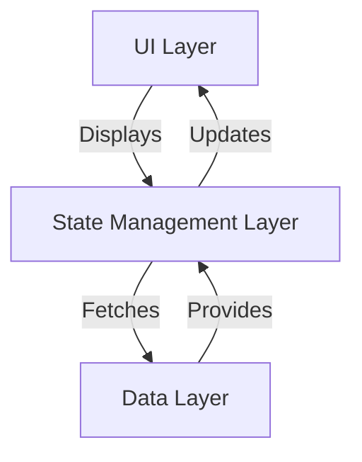

## 9.1.3 Separation of Concerns

In the realm of software development, the principle of Separation of Concerns (SoC) is a foundational concept that guides developers in structuring their applications effectively. This principle is particularly vital in Flutter development, where the complexity of managing state, UI, and data can quickly become overwhelming. In this section, we will explore the definition and importance of SoC, how to apply it in Flutter, its advantages, and best practices to ensure a clean and maintainable codebase.

### Definition and Importance of Separation of Concerns

Separation of Concerns (SoC) is a design principle that involves dividing a program into distinct sections, each responsible for a specific aspect of the application's functionality. This division minimizes overlap and interdependencies between different parts of the code, leading to a more organized and manageable codebase.

#### Why is SoC Important?

- **Simplifies Development and Maintenance:** By isolating different functionalities, developers can focus on one aspect of the application at a time, making it easier to develop, test, and maintain.
- **Enhances Code Readability:** Clear boundaries between different concerns make the codebase easier to understand and navigate.
- **Facilitates Parallel Development:** Teams can work on different parts of the application simultaneously without interfering with each other's work.
- **Improves Testability:** Isolated components can be tested independently, leading to more robust and reliable applications.

### Applying Separation of Concerns in Flutter

In Flutter, applying SoC involves organizing the application into three primary layers: the UI layer, the state management layer, and the data layer. Each layer has a distinct responsibility, contributing to a well-structured application.

#### UI Layer

The UI layer is responsible solely for rendering widgets. It should not contain any business logic or data manipulation code. Instead, it should focus on displaying data and responding to user interactions.

- **Example:** Use StatelessWidget and StatefulWidget to create UI components that are purely concerned with presentation.

```dart
class UserProfileScreen extends StatelessWidget {
  final User user;

  UserProfileScreen({required this.user});

  @override
  Widget build(BuildContext context) {
    return Scaffold(
      appBar: AppBar(title: Text('User Profile')),
      body: Center(
        child: Column(
          children: [
            Text('Name: ${user.name}'),
            Text('Email: ${user.email}'),
          ],
        ),
      ),
    );
  }
}
```

#### State Management Layer

This layer manages the application's state and business logic. It is responsible for handling user inputs, performing calculations, and updating the UI based on state changes.

- **Example:** Use state management solutions like Bloc, Provider, or Riverpod to manage state separately from the UI.

```dart
class UserProfileCubit extends Cubit<UserProfileState> {
  final UserService userService;

  UserProfileCubit(this.userService) : super(UserProfileInitial());

  void loadUserProfile(int userId) async {
    try {
      emit(UserProfileLoading());
      final user = await userService.fetchUser(userId);
      emit(UserProfileLoaded(user));
    } catch (e) {
      emit(UserProfileError('Failed to load user profile'));
    }
  }
}
```

#### Data Layer

The data layer handles data retrieval and storage. It interacts with APIs, databases, or other data sources to fetch and persist data.

- **Example:** Create services or repositories that abstract data access logic.

```dart
class UserService {
  final ApiClient apiClient;

  UserService(this.apiClient);

  Future<User> fetchUser(int userId) async {
    final response = await apiClient.get('/users/$userId');
    return User.fromJson(response.data);
  }
}
```

### Advantages of Separation of Concerns

Implementing SoC in your Flutter applications offers several benefits:

- **Facilitates Parallel Development:** Different team members can work on the UI, state management, and data layers independently, speeding up development.
- **Enhances Testability:** By isolating components, you can write unit tests for each layer without worrying about dependencies on other parts of the application.
- **Simplifies Debugging and Code Comprehension:** With clear boundaries, identifying and fixing bugs becomes more straightforward, and new developers can quickly understand the codebase.

### Example Implementation

To illustrate the application of SoC, let's consider a login feature. The bad practice is to include business logic directly within the UI components, as shown below:

#### Bad Practice

```dart
class LoginScreen extends StatefulWidget {
  @override
  _LoginScreenState createState() => _LoginScreenState();
}

class _LoginScreenState extends State<LoginScreen> {
  void _login(String username, String password) {
    // Perform HTTP request directly
    // This mixes UI and business logic, violating SoC
  }

  @override
  Widget build(BuildContext context) {
    return Scaffold(
      // UI code
    );
  }
}
```

#### Good Practice

A better approach is to separate the business logic into a dedicated service or state management class:

```dart
class AuthService {
  Future<void> login(String username, String password) async {
    // Perform HTTP request here
  }
}

class LoginCubit extends Cubit<LoginState> {
  final AuthService authService;

  LoginCubit(this.authService) : super(LoginInitial());

  void login(String username, String password) async {
    try {
      emit(LoginLoading());
      await authService.login(username, password);
      emit(LoginSuccess());
    } catch (e) {
      emit(LoginError('Login failed'));
    }
  }
}

class LoginScreen extends StatelessWidget {
  @override
  Widget build(BuildContext context) {
    return BlocProvider(
      create: (context) => LoginCubit(context.read<AuthService>()),
      child: Scaffold(
        // UI code
      ),
    );
  }
}
```

### Using State Management Solutions

State management solutions like Bloc, Provider, and Riverpod are instrumental in achieving SoC. They provide a structured way to manage state and business logic separately from the UI.

- **Bloc:** Encourages a clear separation between the UI and business logic through events and states.
- **Provider:** Offers a simple and flexible way to manage state and dependencies.
- **Riverpod:** Provides a more robust and scalable approach to state management with improved testability.

#### Code Example with Bloc

```dart
class LoginCubit extends Cubit<LoginState> {
  final AuthService authService;

  LoginCubit(this.authService) : super(LoginInitial());

  void login(String username, String password) async {
    try {
      emit(LoginLoading());
      await authService.login(username, password);
      emit(LoginSuccess());
    } catch (e) {
      emit(LoginError('Login failed'));
    }
  }
}
```

### Best Practices

- **Avoid Business Logic in Widget's `build` Methods:** Keep the `build` method focused on rendering UI. Use controllers or view models to handle logic.
- **Use Controllers or View Models:** These can act as intermediaries between the UI and the state management layer, further enhancing SoC.
- **Consistent Application of SoC:** Apply SoC principles consistently throughout the project to maintain a clean and organized codebase.

### Mermaid.js Diagrams

To visualize the separation between layers, consider the following diagram:



### Key Takeaways

- **Cleaner Codebase:** SoC leads to a cleaner, more maintainable codebase by clearly delineating responsibilities.
- **Improved Collaboration:** Teams can work more effectively by focusing on separate concerns.
- **Enhanced Flexibility:** Applications become more adaptable to changes and easier to extend.

By consistently applying the principle of Separation of Concerns, you can create Flutter applications that are not only easier to develop and maintain but also more robust and scalable. Encourage your team to embrace these practices to achieve a higher standard of software quality.

## Quiz Time!



### What is the primary goal of Separation of Concerns (SoC)?

- [x] To divide a program into distinct features with minimal overlap in functionality.
- [ ] To increase the complexity of the codebase.
- [ ] To ensure that all code is written in a single file.
- [ ] To make debugging more difficult.

> **Explanation:** The primary goal of SoC is to divide a program into distinct features with minimal overlap in functionality, simplifying development and maintenance.

### Which layer in Flutter is responsible for rendering widgets?

- [x] UI Layer
- [ ] State Management Layer
- [ ] Data Layer
- [ ] Business Logic Layer

> **Explanation:** The UI Layer is responsible for rendering widgets in Flutter.

### What is a key advantage of applying SoC in Flutter applications?

- [x] Facilitates parallel development.
- [ ] Increases code duplication.
- [ ] Makes testing more difficult.
- [ ] Reduces code readability.

> **Explanation:** SoC facilitates parallel development by allowing different team members to work on separate parts of the application independently.

### In the context of SoC, where should business logic be placed?

- [ ] In the UI Layer
- [x] In the State Management Layer
- [ ] In the Data Layer
- [ ] In the Presentation Layer

> **Explanation:** Business logic should be placed in the State Management Layer to keep it separate from the UI.

### Which state management solution encourages a clear separation between UI and business logic?

- [x] Bloc
- [ ] Flutter
- [ ] Dart
- [ ] JSON

> **Explanation:** Bloc encourages a clear separation between UI and business logic through events and states.

### What is a common pitfall when not applying SoC in Flutter?

- [x] Mixing UI and business logic in the same component.
- [ ] Having too many files in the project.
- [ ] Using too many libraries.
- [ ] Over-optimizing the code.

> **Explanation:** A common pitfall is mixing UI and business logic in the same component, which violates SoC principles.

### Which of the following is a benefit of using state management solutions like Provider?

- [x] Provides a structured way to manage state separately from the UI.
- [ ] Increases the complexity of the UI layer.
- [ ] Makes the application slower.
- [ ] Reduces the number of developers needed.

> **Explanation:** Provider offers a structured way to manage state separately from the UI, enhancing SoC.

### What should be avoided in a widget's `build` method?

- [x] Business logic
- [ ] UI rendering
- [ ] State updates
- [ ] Event handling

> **Explanation:** Business logic should be avoided in a widget's `build` method to maintain SoC.

### Which diagram type is used to depict the separation between layers/modules?

- [x] Mermaid.js Diagram
- [ ] UML Diagram
- [ ] Gantt Chart
- [ ] Pie Chart

> **Explanation:** Mermaid.js Diagrams are used to depict the separation between layers/modules.

### True or False: Applying SoC consistently leads to a cleaner, more maintainable codebase.

- [x] True
- [ ] False

> **Explanation:** True. Consistently applying SoC leads to a cleaner, more maintainable codebase by clearly delineating responsibilities.


