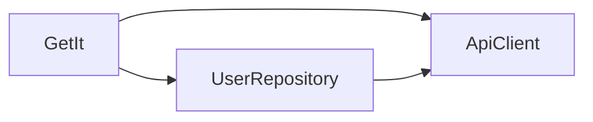

## 9.1.4 Dependency Injection

In the realm of software engineering, Dependency Injection (DI) stands as a cornerstone design pattern that significantly enhances the modularity, testability, and flexibility of applications. Particularly in Flutter, a framework that emphasizes reactive and declarative UI, DI plays a pivotal role in managing dependencies efficiently, thereby streamlining state management processes. This article delves into the intricacies of DI, its benefits, implementation strategies in Flutter, and best practices to adopt for building robust applications.

### Understanding Dependency Injection (DI)

Dependency Injection is a design pattern where an object receives its dependencies from external sources rather than creating them internally. This approach promotes loose coupling between components, making the system more modular and easier to maintain.

- **Loose Coupling:** By decoupling the creation of dependencies from their usage, DI allows components to interact with each other without being tightly bound. This separation of concerns facilitates easier modifications and enhancements.
- **Easier Testing:** DI enables the substitution of real dependencies with mock objects during testing, allowing for isolated unit tests that are both reliable and efficient.

### Benefits of DI

Implementing DI in your Flutter applications can yield several advantages:

- **Enhanced Modularity:** DI encourages a modular architecture where components are independent and reusable.
- **Simplified Testing:** By injecting dependencies, you can easily mock them during tests, ensuring that your tests are focused on the logic rather than the setup.
- **Flexible Implementations:** DI allows for seamless swapping of implementations, such as changing a data source from a local database to a remote API, with minimal impact on the rest of the application.

### Implementing DI in Flutter

Flutter offers multiple ways to implement DI, each with its own set of advantages and use cases. Let's explore the primary methods: manual injection, service locators, and using provider patterns.

#### Manual Injection

Manual injection involves passing dependencies directly through constructors. This method is straightforward and ensures that dependencies are explicitly defined and managed.

```dart
class ApiClient {
  // ApiClient implementation
}

class UserRepository {
  final ApiClient apiClient;

  UserRepository(this.apiClient);
}
```

In this example, `UserRepository` requires an `ApiClient` to function. By passing `ApiClient` through the constructor, we ensure that `UserRepository` is not responsible for creating its dependencies, adhering to the DI principle.

#### Using Service Locators

Service locators provide a centralized registry for managing dependencies, allowing for lazy initialization and retrieval. The `get_it` package is a popular choice for implementing service locators in Flutter.

```dart
import 'package:get_it/get_it.dart';

final getIt = GetIt.instance;

void setup() {
  getIt.registerLazySingleton<ApiClient>(() => ApiClientImpl());
  getIt.registerFactory<UserRepository>(() => UserRepositoryImpl(getIt<ApiClient>()));
}
```

- **Lazy Initialization:** Dependencies are created only when they are first requested, optimizing resource usage.
- **Centralized Management:** All dependencies are registered in one place, simplifying the setup and maintenance.

#### Provider and InheritedWidget

The `Provider` package, built on top of Flutter's `InheritedWidget`, is another powerful tool for DI. It integrates seamlessly with the widget tree, making it ideal for state management.

```dart
import 'package:flutter/material.dart';
import 'package:provider/provider.dart';

class MyApp extends StatelessWidget {
  @override
  Widget build(BuildContext context) {
    return MultiProvider(
      providers: [
        Provider(create: (_) => ApiClient()),
        Provider(create: (_) => UserRepository()),
      ],
      child: MaterialApp(
        home: HomeScreen(),
      ),
    );
  }
}
```

- **Widget Tree Integration:** Providers are part of the widget tree, ensuring that dependencies are available wherever needed.
- **Scoped Access:** Dependencies can be scoped to specific parts of the widget tree, enhancing modularity.

### Best Practices

Adopting best practices in DI can significantly improve the maintainability and scalability of your Flutter applications:

- **Centralize DI Setup:** Keep all DI configurations in a single location to simplify management and reduce errors.
- **Prefer Constructor Injection:** Constructor injection is more explicit and testable compared to static access or global variables.
- **Avoid Overusing Service Locators:** While convenient, over-reliance on service locators can lead to hidden dependencies and reduced clarity.

### Testing with DI

One of the key benefits of DI is its facilitation of testing. By injecting dependencies, you can easily replace them with mocks during tests, ensuring that your tests are isolated and focused on the logic.

```dart
import 'package:flutter_test/flutter_test.dart';
import 'package:mockito/mockito.dart';

class MockApiClient extends Mock implements ApiClient {}

void main() {
  test('UserRepository fetches user data', () {
    final mockApiClient = MockApiClient();
    final userRepository = UserRepository(mockApiClient);

    // Set up mock behavior
    when(mockApiClient.getUserData()).thenReturn(/* test data */);

    // Run test
    // Verify interactions and assertions
  });
}
```

- **Mocking Dependencies:** Use mock libraries like `mockito` to create mock objects for your tests.
- **Isolated Tests:** By isolating dependencies, you ensure that tests are not affected by external factors, leading to more reliable results.

### Mermaid.js Diagrams

To better understand the flow of dependency resolution, let's visualize it using a Mermaid.js diagram:



This diagram illustrates how `GetIt` acts as a service locator, managing the dependencies `ApiClient` and `UserRepository`, and how `UserRepository` relies on `ApiClient`.

### Key Takeaways

- **Role of DI:** Dependency Injection is crucial for building flexible, testable, and maintainable Flutter applications.
- **Consistent Practices:** Adopting DI best practices ensures a clean and scalable codebase.
- **Encouragement:** Consistently apply DI principles to enhance your application's architecture and facilitate easier testing and maintenance.

By understanding and implementing Dependency Injection in your Flutter projects, you can significantly enhance the quality and robustness of your applications. Whether you're building small apps or large-scale systems, DI provides the flexibility and control needed to manage dependencies effectively.

## Quiz Time!



### What is Dependency Injection (DI)?

- [x] A design pattern where an object receives its dependencies from external sources.
- [ ] A pattern where an object creates its own dependencies.
- [ ] A method for optimizing database queries.
- [ ] A technique for improving UI performance.

> **Explanation:** Dependency Injection (DI) is a design pattern where an object receives its dependencies from external sources rather than creating them internally, promoting loose coupling and easier testing.

### Which of the following is a benefit of using DI?

- [x] Enhances code modularity.
- [x] Simplifies mocking dependencies for testing.
- [ ] Increases the complexity of code.
- [ ] Reduces the need for documentation.

> **Explanation:** DI enhances code modularity and simplifies mocking dependencies, making testing easier and more effective.

### How is manual injection implemented in Flutter?

- [x] By passing dependencies through constructors.
- [ ] By using global variables.
- [ ] By creating dependencies within the class.
- [ ] By using static methods.

> **Explanation:** Manual injection involves passing dependencies through constructors, ensuring that dependencies are explicitly defined and managed.

### What is a service locator in the context of DI?

- [x] A centralized registry for managing dependencies.
- [ ] A tool for optimizing network requests.
- [ ] A method for improving UI rendering.
- [ ] A pattern for handling user input.

> **Explanation:** A service locator is a centralized registry for managing dependencies, allowing for lazy initialization and retrieval.

### Which package is commonly used for service locators in Flutter?

- [x] get_it
- [ ] provider
- [ ] bloc
- [ ] redux

> **Explanation:** The `get_it` package is commonly used for implementing service locators in Flutter.

### How does the Provider package integrate with the widget tree?

- [x] By making dependencies available wherever needed in the widget tree.
- [ ] By creating global variables for dependencies.
- [ ] By using static methods to access dependencies.
- [ ] By storing dependencies in a database.

> **Explanation:** The Provider package integrates with the widget tree, ensuring that dependencies are available wherever needed.

### What is a key advantage of constructor injection?

- [x] It is more explicit and testable.
- [ ] It reduces the need for documentation.
- [ ] It simplifies UI design.
- [ ] It increases code complexity.

> **Explanation:** Constructor injection is more explicit and testable compared to static access or global variables.

### How does DI facilitate testing?

- [x] By allowing the substitution of real dependencies with mocks.
- [ ] By reducing the need for test cases.
- [ ] By making tests run faster.
- [ ] By eliminating the need for test data.

> **Explanation:** DI allows the substitution of real dependencies with mocks, facilitating isolated and focused testing.

### What is the role of GetIt in the provided Mermaid.js diagram?

- [x] It acts as a service locator managing dependencies.
- [ ] It is a database for storing user data.
- [ ] It is a UI component for rendering widgets.
- [ ] It is a network client for API requests.

> **Explanation:** In the diagram, GetIt acts as a service locator, managing the dependencies ApiClient and UserRepository.

### True or False: DI is only useful for large-scale applications.

- [ ] True
- [x] False

> **Explanation:** False. DI is beneficial for both small and large-scale applications as it enhances modularity, testability, and flexibility regardless of the application's size.


