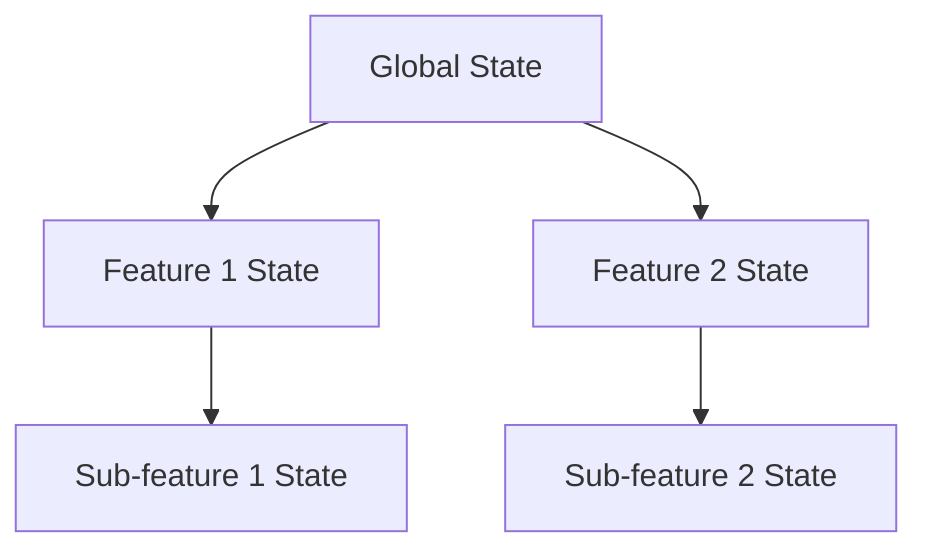

## 9.2.1 Scaling State Management

As Flutter applications grow in complexity, managing state efficiently becomes increasingly challenging. Scaling state management involves addressing performance issues, ensuring state synchronization, and maintaining a clean architecture. This section delves into the challenges of scaling state management in large applications and provides strategies to overcome them, including modular and hierarchical state management, performance optimization techniques, and practical examples.

### Challenges in Scaling

Managing state in large applications presents several challenges:

- **Performance Issues:** As the application grows, the state management system can become a bottleneck, leading to slow UI updates and increased memory usage.
- **State Synchronization:** Ensuring that state changes are consistently propagated across different parts of the application can be difficult, especially in distributed systems.
- **Complexity:** As more features are added, the complexity of managing state increases, making it harder to maintain and debug.

### Strategies for Scaling

To effectively scale state management, consider the following strategies:

#### Modular State Management

Breaking down the global state into modular states for individual features can significantly simplify state management. This approach involves:

- **Feature-Specific Blocs or Providers:** Each feature or module of the application has its own state management logic, encapsulated within a Bloc or Provider. This separation allows for easier maintenance and testing.

```dart
// Example of a feature-specific Bloc for managing user authentication
class AuthenticationBloc extends Bloc<AuthenticationEvent, AuthenticationState> {
  AuthenticationBloc() : super(AuthenticationInitial());

  @override
  Stream<AuthenticationState> mapEventToState(AuthenticationEvent event) async* {
    if (event is LoginRequested) {
      yield AuthenticationLoading();
      try {
        // Perform login logic
        yield AuthenticationSuccess();
      } catch (e) {
        yield AuthenticationFailure(error: e.toString());
      }
    }
  }
}
```

- **Benefits:** Modular state management reduces the risk of state-related bugs and improves code readability and maintainability.

#### Hierarchical State Management

Managing state hierarchically involves organizing state management in a nested manner to limit the scope of state changes:

- **Nested Providers or BlocProviders:** Use nested state management components to manage state at different levels of the widget tree. This approach helps in isolating state changes and reducing unnecessary rebuilds.

```dart
// Example of using nested Providers for hierarchical state management
class MyApp extends StatelessWidget {
  @override
  Widget build(BuildContext context) {
    return MultiProvider(
      providers: [
        Provider<GlobalState>(create: (_) => GlobalState()),
        ChangeNotifierProvider<FeatureState>(create: (_) => FeatureState()),
      ],
      child: MaterialApp(
        home: HomeScreen(),
      ),
    );
  }
}
```

- **Advantages:** Hierarchical state management allows for more granular control over state updates and can improve performance by limiting the scope of state changes.

#### Lazy Loading

Lazy loading involves introducing state only when necessary, which can improve application startup times and reduce initial memory usage:

- **Implementation:** Load state management components only when the corresponding feature or screen is accessed. This can be achieved using Flutter's `Navigator` or conditional logic within the widget tree.

```dart
// Example of lazy loading a feature-specific state
Navigator.push(
  context,
  MaterialPageRoute(
    builder: (context) => FeatureScreen(),
    settings: RouteSettings(
      arguments: FeatureState(),
    ),
  ),
);
```

- **Benefits:** Lazy loading can significantly improve the perceived performance of the application by deferring the initialization of heavy components.

#### Code Generation Tools

Utilizing code generation tools like `freezed` can help in reducing boilerplate and ensuring consistency across state management logic:

- **Freezed Package:** This package allows for the generation of immutable classes and union types, which can simplify state management code.

```dart
// Example of using freezed to generate immutable state classes
@freezed
class UserState with _$UserState {
  const factory UserState.initial() = _Initial;
  const factory UserState.loading() = _Loading;
  const factory UserState.loaded(User user) = _Loaded;
  const factory UserState.error(String message) = _Error;
}
```

- **Advantages:** Code generation tools can improve code quality and reduce the likelihood of errors by automating repetitive tasks.

### Performance Optimization

Optimizing performance is crucial when scaling state management in large applications:

#### Selective Rebuilds

Avoid unnecessary widget rebuilds by using selective rebuild techniques:

- **Selector and BlocBuilder with buildWhen:** Use these tools to rebuild widgets only when specific parts of the state change.

```dart
// Example of using BlocBuilder with buildWhen for selective rebuilds
BlocBuilder<CounterBloc, CounterState>(
  buildWhen: (previous, current) => previous.count != current.count,
  builder: (context, state) {
    return Text('Count: ${state.count}');
  },
);
```

- **Benefits:** Selective rebuilds can significantly improve UI performance by reducing the number of widget rebuilds.

#### Asynchronous Operations

Offload heavy computations to background isolates to prevent blocking the main thread:

- **Implementation:** Use Dart's `compute` function or `Isolate` API to perform expensive operations in the background.

```dart
// Example of using compute for background processing
Future<int> heavyComputation(int input) async {
  return await compute(_expensiveFunction, input);
}

int _expensiveFunction(int input) {
  // Perform heavy computation
  return input * 2;
}
```

- **Advantages:** Offloading computations can improve the responsiveness of the application by keeping the UI thread free for rendering.

#### Pagination and Infinite Scrolling

Implement data loading in chunks to manage memory usage effectively:

- **Implementation:** Use pagination or infinite scrolling techniques to load data incrementally as the user scrolls.

```dart
// Example of implementing pagination with a ListView
ListView.builder(
  itemCount: items.length + 1,
  itemBuilder: (context, index) {
    if (index == items.length) {
      // Trigger loading more data
      context.read<ItemBloc>().add(LoadMoreItems());
      return CircularProgressIndicator();
    }
    return ListTile(title: Text(items[index].name));
  },
);
```

- **Benefits:** Pagination reduces the memory footprint by loading only the data that is currently needed.

### Scaling Requires Planning

Anticipating growth and designing the state architecture accordingly is essential for scaling:

- **Proactive Planning:** Consider future features and potential growth when designing the state management architecture. This foresight can prevent costly refactoring later on.

- **Documentation:** Maintain thorough documentation of the state management logic to facilitate onboarding new team members and ensure consistency.

### Case Study: E-Commerce Application

Consider an e-commerce application handling a large product catalog. Here's how state management can be segmented:

- **Cart Management:** Use a dedicated state management solution, such as a Bloc or Provider, to handle cart operations like adding, removing, and updating items.

- **Product Listings:** Implement pagination and lazy loading to manage the display of a large number of products efficiently.

- **User Profiles:** Use hierarchical state management to manage user-specific settings and preferences.

```dart
// Example of segmenting state management in an e-commerce app
class ECommerceApp extends StatelessWidget {
  @override
  Widget build(BuildContext context) {
    return MultiProvider(
      providers: [
        Provider<CartBloc>(create: (_) => CartBloc()),
        Provider<ProductBloc>(create: (_) => ProductBloc()),
        Provider<UserProfileBloc>(create: (_) => UserProfileBloc()),
      ],
      child: MaterialApp(
        home: ProductListScreen(),
      ),
    );
  }
}
```

### Best Practices

- **Regular Refactoring:** Continuously refactor and optimize state management logic to adapt to changing requirements and improve performance.

- **Performance Monitoring:** Use tools like Flutter DevTools to monitor performance and identify bottlenecks.

- **Adjust Strategies:** Be flexible in adjusting state management strategies as the application evolves.

### Mermaid.js Diagrams

Visualizing the state management hierarchy can aid in understanding and planning:



### Key Takeaways

- **Proactive Planning:** Plan for scalability from the outset to avoid costly refactoring.
- **Efficient State Management:** Efficient state management is crucial for maintaining performance in large applications.
- **Continuous Improvement:** Regularly review and improve state management practices to keep up with evolving application needs.

By implementing these strategies and best practices, developers can effectively scale state management in Flutter applications, ensuring performance and maintainability as the application grows.

## Quiz Time!



### What is a key benefit of modular state management?

- [x] It reduces the risk of state-related bugs.
- [ ] It increases the complexity of the application.
- [ ] It requires more memory usage.
- [ ] It makes testing more difficult.

> **Explanation:** Modular state management reduces the risk of state-related bugs by isolating state logic within specific features, making it easier to manage and test.

### How does hierarchical state management improve performance?

- [x] By limiting the scope of state changes.
- [ ] By increasing the number of widget rebuilds.
- [ ] By using more global state variables.
- [ ] By avoiding the use of Providers.

> **Explanation:** Hierarchical state management limits the scope of state changes, reducing unnecessary widget rebuilds and improving performance.

### What is lazy loading in the context of state management?

- [x] Introducing state only when necessary to improve startup times.
- [ ] Loading all state at the beginning of the application.
- [ ] Avoiding the use of state management solutions.
- [ ] Using global state for all features.

> **Explanation:** Lazy loading involves introducing state only when necessary, which can improve application startup times and reduce initial memory usage.

### Which tool can be used for generating immutable classes in Flutter?

- [x] Freezed
- [ ] Bloc
- [ ] Provider
- [ ] Redux

> **Explanation:** The `freezed` package is used for generating immutable classes and union types, simplifying state management code.

### What is the purpose of selective rebuilds?

- [x] To avoid unnecessary widget rebuilds.
- [ ] To increase the frequency of widget rebuilds.
- [ ] To ensure all widgets rebuild on every state change.
- [ ] To use more memory.

> **Explanation:** Selective rebuilds avoid unnecessary widget rebuilds by updating only the parts of the UI that are affected by state changes.

### How can heavy computations be offloaded in Flutter?

- [x] By using Dart's `compute` function or `Isolate` API.
- [ ] By running them on the main thread.
- [ ] By using global variables.
- [ ] By avoiding asynchronous operations.

> **Explanation:** Heavy computations can be offloaded to background isolates using Dart's `compute` function or `Isolate` API, preventing them from blocking the main thread.

### What is a benefit of implementing pagination in a Flutter app?

- [x] It reduces memory usage by loading data incrementally.
- [ ] It increases the initial load time of the app.
- [ ] It requires more network requests.
- [ ] It complicates the UI design.

> **Explanation:** Pagination reduces memory usage by loading data incrementally, which is especially useful for managing large datasets.

### Why is proactive planning important in scaling state management?

- [x] To anticipate growth and design the state architecture accordingly.
- [ ] To avoid using state management solutions.
- [ ] To increase the complexity of the application.
- [ ] To ensure all state is global.

> **Explanation:** Proactive planning is important to anticipate growth and design the state architecture accordingly, preventing costly refactoring later on.

### What is a common tool for monitoring performance in Flutter applications?

- [x] Flutter DevTools
- [ ] Redux DevTools
- [ ] MobX Inspector
- [ ] Android Studio

> **Explanation:** Flutter DevTools is a common tool used for monitoring performance and identifying bottlenecks in Flutter applications.

### True or False: Lazy loading can improve the startup time of a Flutter application.

- [x] True
- [ ] False

> **Explanation:** True. Lazy loading can improve the startup time of a Flutter application by deferring the initialization of heavy components until they are needed.


