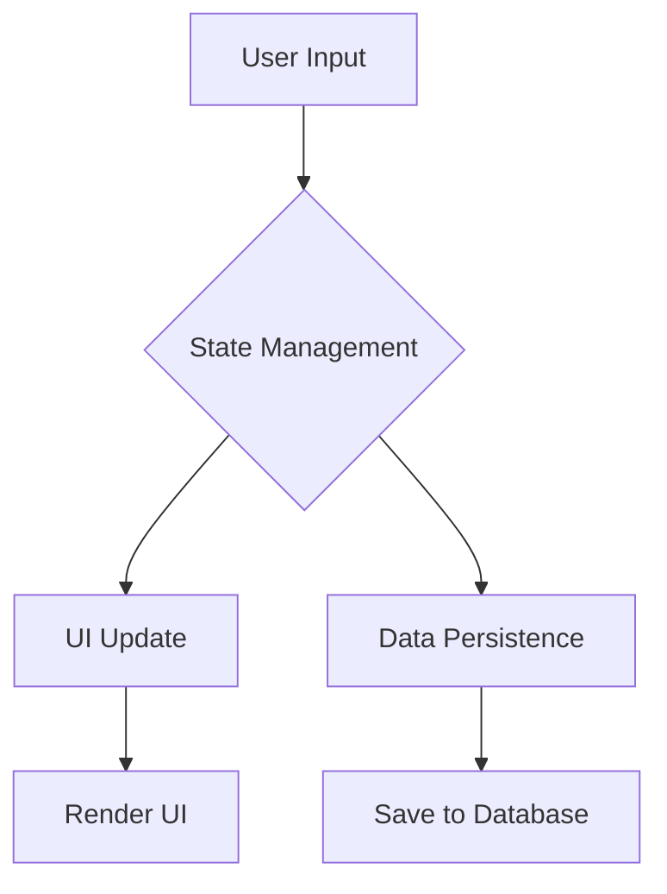

## 9.2.3 Documentation Standards

In the realm of software development, particularly in managing complex applications like those built with Flutter, documentation serves as the backbone that supports understanding, maintenance, and extensibility of code. This section delves into the critical role of documentation in state management, exploring various types, best practices, and strategies for maintaining high-quality documentation.

### Importance of Documentation

Good documentation is not just a nice-to-have; it's essential for several reasons:

- **Understanding:** It provides a clear guide for developers to understand the codebase, especially for new team members or contributors.
- **Maintenance:** Well-documented code is easier to maintain and update, reducing the likelihood of bugs and errors.
- **Extensibility:** Documentation facilitates the extension of code by providing insights into the design and architecture, enabling developers to add new features without disrupting existing functionality.

### Types of Documentation

#### Code Comments

Code comments are the first line of documentation within the code itself. They serve to explain complex logic or decisions that might not be immediately apparent from the code alone.

- **Complex Logic Explanation:** Use comments to clarify why certain approaches were taken, especially in complex algorithms or state management logic.
- **Dart Documentation Comments:** For public APIs, use Dart's documentation comments with `///`. This not only helps developers using your code but also aids in generating API documentation.

```dart
/// This function calculates the factorial of a number.
/// 
/// It uses a recursive approach to compute the factorial.
/// 
/// - Parameter n: The number to calculate the factorial for.
/// - Returns: The factorial of the number.
int factorial(int n) {
  if (n <= 1) return 1;
  return n * factorial(n - 1);
}
```

#### README Files

README files provide an overview of modules or packages, offering a high-level understanding of what the code does, how to set it up, and how to use it.

- **Overview:** Include a brief description of the module or package.
- **Installation Instructions:** Provide clear steps to set up the environment.
- **Usage Examples:** Offer examples of how to use the module or package effectively.

#### Wiki/Confluence Pages

For larger projects, maintaining a centralized documentation hub like a Wiki or Confluence page can be invaluable.

- **Architectural Decisions:** Document key architectural decisions and the rationale behind them.
- **Standards and Guides:** Outline coding standards, guidelines, and best practices for the team.

#### API Documentation

Generating API documentation using tools like `dartdoc` ensures that all public interfaces are well-documented and easily accessible.

- **Automated Generation:** Use `dartdoc` to automatically generate documentation from your code comments.
- **Accessibility:** Ensure the generated documentation is easily accessible to all team members.

### Documentation Practices

#### Consistency

Maintaining consistent formatting and style across all documentation is crucial for readability and professionalism.

- **Style Guides:** Adopt a documentation style guide to ensure uniformity.
- **Template Usage:** Use templates for common documentation types to maintain consistency.

#### Clarity and Conciseness

Documentation should be clear and to the point, avoiding unnecessary jargon or verbosity.

- **Plain Language:** Use simple language to explain concepts.
- **Avoid Redundancy:** Be concise and avoid repeating information unnecessarily.

#### Update Regularly

Documentation should be a living document that evolves with the code.

- **Regular Updates:** Ensure documentation is updated with every significant code change.
- **Version Control:** Use version control to track changes in documentation.

### Automating Documentation

Automation can greatly enhance the efficiency and accuracy of documentation processes.

- **Scripts and Tools:** Use scripts or tools to automate the generation and updating of documentation.
- **CI Integration:** Integrate documentation generation into the Continuous Integration (CI) pipeline to ensure it is always up-to-date.

### Examples and Tutorials

Providing examples and tutorials can greatly enhance the usability of your documentation.

- **Code Examples:** Include code snippets to demonstrate how to use components or features.
- **Tutorials:** Create step-by-step tutorials for complex features or workflows.

### Mermaid.js Diagrams

Visual aids like diagrams can significantly enhance the understanding of complex systems and processes.

- **System Visualization:** Use Mermaid.js diagrams to visualize system architecture, data flow, and state transitions.
- **Integration:** Include these diagrams in your documentation to provide a visual representation of concepts.



### Best Practices

Encouraging a culture that values documentation is key to maintaining high standards.

- **Team Culture:** Foster a team culture that values and prioritizes documentation.
- **Code Reviews:** Include documentation review as part of the code review process.

### Key Takeaways

- **Integral to Success:** Good documentation is integral to the long-term success of a project.
- **Habit Formation:** Encourage making documentation a habitual part of the development process.

By adhering to these documentation standards, teams can ensure that their Flutter applications are not only well-managed but also easily understandable and maintainable, paving the way for future growth and innovation.

## Quiz Time!



### Why is good documentation essential in software development?

- [x] It aids in understanding, maintaining, and extending code.
- [ ] It increases the size of the codebase.
- [ ] It makes the code run faster.
- [ ] It is only useful for new developers.

> **Explanation:** Good documentation helps developers understand, maintain, and extend the codebase, which is crucial for the long-term success of a project.

### What is the purpose of using `///` in Dart?

- [x] To create documentation comments for public APIs.
- [ ] To mark deprecated code.
- [ ] To write multi-line comments.
- [ ] To indicate a TODO item.

> **Explanation:** In Dart, `///` is used to create documentation comments that can be used to generate API documentation.

### Which of the following is NOT a type of documentation mentioned?

- [ ] Code Comments
- [ ] README Files
- [ ] Wiki/Confluence Pages
- [x] Bug Reports

> **Explanation:** Bug reports are not a type of documentation discussed in this section. The focus is on code comments, README files, and Wiki/Confluence pages.

### What tool is recommended for generating API documentation in Dart?

- [x] dartdoc
- [ ] Javadoc
- [ ] Sphinx
- [ ] Doxygen

> **Explanation:** `dartdoc` is the recommended tool for generating API documentation in Dart.

### How can documentation be kept up-to-date with code changes?

- [x] By updating it regularly and integrating it into the CI pipeline.
- [ ] By writing it once and never changing it.
- [ ] By deleting old documentation.
- [ ] By using only code comments.

> **Explanation:** Regular updates and CI integration help keep documentation current with code changes.

### What is the benefit of using Mermaid.js diagrams in documentation?

- [x] They provide visual representation of systems and processes.
- [ ] They replace the need for written documentation.
- [ ] They are only useful for UI design.
- [ ] They make the documentation look more colorful.

> **Explanation:** Mermaid.js diagrams help visualize complex systems and processes, enhancing understanding.

### What is a key practice to ensure documentation consistency?

- [x] Using style guides and templates.
- [ ] Writing documentation in different styles for variety.
- [ ] Avoiding documentation altogether.
- [ ] Using only bullet points.

> **Explanation:** Style guides and templates help maintain consistency in documentation.

### Why should documentation be reviewed during code reviews?

- [x] To ensure it is accurate and up-to-date.
- [ ] To increase the length of the review process.
- [ ] To make the code review more challenging.
- [ ] To find spelling errors.

> **Explanation:** Reviewing documentation during code reviews ensures it is accurate and reflects the current state of the code.

### What is a benefit of automating documentation generation?

- [x] It ensures documentation is always up-to-date.
- [ ] It eliminates the need for developers to write documentation.
- [ ] It makes the documentation process slower.
- [ ] It only works for small projects.

> **Explanation:** Automating documentation generation helps keep it current and reduces manual effort.

### True or False: Good documentation is only necessary for large projects.

- [ ] True
- [x] False

> **Explanation:** Good documentation is important for projects of all sizes to ensure clarity, maintainability, and extensibility.


