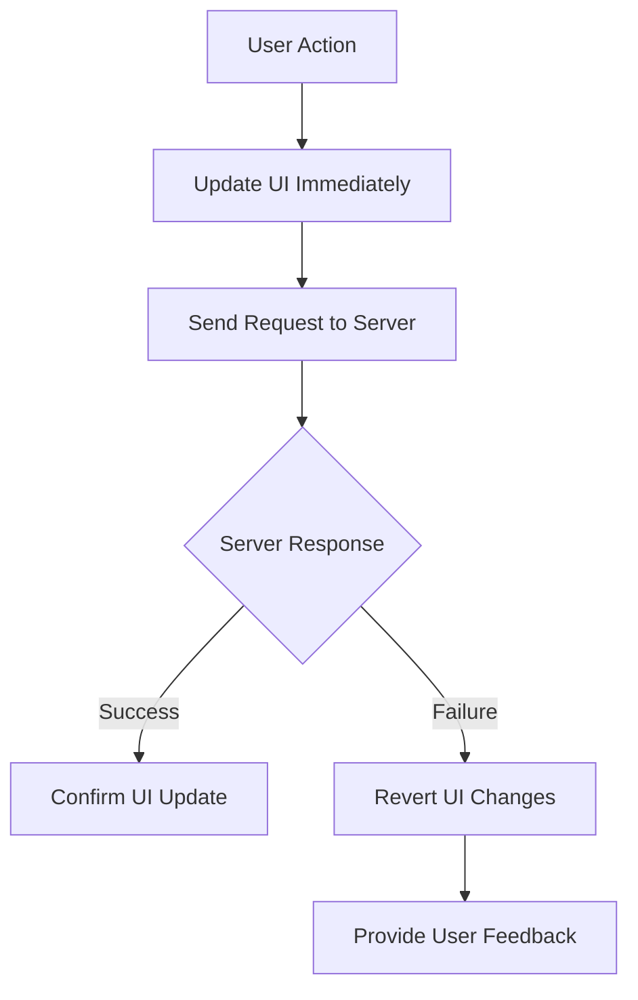

## 9.3.1 Optimistic UI Updates

In the fast-paced world of mobile applications, user experience is paramount. Users expect applications to be responsive and provide immediate feedback to their actions. One technique that has gained popularity in enhancing user experience is the use of **Optimistic UI Updates**. This approach involves updating the user interface immediately, before confirming the action with the server, thus providing instant feedback and a seamless user experience.

### Understanding Optimistic UI

Optimistic UI is a design pattern that assumes a positive outcome for user actions, updating the interface immediately while the server processes the request in the background. This approach can significantly improve the perceived performance of an application, as users are not left waiting for server responses before seeing the results of their actions.

#### Key Benefits of Optimistic UI

- **Instant Feedback:** Users receive immediate visual confirmation of their actions, reducing perceived latency.
- **Enhanced User Satisfaction:** By minimizing wait times, users feel more in control and engaged with the application.
- **Improved Performance Perception:** The application appears faster and more responsive, even if server processing takes time.

### Implementing Optimistic Updates

Implementing optimistic UI updates involves a straightforward process flow:

1. **Update the UI Immediately:** Reflect the user's action in the UI as soon as it occurs.
2. **Send the Request to the Server:** Initiate the server request to perform the action.
3. **Handle Success or Failure Responses:** Adjust the UI based on the server's response, reverting changes if necessary.

#### Process Flow Diagram

Below is a diagram illustrating the process flow of implementing optimistic UI updates:



### Handling Errors

While optimistic UI updates can greatly enhance user experience, they also introduce the challenge of handling errors gracefully. If the server responds with an error, it's crucial to revert the UI to its previous state and inform the user of the issue.

#### Error Handling Strategies

- **Revert Changes Seamlessly:** Ensure that reverting changes is smooth and does not disrupt the user experience.
- **Provide Clear Feedback:** Use error messages or notifications to inform the user of the failure and any corrective actions they can take.

### Example Implementation

To illustrate how optimistic UI updates can be implemented in a Flutter application, let's consider a scenario where a user deletes an item from a list. We'll use the `Provider` package for state management.

#### Code Example with Provider

```dart
import 'package:flutter/material.dart';

class Item {
  final String id;
  final String name;

  Item({required this.id, required this.name});
}

class ItemProvider with ChangeNotifier {
  List<Item> _items = [
    Item(id: '1', name: 'Item 1'),
    Item(id: '2', name: 'Item 2'),
  ];

  List<Item> get items => _items;

  void deleteItem(String itemId) {
    // Save the current state
    final previousItems = List<Item>.from(_items);

    // Optimistically update the UI
    _items.removeWhere((item) => item.id == itemId);
    notifyListeners();

    // Simulate a server request
    Future.delayed(Duration(seconds: 2), () {
      // Simulate a failure response
      bool success = false;

      if (!success) {
        // Revert the changes
        _items = previousItems;
        notifyListeners();
        // Show error message
        print('Failed to delete item. Please try again.');
      }
    });
  }
}
```

In this example, the `deleteItem` method optimistically removes an item from the list and updates the UI. If the server request fails, the changes are reverted, and an error message is displayed.

### Best Practices

To ensure a smooth and effective implementation of optimistic UI updates, consider the following best practices:

- **Seamless Reversion:** Make sure that reverting changes is as smooth as the initial update, minimizing disruption to the user experience.
- **Clear Communication:** Use animations, visual cues, or notifications to communicate actions and outcomes to the user.
- **Progress Indicators:** Display progress indicators for actions that might take longer to process, setting user expectations appropriately.

### User Feedback

Providing visual feedback is crucial in optimistic UI updates. Consider using animations or subtle visual cues to indicate that an action is being processed. This can include:

- **Loading Indicators:** Show a spinner or progress bar while the server processes the request.
- **Success Animations:** Use animations to confirm successful actions, reinforcing positive feedback.
- **Error Notifications:** Display error messages or alerts if an action fails, guiding the user on next steps.

### Testing

Testing optimistic UI updates is essential to ensure that they function correctly and handle edge cases gracefully. Consider the following testing strategies:

- **Simulate Network Conditions:** Test under various network conditions to ensure the UI behaves as expected.
- **Edge Case Handling:** Test scenarios where server responses fail or are delayed, ensuring that the UI reverts changes appropriately.
- **User Feedback Verification:** Ensure that all user feedback mechanisms (animations, notifications) are triggered correctly.

### Key Takeaways

Optimistic UI updates can significantly enhance user satisfaction by providing immediate feedback and a seamless experience. However, they require careful handling of error scenarios to maintain trust and reliability. By implementing optimistic updates thoughtfully, developers can create applications that feel fast and responsive, even when server interactions are involved.

### Further Reading and Resources

- [Flutter Documentation](https://flutter.dev/docs): Official Flutter documentation for in-depth understanding of Flutter's capabilities.
- [Provider Package](https://pub.dev/packages/provider): Learn more about the Provider package used in the example.
- [User Experience Design](https://www.smashingmagazine.com/): Articles and insights on enhancing user experience in applications.

## Quiz Time!



### What is the primary benefit of using Optimistic UI updates?

- [x] Provides instant feedback to users
- [ ] Reduces server load
- [ ] Simplifies code structure
- [ ] Eliminates the need for error handling

> **Explanation:** Optimistic UI updates provide instant feedback to users, enhancing the user experience by making the application feel more responsive.

### In the context of Optimistic UI, what should be done if a server request fails?

- [x] Revert the UI changes
- [ ] Ignore the error
- [ ] Retry the request indefinitely
- [ ] Log the error and continue

> **Explanation:** If a server request fails, the UI changes should be reverted to maintain consistency and inform the user of the failure.

### Which Flutter package is used in the example implementation of Optimistic UI updates?

- [x] Provider
- [ ] Bloc
- [ ] Redux
- [ ] MobX

> **Explanation:** The example implementation uses the Provider package for state management.

### What is a key consideration when implementing Optimistic UI updates?

- [x] Handling errors gracefully
- [ ] Reducing code complexity
- [ ] Increasing server requests
- [ ] Simplifying UI design

> **Explanation:** Handling errors gracefully is crucial to ensure that the application remains reliable and user-friendly.

### Which visual cue can be used to indicate that an action is being processed?

- [x] Loading indicator
- [ ] Static image
- [ ] Text label
- [ ] Sound alert

> **Explanation:** A loading indicator is a common visual cue used to show that an action is being processed.

### What is the first step in the process flow of implementing Optimistic UI updates?

- [x] Update the UI immediately
- [ ] Send the request to the server
- [ ] Handle success or failure responses
- [ ] Provide user feedback

> **Explanation:** The first step is to update the UI immediately to provide instant feedback to the user.

### Why is it important to test Optimistic UI updates under various network conditions?

- [x] To ensure the UI behaves as expected
- [ ] To reduce testing time
- [ ] To increase server load
- [ ] To simplify error handling

> **Explanation:** Testing under various network conditions ensures that the UI behaves as expected and handles edge cases gracefully.

### What should be displayed if an action fails in an Optimistic UI implementation?

- [x] Error message
- [ ] Success animation
- [ ] Loading spinner
- [ ] Static image

> **Explanation:** An error message should be displayed to inform the user of the failure and guide them on next steps.

### Which of the following is a benefit of using animations in Optimistic UI updates?

- [x] Reinforces positive feedback
- [ ] Increases server load
- [ ] Simplifies code structure
- [ ] Eliminates the need for testing

> **Explanation:** Animations reinforce positive feedback by visually confirming successful actions.

### True or False: Optimistic UI updates eliminate the need for error handling.

- [ ] True
- [x] False

> **Explanation:** False. Optimistic UI updates require careful error handling to maintain reliability and user trust.


