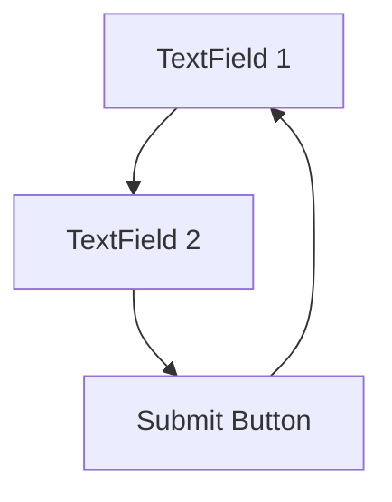

## 9.3.3 Accessibility in State Changes

In the realm of mobile app development, accessibility is not just a feature—it's a necessity. Ensuring that your Flutter applications are accessible means making them usable for everyone, including people with disabilities. This section delves into the importance of accessibility, how to implement accessible state changes, and best practices to follow for an inclusive user experience.

### Understanding Accessibility

Accessibility in software development refers to the design of products, devices, services, or environments for people with disabilities. This includes individuals with visual, auditory, motor, or cognitive impairments. By making your apps accessible, you not only comply with legal standards but also expand your user base and enhance the overall user experience.

#### Why Accessibility Matters

- **Inclusivity:** Accessibility ensures that everyone, regardless of their abilities, can use your app effectively.
- **Legal Compliance:** Many regions have legal requirements for digital accessibility, such as the Americans with Disabilities Act (ADA) in the United States.
- **User Satisfaction:** Accessible apps provide a better user experience for all users, including those with temporary disabilities or situational limitations (e.g., using a device in bright sunlight).

### Accessible State Changes

State changes in an application, such as loading new data or navigating to a different screen, should be perceivable and understandable to all users, including those relying on assistive technologies like screen readers.

#### Ensuring Perceivable State Changes

- **Visual Indicators:** Use animations or visual cues to indicate changes.
- **Auditory Feedback:** Provide sound cues for users who rely on auditory information.
- **Assistive Technology Support:** Ensure that state changes are announced to screen readers and other assistive devices.

### Implementing Accessibility Features

Flutter provides several tools and widgets to help developers create accessible applications. Here, we explore some key features and how to implement them effectively.

#### Semantic Labels

Semantic labels provide context to UI elements, making them understandable to screen readers. The `Semantics` widget in Flutter is used to annotate widgets with semantic information.

```dart
Semantics(
  label: 'Submit button',
  child: ElevatedButton(
    onPressed: _submit,
    child: Text('Submit'),
  ),
);
```

- **Purpose:** The `Semantics` widget helps screen readers convey the purpose of a widget to users. In the example above, the label "Submit button" informs the user about the button's function.

#### Focus Management

Managing focus is crucial for users navigating your app with a keyboard or assistive technologies. Proper focus management ensures that users can traverse your app's UI logically and predictably.

- **Focus Nodes:** Use `FocusNode` to control focus programmatically.
- **Focus Traversal:** Ensure that focus moves in a logical order. Use `FocusTraversalGroup` to group widgets for custom traversal.

```dart
FocusTraversalGroup(
  policy: OrderedTraversalPolicy(),
  child: Column(
    children: [
      TextField(
        focusNode: _firstFocusNode,
      ),
      TextField(
        focusNode: _secondFocusNode,
      ),
    ],
  ),
);
```

#### Announcements

The `SemanticsService.announce` method allows you to announce state changes to assistive technologies, ensuring that users are informed of important updates.

```dart
SemanticsService.announce('Item deleted', TextDirection.ltr);
```

- **Use Case:** Announcements are useful for notifying users of non-visual changes, such as when an item is deleted from a list.

### Testing for Accessibility

Testing is a critical step in ensuring your app is accessible. Use both automated tools and manual testing to identify and fix accessibility issues.

#### Accessibility Audit Tools

- **Flutter Accessibility Scanner:** Use this tool to identify potential accessibility issues in your app.
- **Lighthouse:** An open-source tool for auditing web accessibility, which can also be adapted for mobile apps.

#### Testing with Screen Readers

- **TalkBack (Android):** Enable TalkBack on Android devices to test how your app interacts with screen readers.
- **VoiceOver (iOS):** Use VoiceOver on iOS devices to ensure your app is accessible to users with visual impairments.

### Best Practices

Following best practices in accessibility not only improves usability but also ensures compliance with standards like the Web Content Accessibility Guidelines (WCAG).

- **Follow WCAG Guidelines:** Adhere to WCAG principles for perceivable, operable, understandable, and robust content.
- **Keep UI Simple:** A clean, intuitive interface benefits all users, including those with cognitive impairments.
- **Consistent Navigation:** Ensure that navigation is consistent and predictable across your app.

### Key Takeaways

- **Accessibility Expands Reach:** Making your app accessible broadens your audience and enhances user satisfaction.
- **Integrate Accessibility Early:** Consider accessibility from the start of your project to avoid costly redesigns later.
- **Continuous Improvement:** Regularly update and test your app for accessibility as new guidelines and technologies emerge.

### Practical Example: Accessible To-Do List

Let's consider a practical example of an accessible to-do list application. This example demonstrates how to implement semantic labels, focus management, and announcements.

```dart
import 'package:flutter/material.dart';
import 'package:flutter/services.dart';

void main() => runApp(AccessibleTodoApp());

class AccessibleTodoApp extends StatelessWidget {
  @override
  Widget build(BuildContext context) {
    return MaterialApp(
      title: 'Accessible To-Do List',
      home: TodoListScreen(),
    );
  }
}

class TodoListScreen extends StatefulWidget {
  @override
  _TodoListScreenState createState() => _TodoListScreenState();
}

class _TodoListScreenState extends State<TodoListScreen> {
  final List<String> _todos = [];
  final TextEditingController _controller = TextEditingController();

  void _addTodo() {
    setState(() {
      _todos.add(_controller.text);
      SemanticsService.announce('Task added', TextDirection.ltr);
      _controller.clear();
    });
  }

  void _removeTodoAt(int index) {
    setState(() {
      _todos.removeAt(index);
      SemanticsService.announce('Task removed', TextDirection.ltr);
    });
  }

  @override
  Widget build(BuildContext context) {
    return Scaffold(
      appBar: AppBar(
        title: Text('Accessible To-Do List'),
      ),
      body: Column(
        children: <Widget>[
          Padding(
            padding: const EdgeInsets.all(8.0),
            child: Semantics(
              label: 'Add new task',
              child: TextField(
                controller: _controller,
                decoration: InputDecoration(
                  labelText: 'New Task',
                ),
                onSubmitted: (_) => _addTodo(),
              ),
            ),
          ),
          Expanded(
            child: ListView.builder(
              itemCount: _todos.length,
              itemBuilder: (context, index) {
                return Semantics(
                  label: 'Task ${index + 1}',
                  child: ListTile(
                    title: Text(_todos[index]),
                    trailing: IconButton(
                      icon: Icon(Icons.delete),
                      onPressed: () => _removeTodoAt(index),
                    ),
                  ),
                );
              },
            ),
          ),
        ],
      ),
      floatingActionButton: Semantics(
        label: 'Add task button',
        child: FloatingActionButton(
          onPressed: _addTodo,
          child: Icon(Icons.add),
        ),
      ),
    );
  }
}
```

### Diagram: Focus Management in Flutter

Below is a diagram illustrating focus management in a simple Flutter application. This diagram shows how focus moves between different widgets.



### Conclusion

Accessibility is a crucial aspect of app development that should not be overlooked. By incorporating accessibility features into your Flutter apps, you ensure that all users, regardless of their abilities, can have a seamless and enjoyable experience. Remember, accessibility is not just about compliance—it's about creating a better product for everyone.

## Quiz Time!



### Why is accessibility important in app development?

- [x] It ensures inclusivity for all users.
- [ ] It only benefits users with visual impairments.
- [ ] It is optional and not necessary for most apps.
- [ ] It only applies to web applications.

> **Explanation:** Accessibility ensures that everyone, including people with disabilities, can use your app effectively. It is not limited to any specific group or platform.

### What is the purpose of semantic labels in Flutter?

- [x] To provide context to UI elements for screen readers.
- [ ] To enhance the visual design of the app.
- [ ] To improve app performance.
- [ ] To manage focus traversal.

> **Explanation:** Semantic labels are used to provide context to UI elements, making them understandable to screen readers and assistive technologies.

### How can you announce state changes to assistive technologies in Flutter?

- [x] Use the `SemanticsService.announce` method.
- [ ] Use the `print` function.
- [ ] Use the `Navigator` widget.
- [ ] Use the `setState` method.

> **Explanation:** The `SemanticsService.announce` method is used to announce state changes to assistive technologies, ensuring users are informed of important updates.

### Which tool can be used to test accessibility on Android devices?

- [x] TalkBack
- [ ] VoiceOver
- [ ] Lighthouse
- [ ] Flutter DevTools

> **Explanation:** TalkBack is a screen reader service on Android devices that helps test accessibility features.

### What is a best practice for focus management in Flutter?

- [x] Use `FocusNode` to control focus programmatically.
- [ ] Use `print` statements to debug focus issues.
- [ ] Avoid using focus management to keep the app simple.
- [ ] Use `Navigator` for focus traversal.

> **Explanation:** `FocusNode` is used to control focus programmatically, ensuring logical and predictable focus traversal in the app.

### What is the role of WCAG guidelines in accessibility?

- [x] They provide principles for perceivable, operable, understandable, and robust content.
- [ ] They are optional guidelines for web developers.
- [ ] They are specific to mobile applications only.
- [ ] They focus solely on visual design.

> **Explanation:** WCAG guidelines provide principles for creating accessible content that is perceivable, operable, understandable, and robust.

### How can you test accessibility on iOS devices?

- [x] Use VoiceOver
- [ ] Use TalkBack
- [ ] Use Flutter DevTools
- [ ] Use Lighthouse

> **Explanation:** VoiceOver is a screen reader service on iOS devices used to test accessibility features.

### What is a key takeaway about accessibility in app development?

- [x] Accessibility expands your app's reach and enhances user satisfaction.
- [ ] Accessibility is only necessary for government applications.
- [ ] Accessibility should be considered only after the app is fully developed.
- [ ] Accessibility is primarily for aesthetic purposes.

> **Explanation:** Accessibility expands your app's reach by making it usable for a wider audience, enhancing user satisfaction and inclusivity.

### Which widget is used to provide semantic information in Flutter?

- [x] Semantics
- [ ] Container
- [ ] Scaffold
- [ ] Navigator

> **Explanation:** The `Semantics` widget is used to provide semantic information to assistive technologies, enhancing accessibility.

### True or False: Accessibility features should be integrated at the end of the development process.

- [ ] True
- [x] False

> **Explanation:** Accessibility features should be integrated from the start of the development process to avoid costly redesigns and ensure a seamless user experience.


