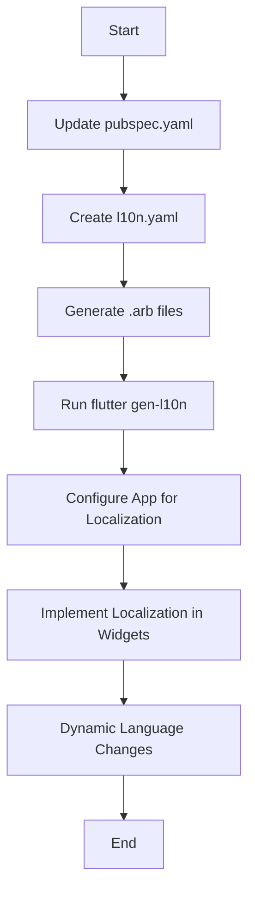

## 9.3.4 Localization and Internationalization

In the globalized world of app development, creating applications that cater to a diverse audience is crucial. This involves not only translating text but also adapting the app's functionality to meet the cultural and linguistic needs of users from different regions. This section delves into the concepts of localization and internationalization in Flutter, focusing on how state management plays a pivotal role in delivering a seamless user experience across multiple languages and locales.

### Understanding Internationalization and Localization

Before diving into the implementation details, it's essential to understand the distinction between internationalization and localization:

- **Internationalization (i18n):** This is the process of designing your application in a way that it can be easily adapted to various languages and regions without requiring engineering changes. It involves setting up the app to support multiple languages, date formats, currencies, and other locale-specific elements.

- **Localization (l10n):** This refers to the actual adaptation of your app for a specific locale, including translating text, adjusting layouts, and formatting dates, times, and numbers according to local customs.

### Implementing Internationalization in Flutter

Flutter provides robust support for internationalization, making it relatively straightforward to prepare your app for multiple languages. Here's how you can implement i18n in Flutter:

#### Step 1: Update `pubspec.yaml`

To start, you need to include the necessary packages in your `pubspec.yaml` file. The `flutter_localizations` package is essential for enabling localization support in Flutter, while the `intl` package helps with formatting dates, numbers, and currencies.

```yaml
dependencies:
  flutter_localizations:
    sdk: flutter
  intl: ^0.17.0
```

#### Step 2: Generate Localization Files

Localization files are typically in the `.arb` (Application Resource Bundle) format. These files contain key-value pairs where the key is a string identifier, and the value is the translated text.

1. **Create a `l10n.yaml` File:** This configuration file tells Flutter how to generate localization files.

   ```yaml
   arb-dir: lib/l10n
   template-arb-file: app_en.arb
   output-localization-file: app_localizations.dart
   ```

2. **Run the Localization Generation Command:**

   Use the following command to generate the localization files:

   ```bash
   flutter gen-l10n
   ```

This command will create a `LocalizationsDelegate` and a `Localizations` class that you can use to access localized strings in your app.

#### Step 3: Configure the App for Localization

In your `main.dart` file, configure the app to use the generated localization classes:

```dart
import 'package:flutter/material.dart';
import 'package:flutter_localizations/flutter_localizations.dart';
import 'package:your_app/l10n/app_localizations.dart';

void main() {
  runApp(MyApp());
}

class MyApp extends StatelessWidget {
  @override
  Widget build(BuildContext context) {
    return MaterialApp(
      localizationsDelegates: [
        AppLocalizations.delegate,
        GlobalMaterialLocalizations.delegate,
        GlobalWidgetsLocalizations.delegate,
      ],
      supportedLocales: [
        const Locale('en', ''), // English
        const Locale('es', ''), // Spanish
        // Add other supported locales here
      ],
      home: MyHomePage(),
    );
  }
}
```

### Using the `intl` Package

The `intl` package is crucial for formatting dates, numbers, and currencies according to the user's locale. Here’s how you can use it:

```dart
import 'package:intl/intl.dart';

void formatExample() {
  var now = DateTime.now();
  var formatter = DateFormat.yMMMMd('en_US');
  String formattedDate = formatter.format(now);
  print(formattedDate); // Output: October 25, 2024
}
```

### Managing State in Multi-language Apps

Managing state in apps that support multiple languages involves ensuring that the state reflects the correct locale. This is particularly important when displaying locale-specific data, such as dates and numbers.

#### Handling Dynamic Language Changes

Flutter allows you to change the app's language dynamically. When the locale changes, you need to ensure that the state is updated accordingly. This might involve re-fetching data or reformatting displayed information.

```dart
void changeLanguage(BuildContext context, Locale newLocale) {
  MyApp.setLocale(context, newLocale);
}
```

### Example Implementation

To illustrate these concepts, let's walk through a simple example of setting up localization in a Flutter app.

#### Add Dependencies

Ensure your `pubspec.yaml` includes the necessary dependencies:

```yaml
dependencies:
  flutter_localizations:
    sdk: flutter
  intl: ^0.17.0
```

#### Setting Up Localization

Create a `l10n.yaml` file and run the `flutter gen-l10n` command to generate the necessary localization files.

#### Dynamic Content Translation

When dealing with user-generated content, consider how translations will be handled. This might involve integrating with a translation service or providing users with the ability to translate content themselves.

#### Locale-Specific State

Manage state that depends on locale changes, such as date formats. For instance, if your app displays a calendar, ensure that the dates are formatted correctly for the user's locale.

### Best Practices

- **Organize Localization Files:** Keep your localization files well-organized and up-to-date. This makes it easier to manage translations as your app grows.

- **Avoid Hardcoding Strings:** Never hardcode strings directly in your code. Instead, use localization files to manage all text.

- **Plan for Internationalization Early:** Consider internationalization from the start of your project. This will save time and effort later on.

### Localization Workflow Diagram

Below is a Mermaid.js diagram illustrating the localization workflow:



### Key Takeaways

- Proper localization enhances user experience by making your app accessible to a broader audience.
- Plan for internationalization early in the development process to avoid costly refactoring later.
- Use Flutter's built-in tools and packages like `flutter_localizations` and `intl` to streamline the localization process.
- Ensure that your app's state management system can handle locale changes gracefully.

By following these guidelines, you can create a Flutter app that not only reaches a global audience but also provides a seamless and culturally relevant user experience.

## Quiz Time!



### What is the primary purpose of internationalization (i18n) in app development?

- [x] Designing the app to support multiple languages and regions.
- [ ] Translating the app's content into different languages.
- [ ] Adapting the app's layout for different screen sizes.
- [ ] Optimizing the app's performance for various devices.

> **Explanation:** Internationalization involves designing the app to support multiple languages and regions, making it adaptable without requiring significant engineering changes.

### Which package is essential for enabling localization support in Flutter?

- [x] flutter_localizations
- [ ] flutter_i18n
- [ ] flutter_translate
- [ ] flutter_multilang

> **Explanation:** The `flutter_localizations` package is essential for enabling localization support in Flutter applications.

### What is the role of the `intl` package in Flutter localization?

- [x] Formatting dates, numbers, and currencies according to the user's locale.
- [ ] Translating text strings into different languages.
- [ ] Managing state changes in multi-language apps.
- [ ] Providing localization files for different locales.

> **Explanation:** The `intl` package is used for formatting dates, numbers, and currencies according to the user's locale.

### How can you dynamically change the language in a Flutter app?

- [x] By updating the app's locale using a method like `MyApp.setLocale(context, newLocale)`.
- [ ] By restarting the app with a different language setting.
- [ ] By modifying the `pubspec.yaml` file and rebuilding the app.
- [ ] By using a third-party translation service.

> **Explanation:** Flutter allows dynamic language changes by updating the app's locale, which can be done programmatically.

### What is a best practice for managing localization files in a Flutter project?

- [x] Keeping localization files organized and up-to-date.
- [ ] Hardcoding strings directly in the code.
- [ ] Using a single localization file for all languages.
- [ ] Avoiding the use of localization files altogether.

> **Explanation:** Keeping localization files organized and up-to-date is a best practice to ensure efficient management of translations.

### What is the purpose of the `l10n.yaml` file in Flutter localization?

- [x] To configure how localization files are generated and managed.
- [ ] To store translations for different languages.
- [ ] To define the app's supported locales.
- [ ] To handle dynamic language changes.

> **Explanation:** The `l10n.yaml` file is used to configure how localization files are generated and managed in a Flutter project.

### Which command is used to generate localization files in Flutter?

- [x] flutter gen-l10n
- [ ] flutter build-l10n
- [ ] flutter create-l10n
- [ ] flutter init-l10n

> **Explanation:** The `flutter gen-l10n` command is used to generate localization files in a Flutter project.

### Why is it important to avoid hardcoding strings in your Flutter app?

- [x] To facilitate easier localization and translation.
- [ ] To improve the app's performance.
- [ ] To reduce the app's memory usage.
- [ ] To ensure compatibility with older devices.

> **Explanation:** Avoiding hardcoded strings facilitates easier localization and translation, making the app more adaptable to different languages.

### What should you consider when managing state in multi-language apps?

- [x] Ensuring that state reflects the correct locale and handling dynamic language changes.
- [ ] Using a single state management solution for all languages.
- [ ] Avoiding the use of state management altogether.
- [ ] Hardcoding state values for each language.

> **Explanation:** In multi-language apps, it's important to ensure that state reflects the correct locale and to handle dynamic language changes effectively.

### True or False: Localization only involves translating text strings in an app.

- [ ] True
- [x] False

> **Explanation:** Localization involves more than just translating text strings; it includes adapting the app to meet cultural and linguistic needs, such as formatting dates and numbers according to local customs.


