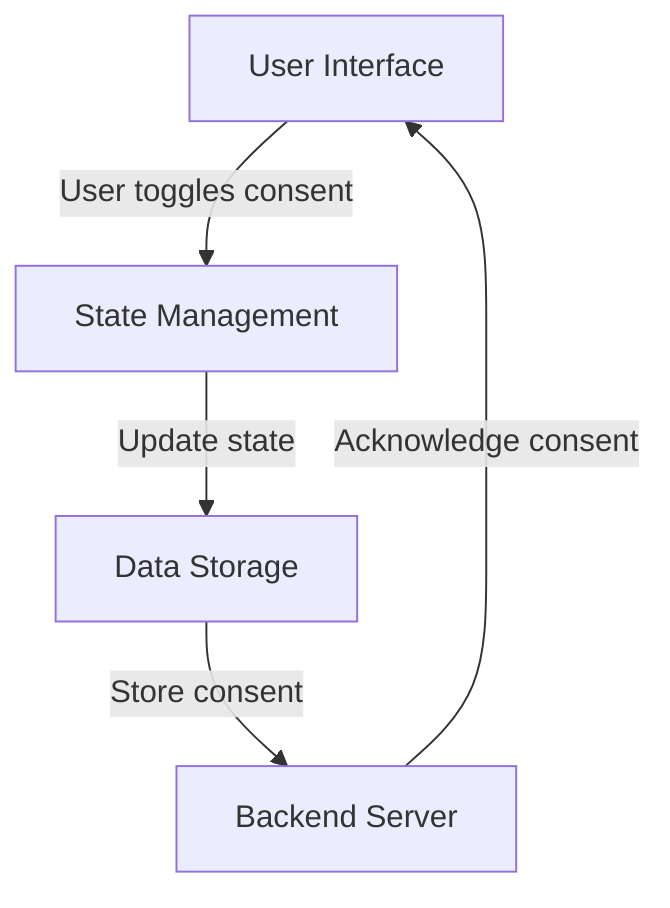

## 9.4.2 Compliance with Regulations

In the digital age, data privacy and security have become paramount concerns for developers and users alike. As Flutter developers, understanding and implementing compliance with regulations such as the General Data Protection Regulation (GDPR) and the California Consumer Privacy Act (CCPA) is crucial. This section delves into the intricacies of these regulations and provides actionable insights for ensuring your Flutter applications are compliant.

### Understanding Legal Requirements

#### GDPR and CCPA Overview

The **General Data Protection Regulation (GDPR)** is a comprehensive data protection law in the European Union that governs how personal data should be collected, processed, and stored. It emphasizes user consent, data protection, and the right to privacy.

The **California Consumer Privacy Act (CCPA)** is a state statute intended to enhance privacy rights and consumer protection for residents of California, USA. It provides consumers with the right to know what personal data is being collected, to whom it is sold, and the ability to access and delete their data.

Both regulations share common goals but have distinct requirements. Understanding these differences is essential for compliance, especially if your app targets users in these regions.

### Key Compliance Aspects

#### User Consent

Obtaining explicit user consent is a cornerstone of both GDPR and CCPA. This involves:

- **Clear Communication:** Inform users about what data is being collected and why.
- **Opt-In Mechanisms:** Implement clear opt-in mechanisms rather than pre-checked boxes.
- **Consent Withdrawal:** Allow users to easily withdraw consent at any time.

#### Right to Access and Deletion

Users have the right to access their data and request its deletion. Implementing these features involves:

- **Data Access Requests:** Provide users with a straightforward process to request access to their data.
- **Data Deletion Requests:** Ensure users can request the deletion of their data and that your system can handle these requests efficiently.

#### Data Minimization

Collect only the data necessary for your application to function. This minimizes risk and aligns with privacy principles:

- **Identify Essential Data:** Determine what data is essential for your app's functionality.
- **Avoid Over-Collection:** Resist the temptation to collect data that is not immediately necessary.

### Implementing Compliance Measures

#### Privacy Policies

A clear, concise privacy policy is essential. It should outline:

- **Data Collection Practices:** What data is collected and for what purpose.
- **User Rights:** How users can exercise their rights under GDPR and CCPA.
- **Contact Information:** Provide a way for users to contact you with questions or concerns.

#### Handling Data Requests

Implement features that allow users to manage their data:

- **User Interfaces for Data Requests:** Develop intuitive interfaces for users to request data access or deletion.
- **Automated Processes:** Consider automating these processes to handle requests efficiently.

### Data Localization

Data localization refers to the practice of storing data within the region it was collected. This is crucial for compliance with certain regulations:

- **Understand Regional Requirements:** Different regions have varying requirements for data storage.
- **Cloud Providers:** Choose cloud providers that offer data centers in the regions you operate.

### Security Measures

Ensuring data security is a regulatory requirement and a best practice:

- **Encryption:** Use encryption to protect data both in transit and at rest.
- **Access Controls:** Implement strict access controls to limit who can access sensitive data.
- **Regular Audits:** Conduct regular security audits to identify and address vulnerabilities.

### Working with Legal Teams

Collaborating with legal professionals is crucial to ensure full compliance:

- **Legal Expertise:** Engage legal experts to review your compliance measures.
- **Regular Updates:** Stay informed about changes in regulations and update your practices accordingly.

### Best Practices

#### Stay Informed

Regulations evolve, and staying informed is key:

- **Subscribe to Updates:** Follow regulatory bodies and legal experts for updates.
- **Continuous Learning:** Attend workshops and seminars on data privacy and security.

#### Privacy by Design

Incorporate privacy into the design of your systems from the outset:

- **Design Principles:** Apply principles of privacy by design in your development process.
- **User-Centric Design:** Focus on creating user-centric privacy features.

### Key Takeaways

- **Legal Compliance:** Non-compliance can result in hefty penalties and damage to your reputation.
- **User Trust:** Transparent practices build user trust and loyalty.
- **Proactive Measures:** Implementing compliance measures proactively can save time and resources in the long run.

### Practical Code Examples

To illustrate these concepts, let's look at a simple example of implementing user consent in a Flutter application.

```dart
import 'package:flutter/material.dart';

void main() => runApp(MyApp());

class MyApp extends StatelessWidget {
  @override
  Widget build(BuildContext context) {
    return MaterialApp(
      home: ConsentScreen(),
    );
  }
}

class ConsentScreen extends StatefulWidget {
  @override
  _ConsentScreenState createState() => _ConsentScreenState();
}

class _ConsentScreenState extends State<ConsentScreen> {
  bool _consentGiven = false;

  void _toggleConsent(bool value) {
    setState(() {
      _consentGiven = value;
    });
  }

  @override
  Widget build(BuildContext context) {
    return Scaffold(
      appBar: AppBar(title: Text('User Consent')),
      body: Padding(
        padding: const EdgeInsets.all(16.0),
        child: Column(
          crossAxisAlignment: CrossAxisAlignment.start,
          children: [
            Text(
              'We collect data to improve your experience. Do you consent to data collection?',
              style: TextStyle(fontSize: 16),
            ),
            SwitchListTile(
              title: Text('I consent'),
              value: _consentGiven,
              onChanged: _toggleConsent,
            ),
            ElevatedButton(
              onPressed: _consentGiven ? _submitConsent : null,
              child: Text('Submit'),
            ),
          ],
        ),
      ),
    );
  }

  void _submitConsent() {
    // Logic to handle consent submission
    print('User consent given: $_consentGiven');
  }
}
```

In this example, we create a simple consent screen where users can toggle their consent for data collection. This is a basic implementation, and in a real-world scenario, you would need to store this consent information securely and provide users with the ability to withdraw it.

### Diagrams and Visuals

Below is a Mermaid.js diagram illustrating the data flow for handling user consent in a Flutter application.



This diagram shows the flow from the user interface to the backend server, highlighting the importance of state management in tracking user consent.

### References and Further Reading

- [GDPR Official Website](https://gdpr.eu/)
- [CCPA Official Website](https://oag.ca.gov/privacy/ccpa)
- [Flutter Security and Privacy](https://flutter.dev/docs/development/data-and-backend/security)
- Books: "GDPR: A Practical Guide" by IT Governance, "Data Privacy and GDPR Handbook" by Sanjay Sharma

### Conclusion

Ensuring compliance with data privacy regulations is not just a legal obligation but a critical component of building trust with your users. By understanding the requirements and implementing best practices, you can create Flutter applications that respect user privacy and meet regulatory standards.

## Quiz Time!



### Which regulation focuses on data protection within the European Union?

- [x] GDPR
- [ ] CCPA
- [ ] HIPAA
- [ ] COPPA

> **Explanation:** The General Data Protection Regulation (GDPR) is a comprehensive data protection law in the European Union.

### What is a key aspect of both GDPR and CCPA?

- [x] User consent
- [ ] Data monetization
- [ ] Unlimited data collection
- [ ] Data sharing without restrictions

> **Explanation:** Both GDPR and CCPA emphasize obtaining explicit user consent for data collection.

### What should a privacy policy include?

- [x] Data collection practices
- [ ] Marketing strategies
- [ ] Financial projections
- [ ] Employee salaries

> **Explanation:** A privacy policy should outline data collection practices, user rights, and contact information.

### What is data minimization?

- [x] Collecting only necessary data
- [ ] Collecting as much data as possible
- [ ] Sharing data with third parties
- [ ] Encrypting all data

> **Explanation:** Data minimization involves collecting only the data necessary for the application's functionality.

### How can users exercise their rights under GDPR and CCPA?

- [x] Request data access and deletion
- [ ] Request more advertisements
- [ ] Request data sharing with third parties
- [ ] Request financial compensation

> **Explanation:** Users can request access to their data and its deletion under GDPR and CCPA.

### What is data localization?

- [x] Storing data within the region it was collected
- [ ] Storing data in multiple countries
- [ ] Sharing data globally
- [ ] Encrypting data

> **Explanation:** Data localization involves storing data within the region it was collected to comply with regional regulations.

### Why is encryption important?

- [x] Protects data in transit and at rest
- [ ] Increases data size
- [ ] Makes data public
- [ ] Slows down data processing

> **Explanation:** Encryption is crucial for protecting data both in transit and at rest, ensuring it remains secure.

### What is the role of legal teams in compliance?

- [x] Ensuring full compliance with regulations
- [ ] Developing marketing strategies
- [ ] Designing user interfaces
- [ ] Writing code

> **Explanation:** Legal teams ensure that the application complies with all relevant data privacy regulations.

### What is privacy by design?

- [x] Incorporating privacy into system design from the outset
- [ ] Adding privacy features after development
- [ ] Ignoring privacy concerns
- [ ] Focusing solely on aesthetics

> **Explanation:** Privacy by design involves incorporating privacy considerations into the system design from the beginning.

### True or False: Non-compliance with data privacy regulations can result in penalties.

- [x] True
- [ ] False

> **Explanation:** Non-compliance with data privacy regulations like GDPR and CCPA can lead to significant penalties.


